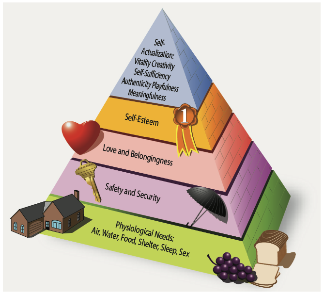

# Human Behavior

## Instructor and Learner Relationship

- You will teach all sorts of people with different personalities
- Be aware of how your teaching style is compatible (or in compatible) with a students learning style

## Human Needs and Motivation

- Theory X: All people are inherently lazy and avoid work
- Theory Y: Work is as natural as play and rest, as long you're properly motivated

### Motivation

- Motivations can be positive or negative
  - Negative motivation can be the result of fear
  - Positive motivation is provided by the promise or achievement of rewards like financial gain, satisfaction of the self-concept, personal gain, or public recognition
  - Positive motivation is essential to true learning
- Maintaining motivation
  - Give praise during incremental successes in training
  - "Challenge" the student to continue getting better
  - Training plateaus are to be expected
  - "What can you do with aviation"
  - Play down the negatives when appropriate

[Aviation Instructor's Handbook pg. 2-2](/_references/AIH/2-2)

## Maslow's Hierarchy of Needs

- Abraham Maslow studied human needs and motivation
- He discovered than certain needs take precedent over others
- Learners tend to show little to no motivation or attention if most of their needs are not met
  - If a student is hungry, they will focus on that instead of a lesson
  - If a student feels unsafe, they will be distracted by a flight response
- Utilize a pre-lesson evaluation of readiness
  - Do you best to verify whether the learner is physically and mentally ready to learn

1. Physiological
2. Security
3. Belonging
4. Esteem
5. Cognitive and Aesthetic
6. Self-Actualization

[Aviation Instructor's Handbook pg. 2-6](/_references/AIH/2-6)

## Defense Mechanisms

- **Repression**: A person places uncomfortable thoughts in an inaccessible area of the mind
- **Denial**: Refusal to accept external reality because it is too threatening
- **Compensation**: Emphasizing strengths in other areas to distract from or disguise a weakness
- **Projection**: Projecting the blame of a personal failing onto someone else
- **Rationalization**: Justifying poor performance on external factors outside of their control
- **Fantasy**: Daydreams about how thing should be or will be in the future, ignoring the current reality
- **Displacement**: Redirecting anger or frustration to someone or something else

[Aviation Instructor's Handbook pg. 2-9](/_references/AIH/2-9)

## Learner Emotional Reactions

### Anxiety

- A normal emotion for new pilot learners
- Can be minimized by making the experience pleasurable and introducing topics with care

### Impatience

- Can be a large deterrent to student success
- Often learns only seek the objective, not the training steps taken to get there
- Train one step at a time
- Train at a pace appropriate for the learner, not too fast/too slow

### Worry or lack of interest

- Learners who are worried or emotionally upset are not ready to learn
- Use the learner's enthusiasm and interests to get them engaged, and divert attention from worries and troubles

### Physical discomfort, illness, fatigue, and dehydration

Any physical discomfort greatly affects the ability of a student to learn.

#### Air sickness

- End a flight as soon as symptoms are experienced

#### Fatigue

- Fatigue can be acute (short-term) or chronic (long-term)
- Acute fatigue accumulates as mental effort is utilized
- Only continue lessons if the learner is alert and performing at an expected level
- Acute fatigue can be indicated by:
  - Inattention
  - Distractibility
  - Errors in timing
  - Lack of awareness
  - Irritability
- Chronic fatigue may have deep-seeded origins and requires a prolonged and deliberate solution

#### Dehydration and heatstroke

- The first signs of dehydration is fatigue
- Always carry an ample supply of water, and drink frequently

#### Apathy due to inadequate instruction

- Learners can be come disengaged when
  - the instructor inadequately prepared
  - Instruction is deficient, contradictory, or insincere
- Teach at an appropriate level
- Don't talk down to a learner

[Aviation Instructor's Handbook pg. 2-12](/_referencs/AIH/2-12)

### Reactions to Stress

Stress will cause a flight or fight response in the body

- Normal reactions to stress:
  - Normal individuals respond rapidly and exactly
  - They will utilize their training and experience
- Abnormal reactions to stress:
  - Inappropriate response to actions, like over-elation
  - Extreme over-cooperation
  - Painstaking self-control
  - Big changes in mood from lesson-to-lesson
  - Severe anger towards an instructor

[Aviation Instructor's Handbook pg. 2-21](/_referencs/AIH/2-21)

## Teaching Adult Students

- Adults have certain expectations about what it takes to learn and succeed
  - Adults tend to be very goal-oriented
  - Adults tend to be self-directed and autonomous learners
  - Need to feel independent and in-control
  - Need to see the practical relevance of presented material
  - Want to maintain their self-esteem and self-image
  - Adults want to solve problems
- Instructors should
  - Provide a clear training syllabus
  - Clarify and articulate all learner expectations early on
  - Refrain from “spoon-feeding” the learner
  - Create opportunities for mutual planning

[Aviation Instructor's Handbook pg. 2-17](/_referencs/AIH/2-17)
