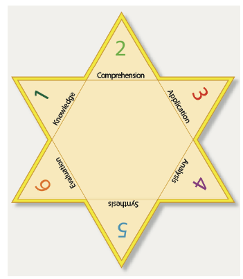
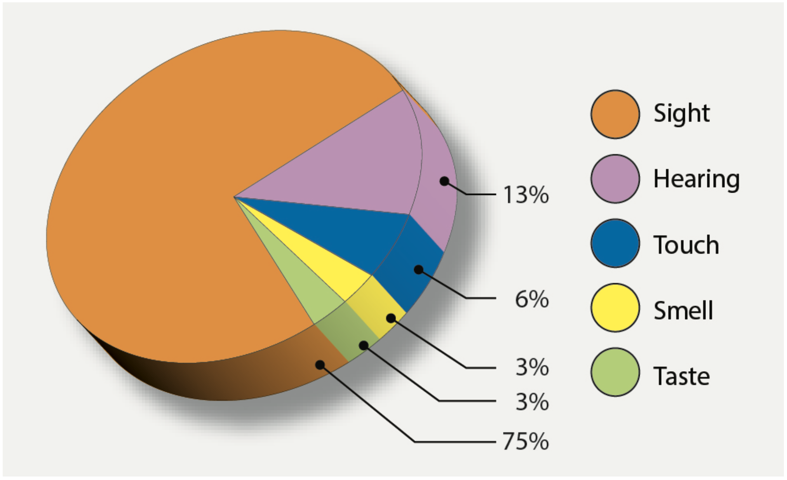

# The Learning Process

## Definition of Learning

- A process which results in a change in behavior
- Gaining knowledge or skills through study, instruction, experience

## Characteristics of Learnings

PEMA:

- **P**urposeful
- Result of **E**xperience
- **M**ultifaceted
- **A**ctive process

[Airplane Flying Handbook pg. 3-2](/_references/AFH/3-2)

## Social Learning

Social learning is simply learning by observation of others. Albert Bandura's Social Learning Theory has four stages:

1. Attention - ability to observe others them
2. Retention - remember the observed behavior
3. Reproduction - reproduce a previous observed behavior, may require addition skills
4. Motivation - a reason to reproduce the behavior

[Airplane Flying Handbook pg. 3-3](/_references/AFH/3-3)

## Learning Theories

1. Classical conditioning: Pavlovian psychology, association with stimuli
2. Operant conditioning: Associations are made between positive behaviors and positive consequences, negative behaviors and negative consequences
3. Social learning: Watching, imitating the actions of others

[Airplane Flying Handbook pg. 3-3](/_references/AFH/3-3)

## Behaviorism

- Explains behavior in terms of observable and measurable responses to stimuli
- Human behavior is conditioned by events in the person's environment
- Based on this theory is the simple "carrot-and-stick" approach to learning

## Cognitive Theory

- Focuses on what's going on inside the mind
- Examine's the human ability to reflect, problem solve, and think critically

[Aviation Instructor's Handbook pg. 3-2](/_referencs/AIH/3-2)

### Bloom's Taxonomy of the Cognitive Domains

1. Comprehension
2. Application
3. Analysis
4. Synthesis
5. Evaluation
6. Knowledge

[Aviation Instructor's Handbook pg. 3-5](/_referencs/AIH/3-5)

### Higher-Order Thinking Skills (HOTS)

- Higher-order thinking skills (HOTS), also called aeronautical decision-making (ADM)
- Based on the last three of Bloom's Taxonomy (Synthesis, evaluation, knowledge)
- Progress learning from simple to complex, from concrete to abstract

## Scenario-Based Training (SBT)

- Use of structured, "real-world" scenarios to approach flight-training objectives
- Helps student's "make meaning" out of their past experiences, and use that to strengthen their ADM

[Aviation Instructor's Handbook pg. 3-6](/_referencs/AIH/3-6)

[Pilot’s Handbook of Aeronautical Knowledge pg. 2-21](/_references/PHAK/2-21)

## Perceptions

- Learning can be better accomplished by utilizing more than one sense (e.g. sight, sound, touch)
- An instructor should guide a learner's perception onto the most important things

[Airplane Flying Handbook pg. 3-7](/_references/AFH/3-7)

### Factors that Affect Perception

- Physical organism: The physical apparatuses for sensing the world around us
- Goals and values: Sensory input is colored by one's own beliefs and values, goals are the produce of one's value structure
- Self-concept: Self image (e.g. confident, insecure), affects a persons perception
  - Negative experiences can contradict a person's self-concept
- Time and opportunity: We need time and practice to develop perception of something
- Element of threat: Fear adversely affects perception by narrowing the perceptual field
  - An overwhelming situation can be threatening
  - If a learner feels they can handle a situation, then it's viewed as a challenge

[Airplane Flying Handbook pg. 3-7](/_references/AFH/3-7)