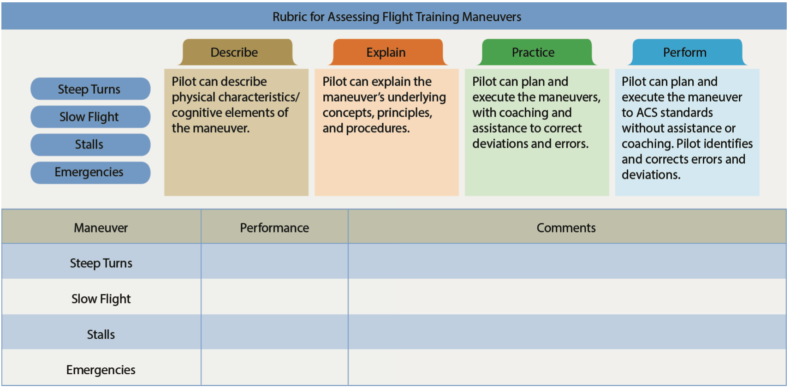

# Assessment

The purpose of an assessment is to check how learning is progressing, and will provide practical feedback for both the learning and instructor.

## Characteristics of Effective Assessment

- Objective: Bias should not be present, test should be honest
- Flexible: Tone of the assessment should fit the occasion
- Acceptable: The learner must accept why they are being assessed
- Comprehensive: Should cover all areas needed
- Constructive: Praise where appropriate
- Thoughtful: Respect the learners feelings
- Specific: Give specific, actionable feedback

[Aviation Instructor's Handbook pg. 6-2](/_references/AIH/6-2)

## Traditional Assessments

Traditional tests are generally written tests with questions like multiple choice, true-false, fill in the blank, and have a time limit.

Good written tests should exhibit:

- Reliability: Consistent when repeated with different students and graders
- Validity: Measuring what it's intended to measure
- Usability: Easy to read and complete
- Objectivity: Single scoring of a given test
- Comprehensiveness: Cover the range of learning required
- Discrimination: How well it measures the quality of the performance

[Aviation Instructor's Handbook pg. 6-3](/_references/AIH/6-3)

## Authentic Assessment

A comprehensive assessment involves students to perform real-world tasks and demonstrate application of skill.

### Learner-Centered Assessment

A four-step series of open-ended questions which guides the learner through a self-assessment:

1. Replay: Have the learner recount a flight or procedure, interject when the account does not seem accurate. This lets the learner evaluate their own perceptions
2. Reconstruct: Ask the learner to identify could have done differently
3. Reflect: Imbue experiences with meaning by having the learner reflect on the experience
4. Redirect: Have the student consider how they might apply these learnings in future scenarios

[Aviation Instructor's Handbook pg. 6-5](/_references/AIH/6-5)

### Maneuver or Procedure "Grades"

1. Describe: Learner can describe elements of the maneuver, but need assistance to do it
2. Explain: Learner understands the concepts and procedure, but needs assistance to do it
3. Practice: Learner can plan an execute the scenario, but some coaching/correct is required
4. Perform: Learner can perform activity without instructor assistance

[Aviation Instructor's Handbook pg. 6-6](/_references/AIH/6-6)

### Assessing Risk Management Skills

1. Explain: Learning can identify, describe, and understand risks, but needs prompting to make decisions
2. Practice: Learner can apply SRM principles to real situation, with some corrections or coaching. Learner is active decision maker
3. Manage/Decision: Learner can gather and evaluate information and make an autonomous decision

[Aviation Instructor's Handbook pg. 6-6](/_references/AIH/6-6)

## Choosing an Effective Assessment

1. Determine level-of-learning: Pick one of the [learning levels](/docs/cfi/foi/learning-process#blooms-taxonomy-of-the-cognitive-domains)
2. List indicators of desired behaviors: Determine what would indicate achievement of assessment objective
3. Establish criterion objectives: Define performance-based objectives and targets
4. Develop criterion-referenced test items: Develop questions or activities which target the specific criterion objectives

[Aviation Instructor's Handbook pg. 6-8](/_references/AIH/6-8)

## Critiques and Oral Assessments

Critiques are instructor-learner assessments.

There are several types that can be used: 
- Instructor/learner: Learners are offered to criticize a performance
- Learner-led: Learners lead the critique
- Small group: Learners are divided and critique in groups
- Self-critique: A learner critiques their own performance
- Written: Critique in writing, which may be more thoughtful or thorough

### Oral Assessments

- 