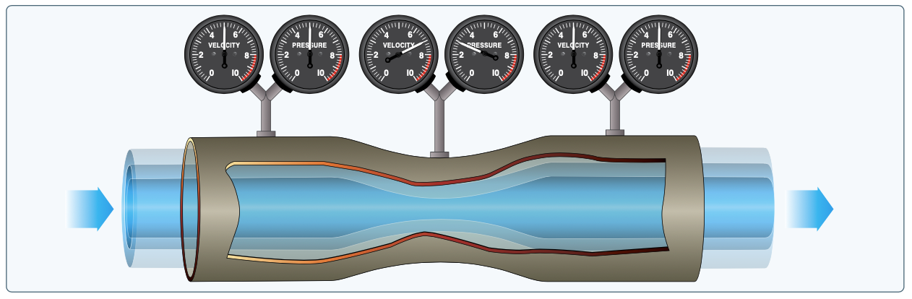

# Lift and Drag

- Weight operates vertically through the center of gravity

## Newton's Third Law

- For every action there is an equal and opposite reaction.
- In an airplane, the propeller moves and pushes back the air
- Consequently, the air pushes the propeller and the airplane forward

## Bernoulli's Law

- As the pipe constricts, the pressure and the velocity must increase
- An increase in velocity means a decrease in pressure / a decrease in velocity means a increase in pressure

- The same principle applies to an airfoil
  - Some air is directed above the wing, some is directed below it
  - An increase in velocity decreases the pressure above the wing, which causes a force vertically on the wing

<iframe width="560" height="315" src="https://www.youtube.com/embed/UqBmdZ-BNig?si=7xuS2UL5c50MPghr" title="YouTube video player" frameborder="0" allow="accelerometer; autoplay; clipboard-write; encrypted-media; gyroscope; picture-in-picture; web-share" referrerpolicy="strict-origin-when-cross-origin" allowfullscreen />

### Lift equation

$$
\text{lift} = \frac{\frac{1}{2} \rho V^2 S C_l}{2}
$$

$$
\text{Where:}\\
\rho = \text{air density}\\
V = \text{velocity}\\
S = \text{surface area}\\
C_l = \text{coefficient of lift}
$$

Note that lift will increase with the square of the velocity.

## Angle of Attack

- Angle of attack is parallel and opposite of the flight path
- The steeper the angle of attack the more the air above the wing is deflected, which increases the lifting force
- Increasing the angle of attack too much, the air become turbulent and doesn't stay on the boundary layer on the rear top of the wing

## Drag

$$
\text{drag} = \frac{\rho V^2 S C_d}{2}
$$

$$
\text{Where:}\\
C_d = \text{coefficient of drag}
$$

- Note it's the same equation and the equation of lift

### Parasite drag

- Think of a "pizza box" in the wind
  - As it moves through the wind we impart energy onto the air molecules impacting the surface

### Induced drag

- A by-product of the production of lift
- The more lift produced, the more induced drag produced
- Caused by the the downwash towards the rear of the airplane
  - This downwash means the relative wind is moving slightly down relative to the flight path
  - The change in relative wind changes the lift force vector slightly aft. The horizontal component of that lift vector is induced drag
  - You can think of this as "bending" the relative wind downward in the local vicinity of the wing
