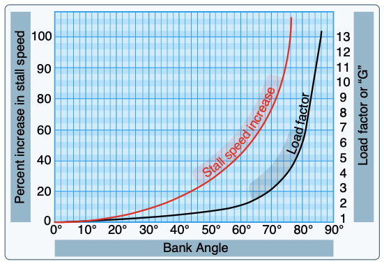

# Forces During Flight

## Forces in Straight-and-Level Flight

- In straight and level, unaccelerated flight all forces are equal

## Forces in a Climb

- The lift vector is a acting rearward and
- Greater thrust is required to balance the forces

## Forces in a Dive

- Consider an aircraft pulling out of a dive:
  - Because a high momentum downward in a dive, rapid changes in pitch will result in a big difference between the aircraft's flight path (downward) and it's pitch angle (less downward), leading to a high angle of attack and a stall
  - Pulling out of a dive slowly allows the flight path to change slowly with the relative wind, keeping the angle of attack small

## Forces in a Turn

- Because a portion of the lift produced by the wing is being used to accelerate the aircraft in the direction of the turn, more lift is required to maintain the same altitude

The load factor of an airplane in a level turn is given by:

$$
\text{load factor} = \frac{1}{\cos{\theta}}, \text{where } \theta = \text{bank angle}
$$

## Load Factor

- Load factor is caused by accelerating the airplane in the vertical direction

### Maneuvering Speed and Vg Diagrams

Maneuvering speed is the speed at which the aircraft will stall before exceeding its load factor limit, if it encounters a sudden increase in angle of attack.

- Consider an airplane flying at a constant airspeed when it encounters a sudden updraft:
  - The relative wind changes the angle of attack, and the wing will instantaneously produce 2x or 3x times the amount of lift
  - This increases lift accelerates the airplane upward, inducing load on the airplane
  - Because this increase in lift is proportional to the square of the airspeed, the faster the airplane goes the more load factor a given gust can induce
  - Maneuvering speed is set at the point at which the wing will stall (exceed the critical angle of attack) before it can impart a load factor greater than the load factor limit (for instance, +3.8g for a the normal category)
- Maneuvering speed allows for full control deflection of a single control surface
- Maneuvering speed increases with weight

  - The heavier the airplane, the more control input will be required to induce a given load factor. So the aircraft will run out of control authority before it can impart too much load factor

References
- [How is Maneuvering Speed Determined](https://www.youtube.com/watch?v=o_KdHEzIJkk&ab_channel=RodMachado)
