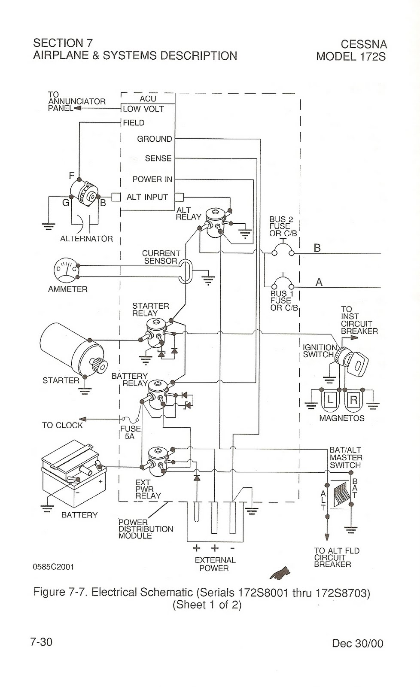

# Cessna 172N Overview

## Structure

- Semi-monocoque
- Thru-spar construction
- Nose landing gear
  - Oil/air strut, connected directly through the firewall
- Main landing gear
  - Spring steel strut, very robust
  - Hydraulic disc braking system
    - Hydraulic lines have blue fittings
- Four seats
  - Separate front seats, combined rear seat
  - Shoulder harnesses and lap belts on front seats
- Two doors
- Windows, both openable on some models
  - Max window speed is Vne

## Flight Controls

- Elevator
  - Cable-actuated
- Elevator trim
  - Single trim tab on one of the elevators
- Ailerons:
  - Frise-type ailerons, helps with adverse yaw
- Rudder
  - Rudder pedals
  - Cable actuated
  - Single manual rudder trim tab
- Nose wheel
  - Push-pull rods for ground steering
- Differential hydraulic brakes
  - Rudder with toe brakes
- Flaps:
  - Slotted flaps (Cessna calls them slotted-types flaps)
- Control lock
  - Simple pin
  - Rudder control lock also available

## Powerplant

- Lycoming O-320, 160hp at 2700 RPM
- Horizontally-opposed, air-cooled, 4-cylinder engine
  - Spinner is designed to direct airflow into the engine baffles
- Engine-driven magnetos
  - Self-contained magnets that generate electrical sparks
- Induction system
  - Air filter below the propeller, entire source of air for the engine
- Exhaust manifold which vents exhaust overboard
  - The heater is a shroud around this exhaust manifold
- Updraft-type carburetor with a venturi
- Primer used for cold-starting
- Engine controls
  - Carburetor heat for carburetor ice
  - Throttle: controls airflow to the butterfly valve in the carburetor
  - Mixture: red handle, controls fuel/air mixture
  - Ignition switch
- Engine instrumentation
  - Fuel gauges which are electric
  - Oil temperature, oil pressure gauges
  - Tachometer
- Oil system
  - Wet sump oil system, all the oil is contained in the bottom part of the engine
  - 6 quart capacity
  - Use correct SAE viscosity temperature of oil
- Propeller
  - Fixed-pitch, two blade

## Fuel system

- Two tanks within each wing
- Fuel caps, one is vented one is not
- Fuel vent on left tank below the wing
- Tube between both tanks to allow venting between tanks
- Fuel sumps on both tanks
- Gravity-fed system into a fuel selector
- Fuel strainer on the gascolator at the lower point

## Brake System

- Red hydraulic fluid which closes disc calipers on the rotors
- Parking brake, don't trust them
  - If temperature increases while it's set can cause too much pressure to build in the system

## Electrical System

- Components
  - 28V DC alternator (60A, continuous output)
    - Higher voltage than the battery so it will charge the battery
  - 24V, 14 A/h battery
    - Without the alternator, the voltage should read 24V
    - Provides 14 amps for 1 hour
  - Bi-direction ammeter
  - Over-voltage protection
  - Hobbs meter: comes on with battery but is activated by an oil pressure transducer

## Vacuum System

- Drive gyros to AI and DG
- Suction 4.2-5.5 PSI, suction gauge

## Stall Warning System

- Mechanical reed that plumbs the sound into the cockpit
- Activated by low pressure at a certain threshold, given by a certain AoA

## Static Wicks

- If you're going fast enough in precipitation you can build up static electricity on the control surfaces
- Static wicks are trailing wires that hang off the back which transmit the static off the back
