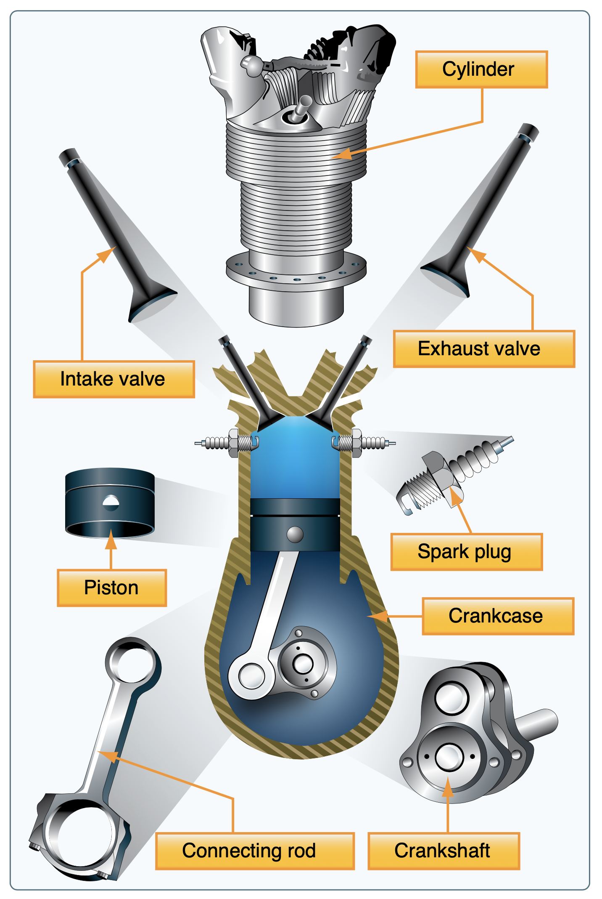
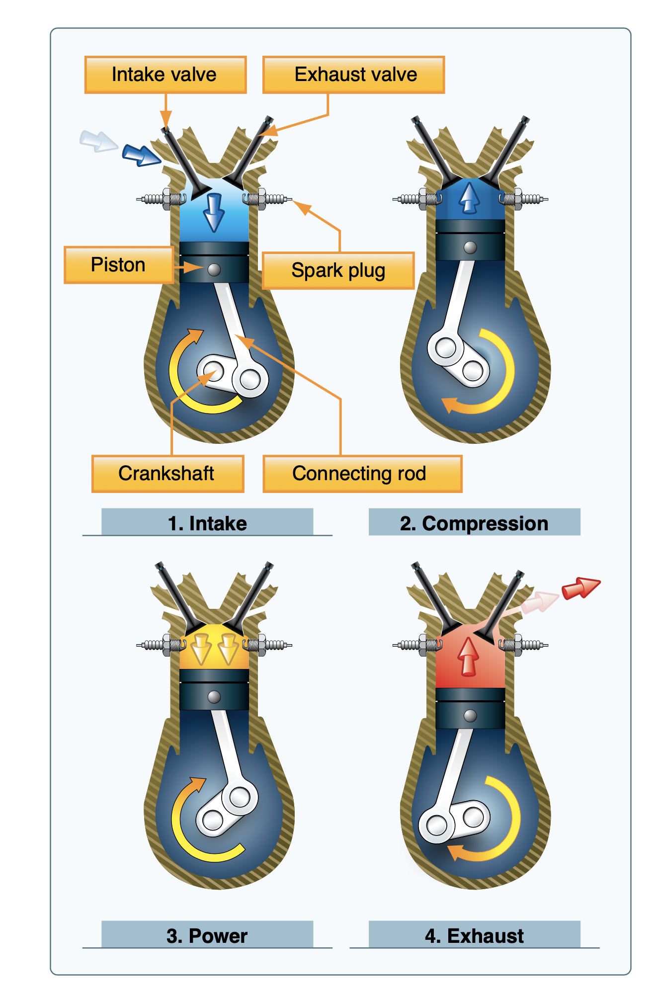
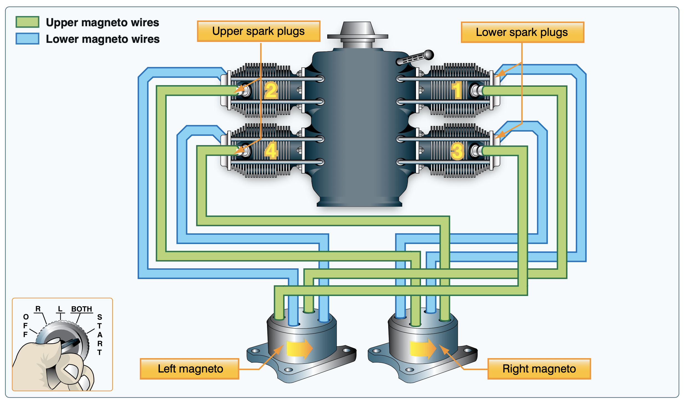

# Aircraft Powerplants

Most aircraft engines are horizontally-opposed, reciprocating, air-cooled engines.

## Pistons

- Pistons convert up and down motion to rotation via the crankshaft

## Four Strokes of an Engine

- Intake: Intake valve opens (exhaust valve closed), fuel + air drawn into cylinder
- Compression: Fuel + air mixture compressed as piston is pushed down
- Ignition: Piston pushed up from expansion
- Exhaust: Exhaust valve opens and burned gasses are expelled

## Carburetor

Carburetor supplies an intake of fuel and air from in the correct ratio.

- The venturi is a small opening that accelerates air and provides suction

## Fuel Injection

- Fuel-injected engines do no have a carburetor
- Fuel is metered in equal amount for each cylinder
- The fuel metering unit is a mechanical pump that is controlled by the throttle

## Intake Manifold

- Air intakes should take in clean air for use in the engine

## Ignition Systems

- Most aircraft have two independent ignition systems, with two spark plugs for each cylinder
- Magnetos are small generators attached directly to the crankshaft
- The current produced by the magnetos are connected to a timing unit, which sends sparks at specific intervals for the engine to fire
