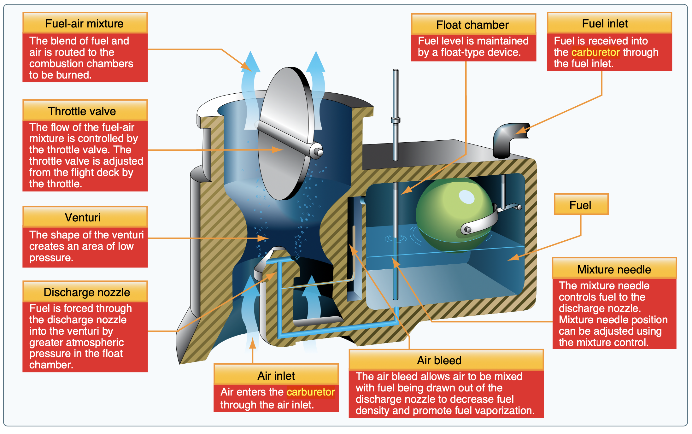

# Aircraft Powerplants

Most aircraft engines are horizontally-opposed, reciprocating, air-cooled engines.

## Pistons

- Pistons convert up and down motion to rotation via the crankshaft

## Four Strokes of an Engine

- Intake: Intake valve opens (exhaust valve closed), fuel + air drawn into cylinder
- Compression: Fuel + air mixture compressed as piston is pushed down
- Ignition: Piston pushed up from expansion
- Exhaust: Exhaust valve opens and burned gasses are expelled

## Carburetor

Carburetor supplies an intake of fuel and air to the engine cylinders in the correct ratio.

- The venturi is a small opening that accelerates air and provides suction
- Note that the fuel-air mixture lines are directed into the cylinders sequentially
  - This means the first cylinder will have the richest mixture, and it gets slightly leaner for the subsequent cylinders

## Fuel Injection

- Fuel-injected engines do no have a carburetor
- Fuel is metered in equal amount for each cylinder
- The fuel metering unit is a mechanical pump that is controlled by the throttle

## Intake Manifold

- Air intakes should take in clean air for use in the engine

## Ignition Systems

- Most aircraft have two independent ignition systems, with two spark plugs for each cylinder
- Magnetos are small generators attached directly to the crankshaft
- The current produced by the magnetos are connected to a timing unit, which sends sparks at specific intervals for the engine to fire

## Fuel Systems

- Wet wings: tanks that are coated surface of the wing structure (as opposed to tanks set within the wing)
- Low wing airplanes only have L/R fuel selectors
  - This is due to the pressure imbalance between the tanks
  - A both position would draw fuel from the lowest tank, since it has lower pressure, and run the tank dry
