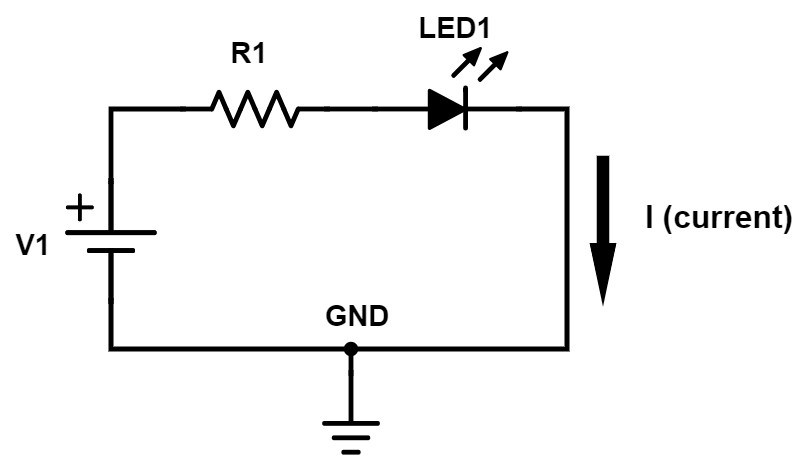
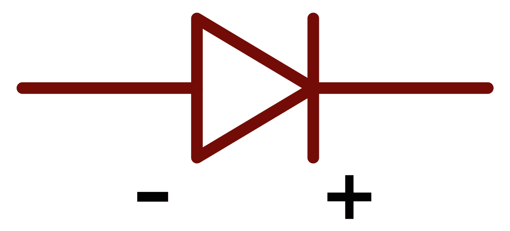

# Aircraft Electrical System

## Circuit Basics

- A circuits is a continuous path of current which carries an electrical potential.
- Loads on a circuit can be connected in parallel or series
  - When in series, any disconnection of the circuit will cause all load to lose power
  - In contrast, a parallel circuit will all operations of the other loads

## Diodes

- Diodes are one-way gates for current

## Aircraft Batteries

- Energy storage for starting and emergencies
- Lead-acid batteries are common in aircraft

## Alternators

- An alternator is connected to the crankshaft of the propeller and generates electrical power
- An alternator will require a voltage regulator to normalize the voltage of the current before being passed to the battery or electrical busses
  - An over-voltage condition is usually displayed somehow in the cockpit

## Ammeter and Load Meters

- Ammeter show battery and alternator output
  - When alternator is producing output, the ammeter will read positive
  - When the battery is being drawn, the ammeter will read negative
- Load meters only show output from the alternator

## Bus Bars

- A bus bar is common connection points for multiple electrical components
-
- Typically there are several busses for different categories of electrical items

## Master switch

- Master switch are often two-part switches
  - The left is the magneto master
  - The right is the battery master

## Fuses and Circuit Breakers

- Fuses and circuit breakers are two methods of protecting individual circuits from overload
- Circuit breakers can be reset after an overload condition is encountered
- Fuses are consumable items, and extras should be carried

## Solenoids, Relays, and Contactors

- A remote switch, which controls the open/closing of a separate circuit
- You don't want the entire current of the master battery going through a small master switch
  - A solenoid or relay allows you to mount a small switch on the panel which controls a larger switch that actually closes the master circuit
- Some small amount of electrical power is used to close a larger switch
- These are often located on the airplane's firewall

## Generators

- Coil of wire surrounding a magnets, mounted on a shaft
- When the magnet spins inside the coils current is induced
- Produces direct current output, but is dependent on the speed of the spinning shaft
- Low RPM = Low voltage

## Alternators

- Instead of a bar magnet on a shaft, an alternator uses an electromagnet
- If the voltage is too low, it can regulate the magnetism of the electromagnet to be stronger
- It outputs alternating current
- A rectifier, usually attached to the back of the unit, converts this AC power into DC power for consumption
