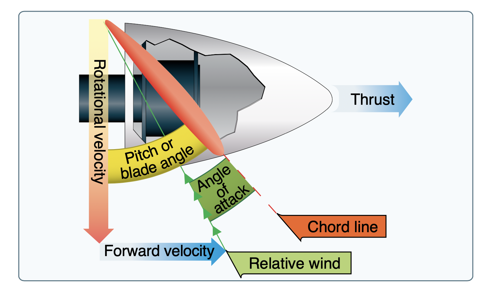
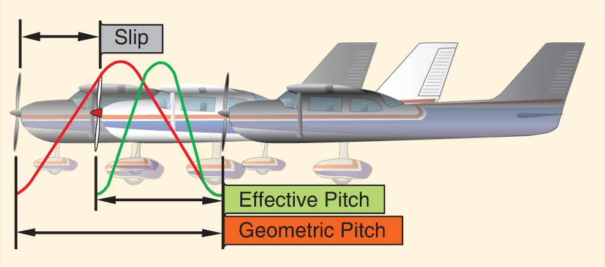
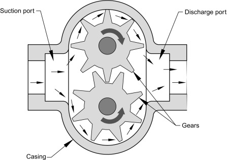
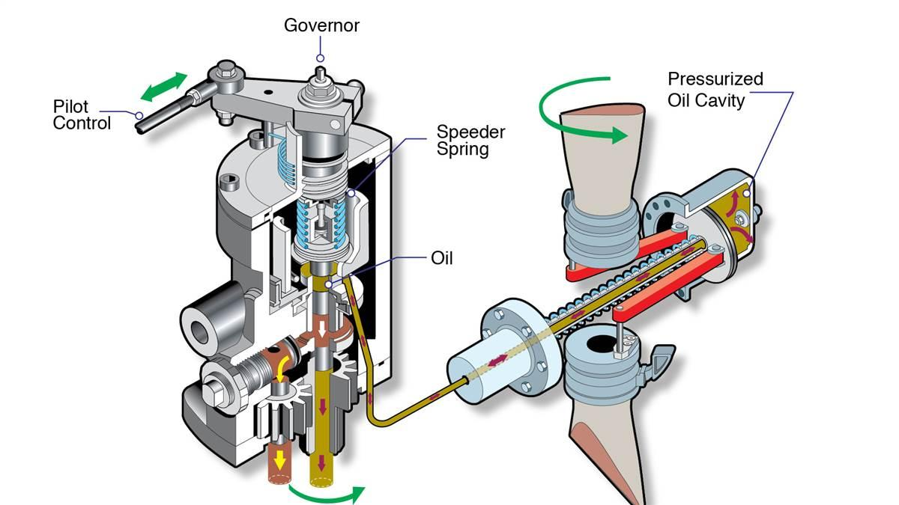
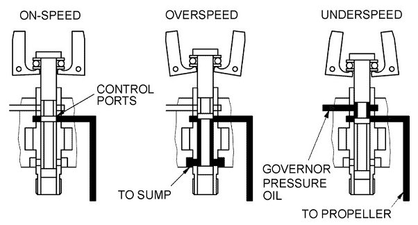
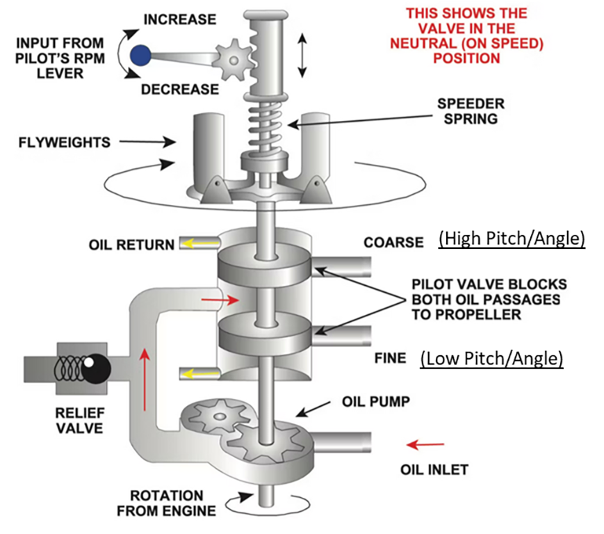
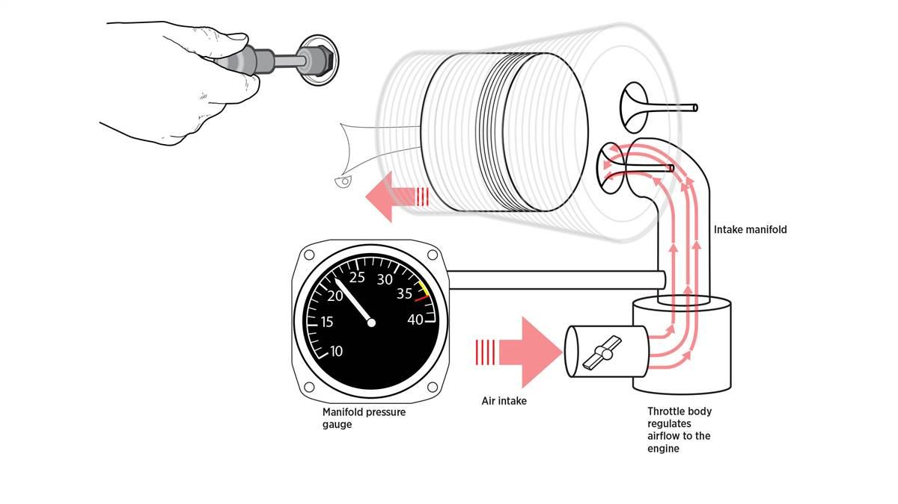

# Propellers

Propeller are rotating airfoils which produce thrust.

- When an aircraft is stationary the propeller is largely stalled
- As the aircraft speed increases the propeller becomes more efficient

## Propeller Slip

- Geometric pitch: the distance the propeller should travel based on its design
- Slippage: Distance between the geometric and effective pitch

## Propeller Twist

- For a given RPM the tip of the propeller is traveling much faster than the hub
- This means the outer portion needs a lower angle of attack to produce even thrust across the whole diameter
- For fast-spinning propeller, the tips can also approach the speed of sound

## Fixed-Pitch Propellers

- A fixed-pitch propeller is only optimal at one specific airspeed
- Different trade-offs
  - Slow speed / high angle of attack (climb propeller)
  - High speed / low angle of attack (cruise propeller)

## Constant-Speed Propellers

### Components

- Automatically adjusts the speed of the propeller to keep the RPM at a pilot-selected level
- Prop spinner houses a piston/spring assembly which can change the pitch of the propeller with oil pressure
- Engine oil pressure is ~60-90 PSI
- Spur gears are used to increase the pressure before the governor assembly

### Operation

- The speeder spring is loaded so the prop is full fine when the engine is off
- To coarsen the blade we need oil pressure to push against that spring loading

- If the prop speed decreases (like in a climb), the fly weights fall inward
  - This allows engine oil to flow out of the propeller hub assembly, making the blade finer, which in turn makes the prop spin faster
- If the prop speed increases (like in descent), the fly weights are pulled outward
  - This forces engine oil into the propeller hub, making the blades coarser, which in turn decreases the speed of the propeller
- This feedback loop between the propeller speed and fly weight speed continues until it reaches an equilibrium at a given RPM

### Speed Control

- Changing the blue propeller control in the cockpit changes the loading of the speeder spring
  - Increasing the speed (blue knob in) reduces compression on the speeder spring, meaning the prop will need to spin faster to reach equilibrium
  - Decreasing the speed (blue know out) increases compression on the speed spring, meaning oil is forced into the propeller hub and the blade is coarsened

- Note that the governor will only operate within the min and max pitch stops
  - For instance you can still observe an RPM at a lower power setting in the run-up, because the prop is still at it's full-fine setting

### Failures

- With a loss of oil pressure the propeller will go full fine
  - This can cause an overspeed condition at high power setting
  - We may need to pull power to prevent overspeeding
- 

## Manifold Pressure

A manifold pressure gauge shows the pressure (usually a partial vacuum) of the air being taken in by the engine.

- When the engine is off, the manifold pressure gauge should read ambient pressure
- As the engine starts it should read less than ambient, as air is drawn into the engine
- When changing power settings:
  - Increasing power: Increase RPM first, then increase power
  - Decreasing power: Decrease power first, then decrease RPM
- When you reduce RPM, the manifold pressure will increase slightly
  - This is because you're slowing the engine's rotation, which means each cylinder isn't "sucking" as much air
