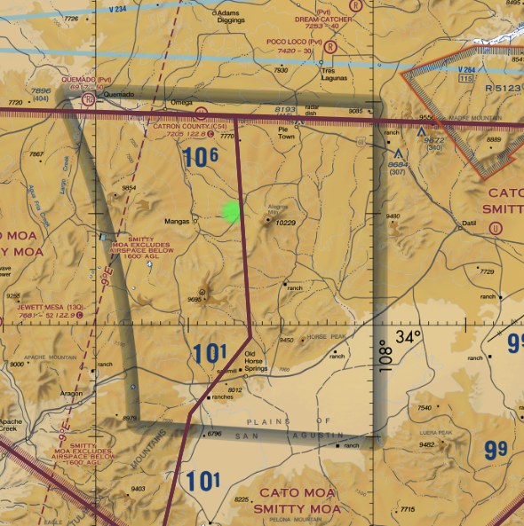
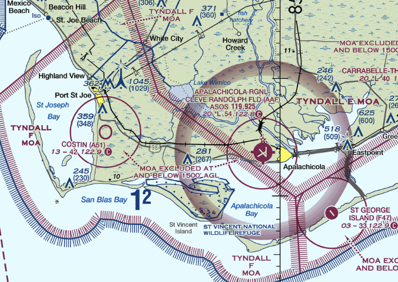

# Airspace

## 5 Cases of Airspaces

1. 1 mile, clear of clouds
2. 3 mile, clear of clouds
3. 1 miles, 500' below, 1000' above, 2000' horizontally
4. 1 miles, 500' below, 1000' above, 2000' horizontally
5. 5 miles, 1000' below, 1000' above, 1.sm horizontally

## Lesson 1: Identifying Airspace

1. Find airspace on the legend, then identify that airspace somewhere on the chart
   1. Class B: Blue solid line
   2. Class C: Magenta solid line
   3. Class D: Blue dashed line
   4. Class E at surface: Magenta dashed line
      - Used for non-precision approaches around non-towered airports
   5. Class E at 700': Purple shading
   6. Class E at 1200' AGL: Blue shading
      - These are exceptions to Class E starting at 1200' AGL
      - Within these cutouts, Class G goes from the surface up to 14,500'
      - These airspaces are going away, and most of them have been decommissioned
      - ATC cannot clear you GPS direct through this big block of Class G
   7. Class E "zipper lines"
      - Shows a boundary where Class E abuts Class G below it

## Lesson 2: Cloud Clearance and Visibilities

1. 1 mile, clear of clouds
   - Class G airspace, up to but no including 1200 AGL
2. 3 mile, clear of clouds
   - Class B Airspace
3. 1 miles, 500' below, 1000' above, 2000' horizontally
   - Class G above 1200 AGL, < 10,000' MSL
4. 3 miles, 500' below, 1000' above, 2000' horizontally
   - Class C, D, and E below 10,000' MSL
   - Class G < 10,000' MSL at night
5. 5 miles, 1000' below, 1000' above, 1.sm horizontally
   - Class E or G above 10,000' MSL

In Class G airspace, you may operate under VFR with in 1/2 mile of an airport runway:

- during the day as long as the visibility is at least 1 statute mile and you remain clear of clouds
- at night, as long as the visibility is at least 3 statute miles and you remain clear of clouds

[91.155](/_references/14-CFR/91.155)

## Lesson 3: Speed Limits and Entry Requirements

- Speed limits
  - < 10,000' MSL: 250 knots
  - In Class B Airspace: 250 knots
  - Below Class B or in a Class B corridor: 200 knots
  - Class D and C airspace within 4nm up to 2500 AGL: 200 knots
- Certificate requirements
  - Class G requires a pilot certificate
  - Class E below 10,000': A pilot certificate, no transponder
  - Class E above 10,000': A pilot certificate and a transponder
  - Class D: Establish 2-way communications (exchange of call sign and facility name)
  - Class C: Establish 2-way communications (exchange of call sign and facility name), inside and above requires a transponder
  - Class B:
    - 2-way communication with a specific clearance into the airspace
    - Student pilot certificate minimum
    - Some airports require a minimum of a private pilot certificate in Part 91 Appendix D
  - Class A:
    - On an instrument flight plan
- Automatic Dependent Surveillance: Broadcast (ADS-B)
  - Required everywhere a transponder is required
  - Plus one additional place: Within 12nm of the shoreline of the Gulf of Mexico between 3000 MSL and 10,000 MSL

## Lesson 4: Special Use Airspace and SVFR

### Special Use Airspace

- Terminal Radar Service Area (TRSA)
  - Class C-level radar service within the TRSA
  - Participation is not mandatory
- MOA
  - No clearance required
  - Find active times on the sectional legend
- Alert area
  - No clearance required
  - Concentrated flight training
  - Participation is voluntary
- Restricted Areas
  - Needs a clearance to enter ("cleared into" the airspace)
- Prohibited area
  - Cannot be entered
- Warning areas
  - Do not required a clearance, but is not recommended
- MOA exclusion area
  - Indicates an area around an airport which is excluded from a MOA
  - 
- Military training routes (MTR)
  - IR: Instrument routes
  - VR: Visual routes
  - 4 digits: < 1500'
  - 3 digits: > 1500'
- Special Flight Rules Area (SFRA)
  - Washington SFRA requires an online course and a clearance
  - The Grand Canyon also has an SFRA
- Temporary Flight Restrictions (TFRs)

### Special VFR

- The pilot must ask the controller
- Maintain 1 mile visibility and clear of clouds
- At night, pilot must be instrument rating and the aircraft instrument equipped
- Some Class B airspace will prohibit SVFR with "NO SVFR"
