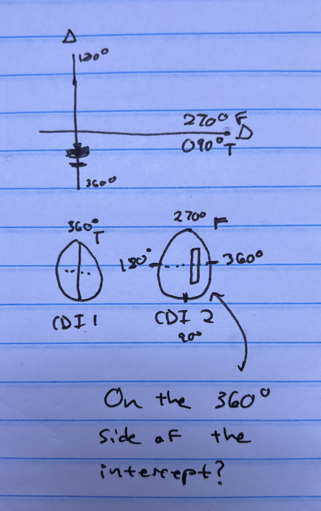

# Ground-Based Navigation

## VHF Omni-directional Range (VOR)

- Charted: VOR / VORDME / VORTAC
- Signal sweeps around starting at north
- We turn our VOR to a specific frequency, which corresponds
- TO/FROM flag
- To go to the VOR, go "to it and through it", meaning through the course
- Intercepting radial: 
  - Fly an intercept
  - Radials get further apart as you get farther from the station
- Same-side safe

