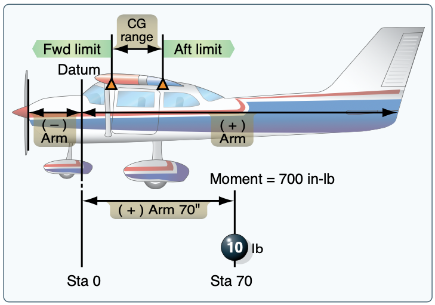
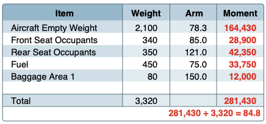
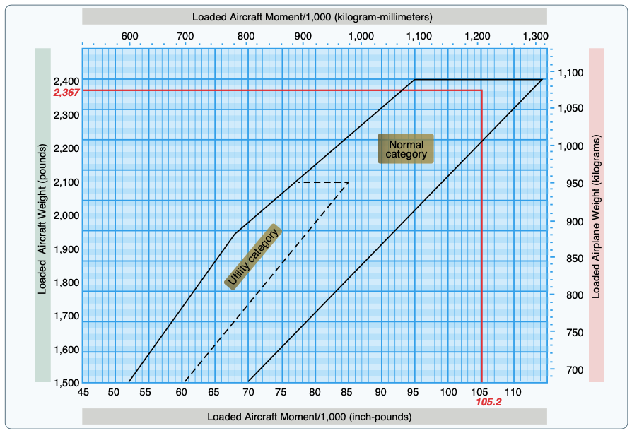

# Weight and Balance

- Set the terms of weight and balance first
- Weight
- Datum: Reference point
- Station: Arm
- Moment: Rotational force
  - $\text{Moment} = \text{Arm} * \text{Weight}$
- Center of gravity: Where the weight appears to be concentrated
- Envelope: CG and weight limits
- Licensed empty weight: does not include oil
- Max ramp weight: weight for taxi but not flight
- Zero fuel weight: maximum authorized weight minus usable fuel
- Mean aerodynamic chord: Average chord line on a airfoil
- Standard empty weight:
- Basic empty weight: the standard empty weight plus the weight of optional and special equipment that have been installed
  - Includes all oil, fluids, and unusable fuel

[Pilot's Handbook of Aeronautical Knowledge pg. 10-4](/_references/PHAK/10-4)

## Determining Weight an Balance

1. Determine empty weight
2. Determine station weights
3. Compute moments for each station
4. Sum weights for total gross weight
5. Sum moments for net moment
6. Apply to loading envelope

## Overweight Condition

- Longer takeoff roll
- Lower climb rate
- Structural compromise
- Damage on landing

## Out of CG Limits

- Not enough elevator authority
- CG forward: lower airspeed, not enough up elevator on landing
- CG aft: Higher airspeed, not enough forward elevator (during a stall)

## Effects on Performance

- As the CG moves closer to the center of pressure the airplane gets less stable
- Forward CG: elevator has to produce downdraft, which induces drag, reducing performance
  - However, this makes the airplane more stable since it has a nose-down tendency
