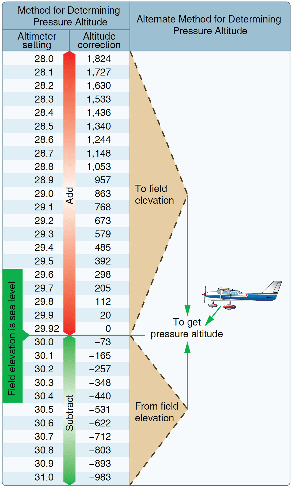
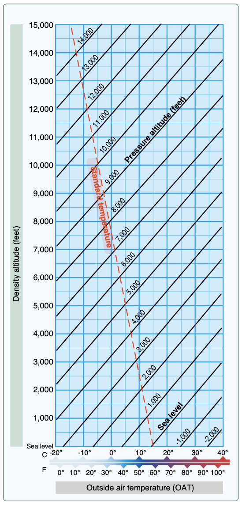

# Performance

## Terms

### Pressure altitude

- Altitude when read off the altimeter when set to standard (29.92" Hg)
- If we are set to non-standard, we need to add or subtract
- A higher ambient pressure means more air density, better performance

### Density altitude

Density altitude is the vertical distance above sea level in the standard atmosphere at which a given density is to be found.

### Indicated airspeed

Speed as read of the airspeed indicator.

### Calibrated airspeed

Indicated airspeed calibrated for position error.

- The pitot tube is mounted slightly off level from the wing
- This gives a more accurate reading during takeoff, but means its slightly off at a cruise attitude
- It also corrected for the alternate static source (in a separate chart)

### True airspeed

Calibrated airspeed corrected for nonstandard temperature and pressure. It is the speed at which the aircraft is moving through the air mass.
