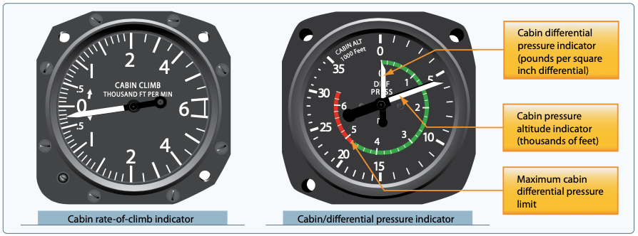

# High Altitude Flight

## Type of Oxygen Systems

- Pressure-demand
  - A mask around the face which provides pressured oxygen flow\
  - Similar to a SCUBA system
- Continuous-flow: Common in GA airplanes
  - A reservoir or bottle in the plane
  - Mask or cannula
- Diluter-demand Oxygen
  - Metering box and a rebreather bag
  - Recycling exhaled oxygen

[Pilot's Handbook of Aeronautical Knowledge pg. 7-38](/_references/PHAK/7-38)

## Pressurization

- Airplanes with a pressure hull that can withstand internal positive pressure
- Pressurized to somewhere around 8000 feet pressure altitude
- Need some kind of inflow and outflow
  - Compressed air often comes from turbochargers
  - Flow control venturi system
- Terms
  - Ambient altitude
  - Ambient pressure
  - Cabin altitude
  - Differential pressure

[Pilot's Handbook of Aeronautical Knowledge pg. 7-35](/_references/PHAK/7-35)

- Explosive decompression
  - Depressurization that's faster than the lungs can expel air
- Rapid decompression
  - Decreases the period of useful consciousness because oxygen in the lungs is exhaled rapidly
