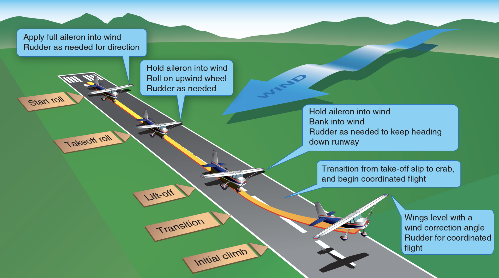

# Normal Takeoffs

## Whiteboard

<table className="maneuver-wb">

<tr>

<td className="wb-col-1">

<label>Objective</label>

Safe transition from ground to flight.

</td>

<td className="wb-col-2 maneuver-title">

<label className="maneuver-label">Normal Takeoffs</label>

(20m)

</td>

<td className="wb-col-3">

<label>Motivation</label>

Needed on every flight.

</td>

</tr>

<tr>

<td className="wb-col-1">

<label>Elements</label>

1. Takeoff principles
2. Control effectiveness
3. Left-turning tendencies
4. Ground effect
5. VX and VY
6. Flaps
7. Crosswinds
8. Takeoff distances

</td>

<td className="wb-col-2">

Transition from "driving" to "swimming" through the air

VX: Best angle of climb, reach a given altitude in the shortest horizontal distance

VY: Best rate of climb, reach a given altitude in the shortest amount of time

Takeoff distance:

- Increase with weight
- Increase with temperature
- Increase with altitude
- Decreases with headwind / Increases with tailwind

</td>

<td className="wb-col-3">

<label>Procedure</label>

1. Pre-takeoff checklist, flaps 10°
2. Clear the runway
3. Roll-out, line up with centerline, nose wheel straight
4. Controls: Into wind
5. Hold brakes
6. Smoothly apply full power, 29-29"
7. Release brakes
8. Right rudder, accelerate, airspeed alive
9. Let airplane fly off the ground
10. Smoothly pitch for VX pitch attitude
11. Once clear of any obstacles, pitch for VY
12. Flaps up

</td>

</tr>

<tr>

<td className="wb-col-1">

<label>Risk Management</label>

- Crosswinds
- Windshear
- Wake turbulence
- Throttle creep
- Engine failure
- Rotation vs climbout speed

</td>

<td className="wb-col-2">

<label>Common Errors</label>

- Abrupt throttle usage, overboosting
- Center line control
- Lift-off before rotation speed
- Climbing out before VX or VY
- "Chasing" airspeeds, not using pitch attitude

</td>

<td className="wb-col-3">

<label>Completion Standards</label>

- Maintain VY &pm;5 knots
- Position flight controls into the wind

</td>

</tr>

</table>

## References

- [Airplane Flying Handbook pg. 6-3](/_references/AFH/6-3)
- [ThrustFlight Video](https://www.youtube.com/watch?v=PITGxMbsGZM)
