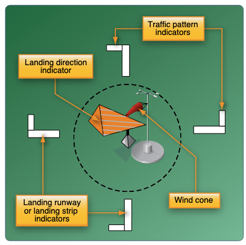
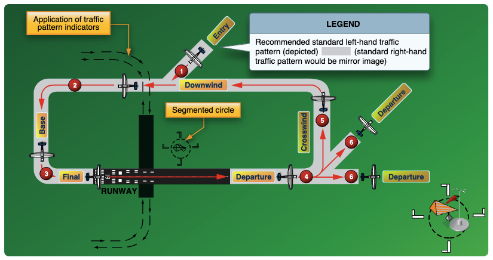

# Traffic Patterns

## Whiteboard

<table className="maneuver-wb">

<tr>

<td className="wb-col-1">

<label>Objective</label>

Describe and identify the legs of a traffic pattern, plus the standard entry and exit procedures.

</td>

<td className="wb-col-2 maneuver-title">

<label className="maneuver-label">Traffic Patterns</label>

</td>

<td className="wb-col-3">

<label>Motivation</label>

Traffic patterns get you safely in and out of the airport environment.

</td>

</tr>

<tr>

<td className="wb-col-1">

<label>Elements</label>

- Description
  - Size, shape, legs
- Direction wind
- Wind indicators
- Altitude
- Entry
- Exit
- Spacing
- Wind drift

</td>

<td className="wb-col-2"  colspan="2">

</td>

</tr>

<tr>

<td className="wb-col-1">

<label>Risk Management</label>

- Collision avoidance
- Bank angles
- Communications
- Windshear and turbulence
- Wake turbulence

</td>

<td className="wb-col-2">

<label>Common Errors</label>

- Steep bank angles
- Improper wind correction
- Improper entry
- Entry at improper altitude
- Inadequate communication

</td>

<td className="wb-col-3">

<label>Completion Standards</label>

</td>

</tr>

</table>

## References
