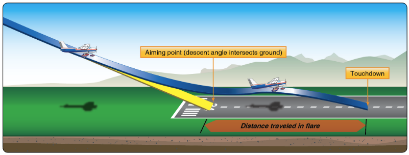

# Normal Approach and Landing

## Whiteboard

<table className="maneuver-wb">

<tr>

<td className="wb-col-1">

<label>Objective</label>

Safely transition from the air to the ground.

</td>

<td className="wb-col-2 maneuver-title">

<label className="maneuver-label">Normal Approach and Landing</label>

</td>

<td className="wb-col-3">

<label>Motivation</label>

Every takeoff requires a landing.

</td>

</tr>

<tr>

<td className="wb-col-1">

<label>Elements</label>

1. Weight to wheels
2. Touchdown, energy
3. Approach, glideslope
4. Aiming point
5. Power = Altitude / Pitch = Airspeed
6. Ground effect
7. Flare, trading A/S for altitude
8. Rollout and braking
9. Wind

</td>

<td className="wb-col-2">

- Traffic pattern diagram

</td>

<td className="wb-col-3">

<label>Procedure</label>

1. Pre-landing checklist (GUMPS)
2. Abeam touchdown: 12" MP, 90 knots, 10&deg; flaps
3. Base: 20&deg; flaps 75 knots
4. Final: 40&deg; flaps, 70 knots, stable approach
5. 10-20' above runway: Flare, reduce power smoothly
6. Watch runway end: Peripherals, judge touchdown
7. Touchdown: Elevator back pressure
8. Sufficient braking, centerline with feet

</td>

</tr>

<tr>

<td className="wb-col-1">

<label>Risk Management</label>

- Crosswinds
- Windshear
- Go-arounds
- On centerline by 500'
- Stabilized by 300'
- Tailwinds
- Steep bank angles
- Overshooting
- Stall/spin

</td>

<td className="wb-col-2">

<label>Common Errors</label>

- Not correcting for wind drift
- Undershooting/overshooting final
- Steep banks in the traffic pattern
- Poor coordination
- Stretching glide
- Excess airspeed in flare
- Insufficent airspeed in flare
- Flaring to early, too late, too fast, too slow
- Focusing too close in flare
- No aerodynamic braking
- Excessive wheel braking

</td>

<td className="wb-col-3">

<label>Completion Standards</label>

- Approach +10/-5 knots
- Touchdown +400'/-0ft (private)

</td>

</tr>

</table>

## References
