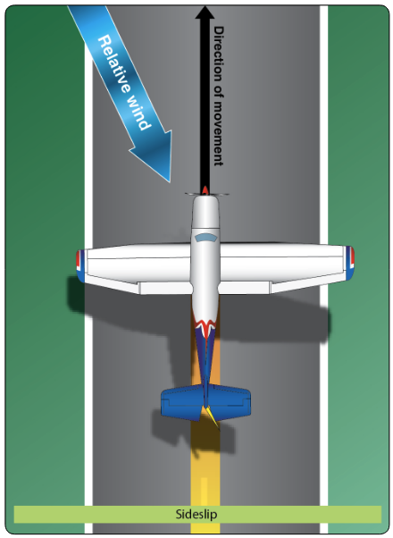

# Crosswind Landings

## Whiteboard

<table className="maneuver-wb">

<tr>

<td className="wb-col-1">

<label>Objective</label>

Land the airplane safely with winds not directly down the runway.

</td>

<td className="wb-col-2 maneuver-title">

<label className="maneuver-label">Crosswind Landings</label>

</td>

<td className="wb-col-3">

<label>Motivation</label>

Crosswind landings are an essential pilot technique for windy days.

</td>

</tr>

<tr>

<td className="wb-col-1">

<label>Elements</label>

1. Goal: Land with Longitudinal axis aligned with centerline
2. Sideload
3. Forward slip vs forward slip
4. Sideslip + wind = Longitudinal axis aligned
5. Flare, wing low
6. Upwind wheel touches first
7. Airspeed error in slip
8. Cross-wind airplane limits

</td>

<td className="wb-col-2">

</td>

<td className="wb-col-3">

<label>Procedure</label>

1. Normal downwind, base, compensating for wind
2. Final approach crab into wind
3. Transition to sideslip, align with runway
4. Flare smoothly
5. Touchdown upwind wheel first, then other main wheel
6. Gently lower the nose

</td>

</tr>

<tr>

<td className="wb-col-1">

<label>Risk Management</label>

- Stalls and spins
- Continuing a bad landing
- Crosswind limits

</td>

<td className="wb-col-2">

<label>Common Errors</label>

- Attempting to landing in conditions that exceed max demonstrated crosswind
- Not enough slip to compensate for wind drift
- Keeping correction when wind has dissipated
- Unstable approach
- Excessive sink rate
- Drift during touchdown
- Undershooting/overshooting final leg

</td>

<td className="wb-col-3">

<label>Completion Standards</label>

</td>

</tr>

</table>

## References

- [Aviation Instructor's Handbook pg. 9-15](/_references/AIH/9-15)
