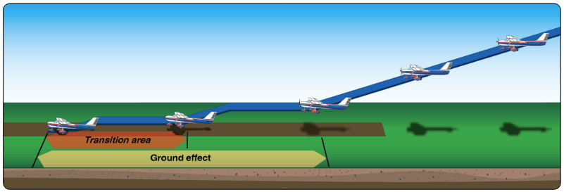

# Soft-Field Landing

## Whiteboard

<table className="maneuver-wb">

<tr>

<td className="wb-col-1">

<label>Objective</label>

Safely land on a non-hard surface runways.

</td>

<td className="wb-col-2 maneuver-title">

<label className="maneuver-label">Soft-Field Landing</label>

</td>

<td className="wb-col-3">

<label>Motivation</label>

Open up more airports and emergency landing sites.

</td>

</tr>

<tr>

<td className="wb-col-1">

<label>Elements</label>

1. Soft-field surfaces
2. Hazards, condition: Grass, mud, dirt
3. Weight to wheel: Gradually
4. Ground effect
5. Increasing AoA in flare
6. Aft elevator on rollout
7. Minimal braking
8. Keep moving

</td>

<td className="wb-col-2">

</td>

<td className="wb-col-3">

<label>Procedure</label>

1. Pre-landing checklist (GUMPS)
2. Downwind: 90 knots, 12", 10&deg; flaps
3. Base: 80 knots, 20&deg; flaps
4. Final: 70 knots, 40&deg; flaps
5. Stable approach 65-70 knots
6. Enter ground effect
7. Smooth flare, remove power
8. Don't let the airplane land
9. Touch down: Hold rear elevator pressure
10. Keep moving during turn off

</td>

</tr>

<tr>

<td className="wb-col-1">

<label>Risk Management</label>

- Surface conditions
- Sinking into surface
- Ballooning
- Crosswinds

</td>

<td className="wb-col-2">

<label>Common Errors</label>

- Excessive descent rate
- Excessive airspeed
- Rounding out too high
- Float/ballooning
- Hard touchdown
- Nose wheel "falling" down after mains touch

</td>

<td className="wb-col-3">

<label>Completion Standards</label>

- Approach speed VREF +10/-5 knots

</td>

</tr>

</table>

## References

- [Airplane Flying Handbook pg. 9-23](/_references/AFH/9-23)
