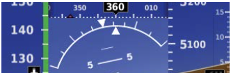

# Steep Turns

## Whiteboard

<table className="maneuver-wb">

<tr>

<td className="wb-col-1">

<label>Objective</label>

Perform a level, 360&deg; turn with 45-50&deg; bank, maintaining altitude, airspeed, and coordination.

</td>

<td className="wb-col-2 maneuver-title">

<label className="maneuver-label">Steep Turns</label>

</td>

<td className="wb-col-3">

<label>Motivation</label>

Performance maneuver for steeply turning, develops sense of turning characteristics.

</td>

</tr>

<tr>

<td className="wb-col-1">

<label>Elements</label>

1. HCL/VCL
2. Back pressure, more lift = more force
3. Load factor vs bank angle (+3.8g limits)
4. Stall speed
5. Adverse yaw
6. Procedure
7. Overbanking tendency
8. Leading the rollout

</td>

<td className="wb-col-2">

Roll scale: 10, 20, 30, 45, and 60&deg;

</td>

<td className="wb-col-3">

<label>Procedure</label>

1. [Pre-maneuver checklist](/docs/lesson-plans/maneuvers/pre-maneuver-checklist)
2. Establish &lt; maneuvering speed ~100 knots
3. Pick a point, set heading bug
4. Roll with aileron/rudder
5. Add 1" power
6. Establish turn attitude
7. Glance at airspeed, altimeter
   1. Descending: Remove bank, add pitch, add bank
   2. Climbing: Relax pitch
8. Opposite aileron as needed
9. Start rollout ~20&deg; ahead of target (for 45&deg; turn)
10. Remove power

</td>

</tr>

<tr>

<td className="wb-col-1">

<label>Risk Management</label>

- Accelerated stalls
- Spins
- Coordination
- Overstress
- Collisions
- CFIT
- Distractions and fixation

</td>

<td className="wb-col-2">

<label>Common Errors</label>

- Failure to clear the area
- Excessive pitch change on entry/recovery
- Premature rollout
- Over/undershoot rollout heading
- Poor coordination
- Poor airspeed
- Gaining/losing altitude
- Fluctuating bank angle
- No traffic scanning

</td>

<td className="wb-col-3">

<label>Completion Standards</label>

- 360&deg; turn, 45-50&deg; of bank
- &lte; VA
- Altitude &plusmn; 100 ft.
- Airspeed &plusmn; 10 knots
- Bank &plusmn; 5 &deg;
- Heading &plusmn; 10 &deg;

</td>

</tr>

</table>

## References

- 