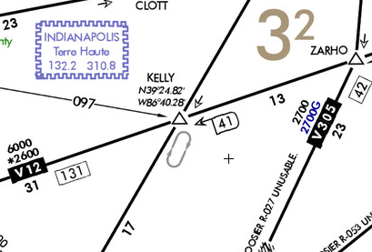
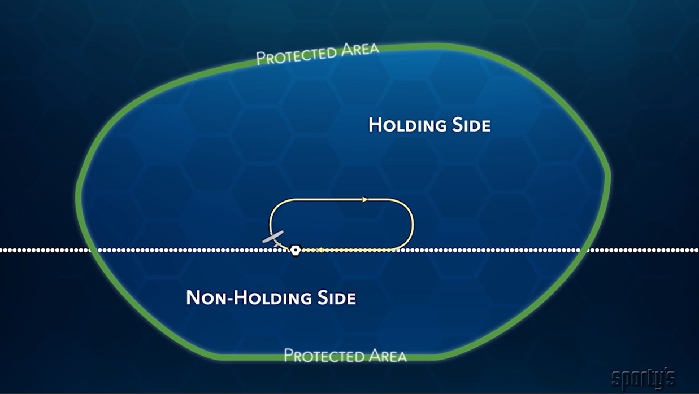

# Holding Procedures

## Objective

The student will be able to describe the purpose and structure of standard holding patterns, correctly apply the three standard entry procedures, and implement appropriate wind correction techniques.

## Motivation

Published and unpublished holds are a routine part of IFR flight and must be understood by an IFR-rated pilot.

## Timing

45 minutes

## Homework

- [Hold entries FlightInsight video](https://www.youtube.com/watch?v=hUFobPNQHPc)

## Format

- Whiteboard
- Garmin GTN Demo App

## Overview

- What is a holding pattern? When would we use one?
- Components of a holding pattern
- Holding instructions
- Hold entries
  - Direct
  - Parallel
  - Teardrop
- Flying a hold
  - VOR hold
  - DME hold
  - RNAV hold
- Hold airspace
- Wind correction
- Lost comms procedure

## Elements

### What is a holding pattern? When would we use one?

- A holding a pttern is a racetrack pattern in the sky which is used for delaying aircraft or for getting turned around onto a separate course
  - Standard holds: _right turns_
  - Non-standard holds: _left turns_

### Components of a holding pattern

- Holding fix
- Inbound course, inbound segment
- Output course
- Standard-rate turns, &lt; 30 degrees (&lt; 25&deg; with FD on)

[Draw a holding pattern]

### Hold Types

- Published
  - Approach charts (e.g. Hold-in-lieu of procedure turn, missed hold)
  - Enroute charts
    - 
- Unpublished holds
  - Instructions give by ATC

### Holding instructions

1. Direction of holding from the fix in terms of the 8 cardinal compass points (N, NE, E, SE, etc.)
2. Holding fix
3. Radial, course, bearing, airway, or route on which the aircraft is to hold
4. Leg length in miles, if DME or RNAV is to be used
5. Direction of turns, if left turns are to be made
6. Time to EFC (expect further clearance) and any pertinent additional delay info

### Hold clearance examples

- "Hold as published on the ARTTY intersection, expect further clearance at 15:30Z"
  - KSLE RNAV 31
- "Hold east of the UGB VOR on the 090&deg; radial, expect further clearance at 15:30Z"
  - No leg length was given, so 1 minute turns are expected
- "Hold north on the 360 radial of the SHEDD intersection, left turns, 4nm legs."

### Hold entries

- Start with a hold and draw the racetrack: VOR, hold south on the 240 radial
- Always start tracking inbound to the fix
- Depending on where we are, what's the best way to get into the racetrack pattern?
  - Direct: Turning directly outbound, may be more than 180&deg;
  - Parallel: Track inbound course outbound, then turn &gt;180&deg; (like 210&deg;) to intercept
  - Teardrop: Fly 30&deg; into the hold for 1 minute
- Note we want to be at holding speed with in 3 min. of holding

### Flying a hold

- Turn, time, twist, (throttle, talk)
- VOR hold: Timed hold
  - When T/F flag flips completely (over the station), start standard rate turn to the outbound heading
    - T #1: Turn
  - After completion of the turn the T/F flips again, then start a 1 minute timer
    - T #2: Time
    - T #3: Throttle (also hrottle, talk)
  - After 1 minute, start a standard rate turn to intercept the inbound leg
- Dual VOR intersection hold
  - Same as VOR hold, but we use the other VOR to determine station passage
  - Note the VOR may not be all that sensitive
- DME holds
  - Just like a VOR hold, only use the set DME distance to determine holding fix
  - Or, use DME to determine how far to fly outbound (e.g. for 4nm legs start at DME 20 fly to DME 24)
    - Don't use time to determine leg length
    - It's ok to ignore slant-range error
- RNAV hold
  - Newer GPS units (GTNs): Will determine hold entry and issue roll-steering commands to fly the hold
    - Note they may not always choose the hold entry you would chose
  - GPS demo (DTO, hold, holding directions)
    - "Hold west on the 100 degree radial of the ARTTY intersection, 4nm legs, left turns."
- OBS mode hold
  - Allows you track an inbound radial to any arbitrary fix using the GPS
  - Fly just like a timed VOR hold, except using the GPS in OBS mode
  - OBS mode demo (DTO, OBS mode, select inbound course)

### Hold protected airspace

- ~60% of the protected area is on the holding side

### Wind correction

- Crosswind correction
  - Determine an approximate wind correction angle (WCA) when flying the inbound course
  - When flying the outbound course, trip the WCA and apply it in the other direction
  - This warps the racetrack but keeps you in the protected area
- Headwind correction
  - Adjust timing of the outbound leg to make the inbound leg 1 minute
  - If the inbound leg took only 45s, make outbound leg 1min 15s on the next lap

### Hold altitudes and speeds

- Standard leg timing &le; 14,000' MSL: 1 minute
- Standard leg timing &gt; 14,000' MSL: 1.5 minutes
- Speed limits
  - Up to 6,000’: 200 knots
  - 6,001’ to 14,000’: 230 knots
  - 14,001 and higher: 265 knots

### Lost comms procedure

FAR 91.185: Leaving the Clearance Limit (CL)

- Hold until time to leave the CL
- If the CL is a fix from which an approach begins: Leave at EFC time
  - If no EFC, leave as close to the ETA based on ETE
- If the CL is not a fix from which an approach begins: Leave at EFC time
  - If none, proceed to a fix where the approach begins, and leave at ETA based on ETE

## Summary

- What is a holding pattern?
- Components: Inbound, holding fix, outbound leg, protected area
- Holding instructions: Inbound, leg length, turn direction
- Hold altitudes and speeds
- Hold entries: Direct, parallel, teardrop
- Flying a hold: VOR, DME, RNAV/GPS
- Wind correction: Note WCA inbound, apply 3x correction outbound
- Lost comms procedure

## References

- [AIM 5-3-8](https://www.faa.gov/air_traffic/publications/atpubs/aim_html/chap5_section_3.html#$paragraph5-3-8)
- [Pilot Institute Holding](https://pilotinstitute.com/holding-patterns/#what-is-distance-based-holding)
