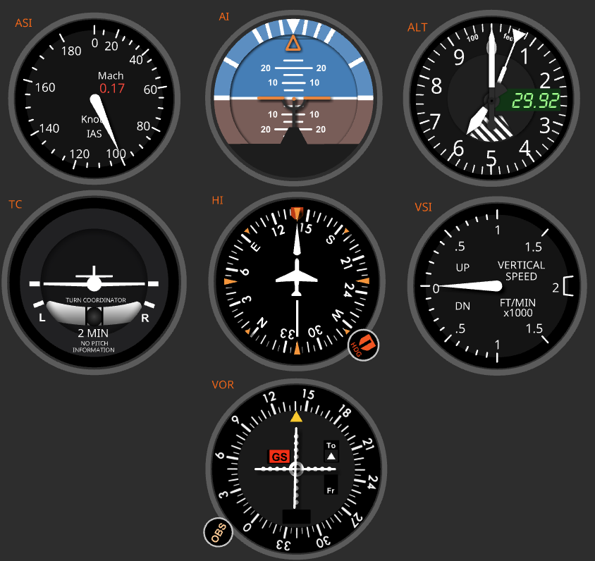
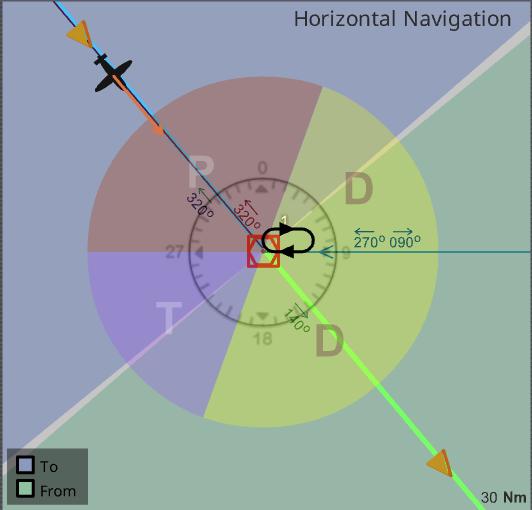
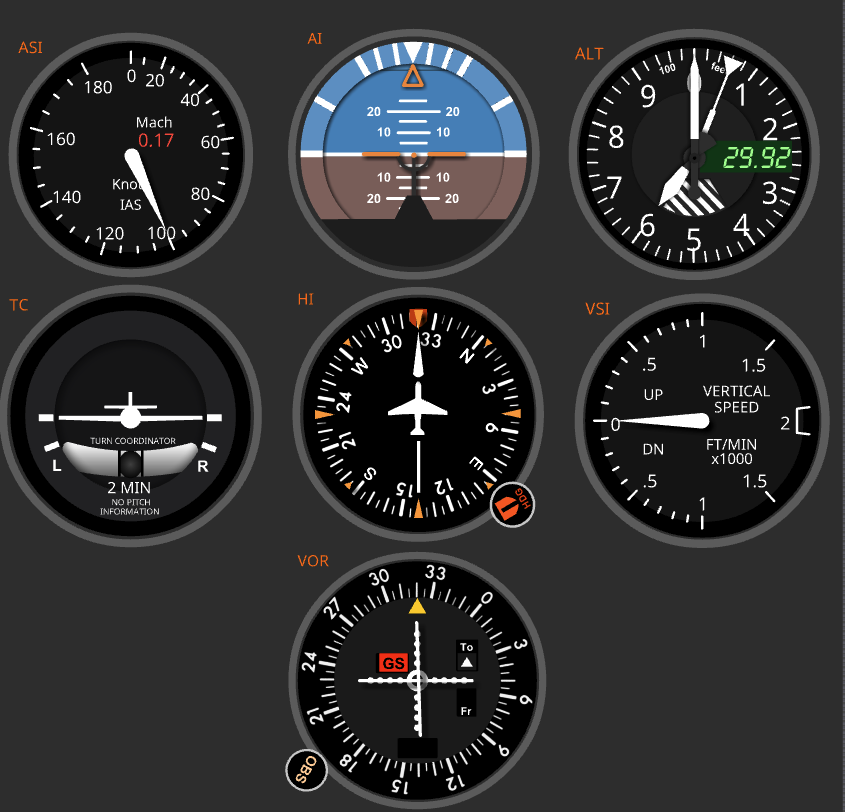
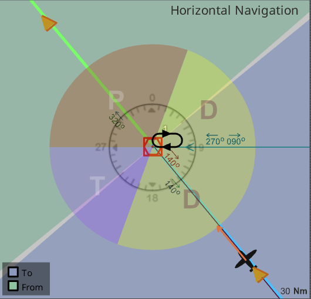
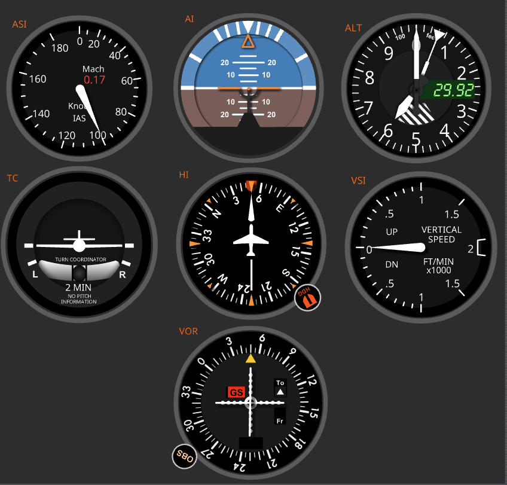
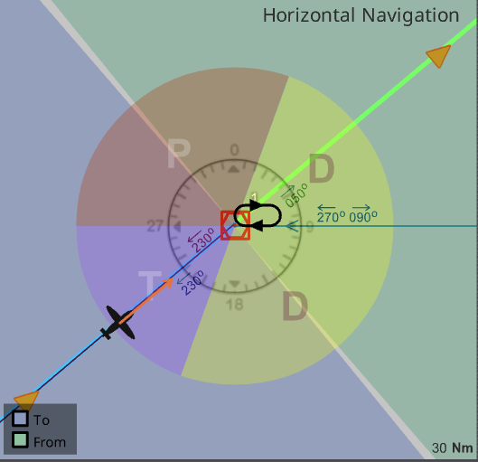
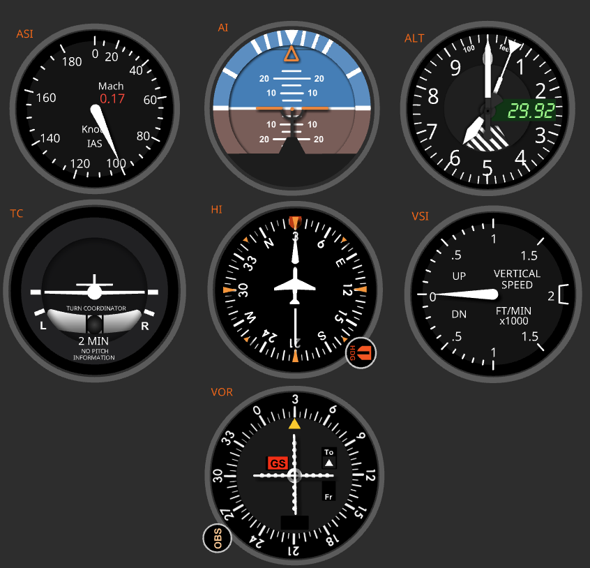
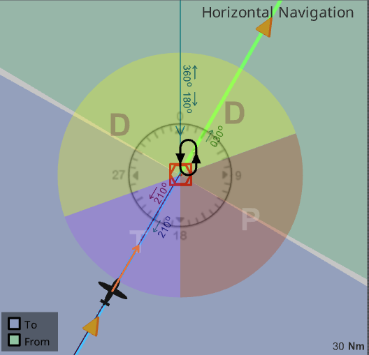

# Holding Exercises

See [IFR Sim](https://www.luizmonteiro.com/Learning_VOR_Sim.aspx)

## Problem 1

> Hold east on the 090 radial of the UBG VOR, 6000', EFC at 19:00.

Answer

## Problem 2

> Hold east on the 090 radial of the UBG VOR, 6000', EFC at 19:00.

Answer

## Problem 3

> Hold east on the 090 radial of the UBG VOR, 6000', EFC at 19:00.

Answer

## Problem 4

> Hold north on the 360 radial of the UBG VOR, left turns, 6000', EFC at 20:00.

Answer

