# Flight Instruments

## Objective

Review the pitot-static and gyroscopic instruments, their operation and errors, and emphasize how they are relied upon for IFR flight.

## Timing

45 minutes

## Format

- Whiteboard
- [Pitot Static System Simulator](https://www.luizmonteiro.com/Learning_Pitot_Sim.aspx)

## Overview

## Elements

### Pitot-Static Instruments

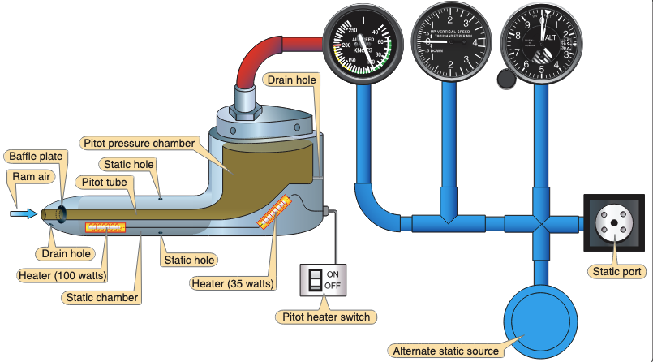

- Pitot: Pitot tube, often on the wing of GA aircraft
- Static port: Usually flush with the fuselage on the side of an aircraft
- Which instruments are pitot static instruments?

#### Altimeter (Sensitive altimeter)

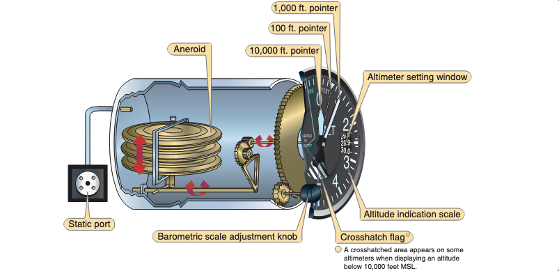

- Static ports
  - Fed by one or more static ports on the side of the aircraft
  - Some static ports may be heated
- A traditional altimeter contains an aneroid wafer with a vacuum inside
  - As ambient pressure changes, the wafer expands and contracts
  - This expansion causes the needle to move up/down
- 1” Hg = 1,000’
- Types of altitude
  - **Indicated altitude**: Read from the altimeter
  - **True altitude (MSL)**: How many feet the aircraft is above true mean sea level
  - **Pressure altitude**: Read from the altimeter when set to 29.92"
    - Also, the height in the standard atmosphere where that ambient _pressure_ would be found
  - Density altitude
    - The height in the standard atmosphere where an equivalent pressure is found after adjusting for non-standard temperature and pressure
  - Absolute altitude (AGL): Actual height above the terrain
- Altimetry errors
  - **Cold weather errors**: Cold air is more dense, therefore at the same indicated altitude the aircraft would be flying lower than is indicated
    - Think of the cylinder of air below the aircraft condensing in cold weather
  - **Warm weather errors**: Warm air is less dense, therefore at the same indicated altitude the aircraft would be flying higher than is indicated
    - Think of the cylinder of air below the aircraft expanding in hot weather
  - **Ambient pressure errors**: Altimeters also need to be set to a nearby altimeter setting to account for changes in ambient pressure
    - Flying from high to low pressure: Altimeter will indicate higher than true altitude
    - Flying from low to high pressure: Altimeter will indicate lower than true altitude
    - Altimeter should read within **75 feet** of the airport elevation ([AIM 7-2-3](/_references/AIM/7-2-3))
  - "From hot to cold, or high to low, look out below"

Simulation Scenario

[Pitot Static System Simulator](https://www.luizmonteiro.com/Learning_Pitot_Sim.aspx)

From high to low pressure

1. Set to 9000' and 120 knots
2. Manually set altimeter to 29.92
3. Change pressure to 29.45
4. Note altimeter reads 400' high (this would make us fly 400' lower)

From hot to cold temperature

1. Set to 9000' and 120 knots
2. Manually set temperature to -10&deg;
3. Note altimeter reads 300' high (this would make us fly 300' lower)

Blocked static source

1. Set to 9000' and 120 knots
2. Block static source
3. Climb to 9500', note airspeed drop and altitude doesn't change

Alternate static source

1. Set to 9000' and 120 knots
2. Block static source
3. Enable alternate static source
4. Note slight increase in altitude and airspeed (lower pressure in alt. static air)

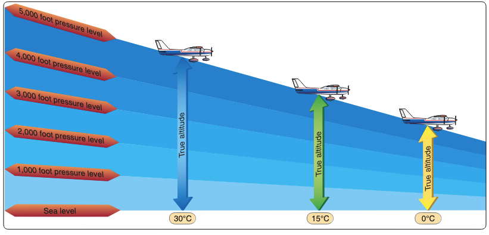

#### Vertical Speed Indicator

- Uses a diaphragm similar to an ASI, with static pressure on one side and instrument case pressure on the other
- The instrument case has a "calibrated leak" which prevents the case from changing pressure too quickly
  - Thus, the diaphragm changes immediately relative to the case pressure, which changes slowly

| Operation | Static Pressure | Diaphragm                                     | VSI Indication      |
| --------- | --------------- | --------------------------------------------- | ------------------- |
| Climb     | Decreases       | Pressure decreases, contracting the diaphragm | Indicates a climb   |
| Descent   | Increases       | Pressure increases, expanding the diaphragm   | Indicates a descent |

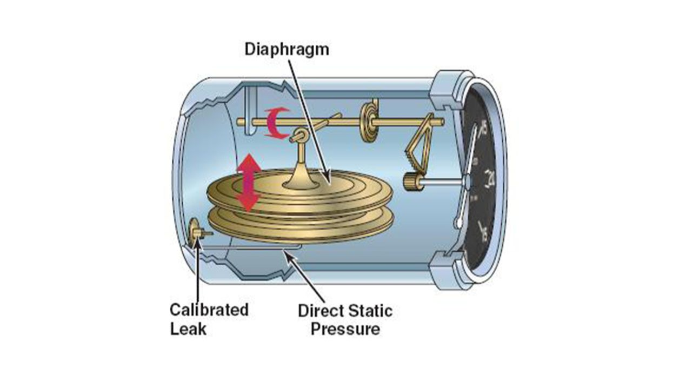

#### Airspeed Indicator

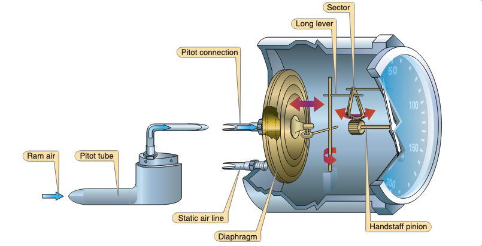

**Airspeed = (RAM air pressure - static pressure)**

- Operation
  - Pitot Tube: Diaphragm
  - Static Port: Instrument Case
- Types of Airspeed
  - **Indicated airspeed**: Read from the altimeter
  - **Calibrated airspeed**: Airspeed corrected for installation and position errors
  - **True airspeed**: The speed at which the aircraft is moving through the airmass
    - Changes in temperature and ambient pressure result in different air densities
    - This means the aircraft could be moving faster or slower through an airmass at the same indicated airspeed
    - True airspeed corrects for this
- Pitot-static errors and malfunctions
  - Blocked pitot tube (drain tube free): Indicated airspeed slowly drops to zero
  - Blocked pitot tube (drain tube blocked): Indicated airspeed drastic increases as the aircraft climbs, and decreases as it descends
  - Blocked static port: Altimeter will read altitude where it became blocked
- Alternate static source: Used for situation where the static port becomes blocked
  - Pressure inside the cabin is lower than the pressure on the outside of the fuselage
    - Altimeter reads slightly higher than actual
    - Airspeed reads slightly faster than actual

Static Simulation Scenario

[Pitot Static System Simulator](https://www.luizmonteiro.com/Learning_Pitot_Sim.aspx)

Ram blockage blockage

1. Set to 9000' and 120 knots
2. Block ram air tube
3. Note airspeed

Ram + drain blockage

1. Set to 9000' and 120 knots
2. Block RAM and drain tube
3. Note airspeed
4. Climb to 9500 and note airspeed
5. Descent to 8500 and note airspeed

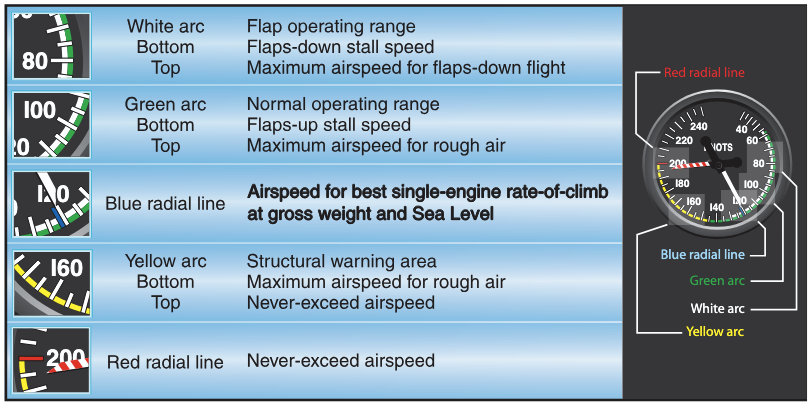

### Gyroscope Instruments

A spinning object exhibits the following qualities:

1. Rigidity in space
2. Precession

Gyroscopic instruments are often powered by:

- An electric motor
- Pneumatic systems: Venturi tubes or vacuum pumps
  - Wet-type vacuum system: Engine-driven steel vane air pump
    - Lubricated with engine oil
    - Often used with smaller, lower-flying aircraft
  - Dry-air vacuum pump
    - Oil is not mixed with the air (hence dry)
    - More suitable for higher-altitude operations where the air is thinner

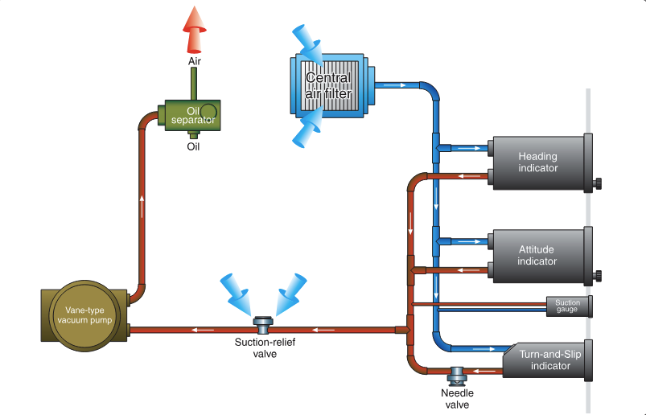

### Attitude Indicator

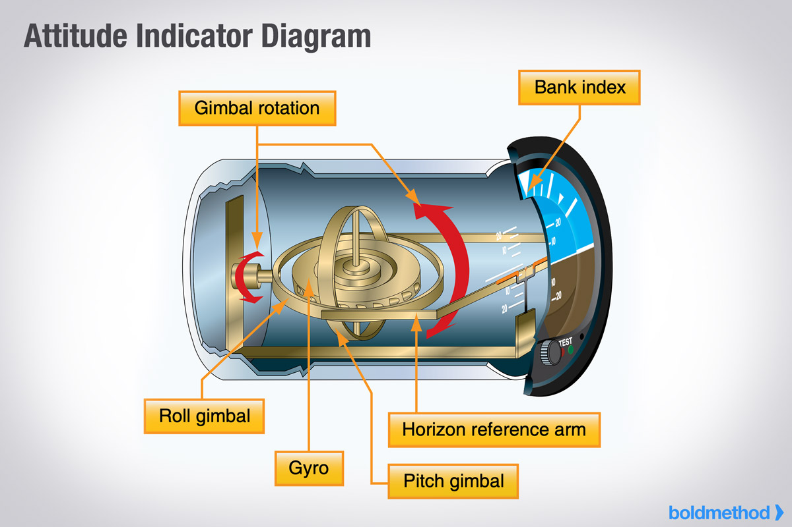

- Sometimes called an "artificial horizon"
- Operation
  - Contains a vertical spinning wheel, spun at high speeds
  - This wheel is mounted in a **double gimbal**, which allows the aircraft to pitch and bank _around_ the gyro
- Older instruments have pitch/bank limits at which the gyro tumbles, becoming unreliable
- Gyroscopic A.I.'s can take up to 5 minutes to stabilize
- Some AI's have a slight acceleration error
  - Slight nose-up indication when accelerating
  - Slight nose-down indication when decelerating

### Gyro-driven Heading Indicator

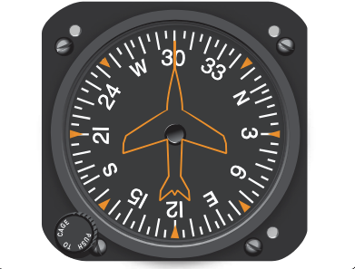

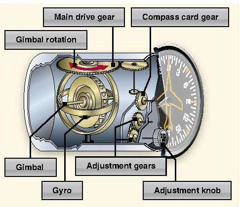

- Operation
  - Mounted in double gimbal axis (like the attitude indicator), but the spin axis is horizontal
  - Headings turn cause rotation around the aircraft's vertical axis
- These are not compasses and are _not_ north-seeking
- They must be periodically set to the magnetic compass
  - The Earth constantly rotates at 15° per hour, and the gyro is rigid in space
  - Thus, the heading error will accumulate at least at 15° per hour
  - Standard practice is to compare the compass and HI every **15 minutes**

### Remote Indicating Compass/Radio Magnetic Indicator (RMI)

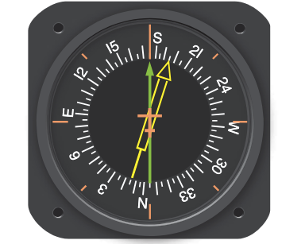

- A flux valve automatically adjusts heading as you turn
- Flux valve (pictured right): small, segmented ring of soft iron that readily accepts lines of magnetic flux. As heading changes, current in the flux valve changes, rotating the RMI’s heading
- Bearing indicator(s) overlaid on a heading indicator
  - Doesn't require constant calibration like a heading indicator
  - Gyro automatically "slaves" to the detected heading
  - These can usually operate in "slave" or "free gyro" mode

### HSI

- Operates just like an RMI, but overlays a CDI and glideslope

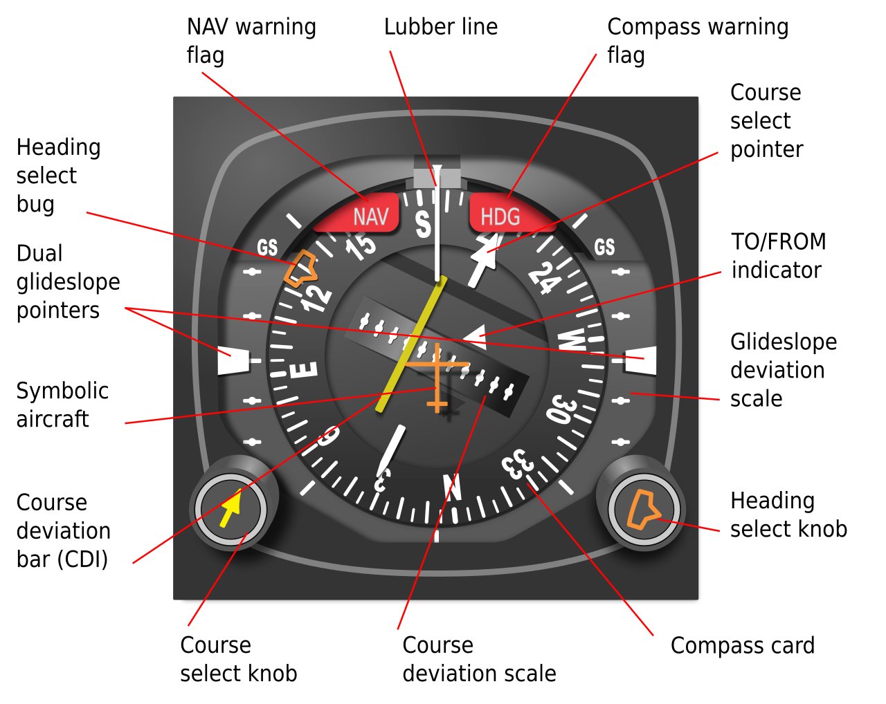

### Turn-and-Slip Indicator

- Operation
  - Operates in much the same way as the heading indicator with a vertical spinning gyro
  - Unlike an AI or HI, it only has a single gimbal
  - Yawing produces a force in the horizontal plane
  - Precession causes the gyro and its gimbal to rotate about the gimbal axis
- Used to make standard-rate turns
- Often are powered by a DC motor, for redundancy if the main vacuum pump were to fail

### Turn Coordinator

- Improvement over a basic turn-and-slip indicator
- Operates like the Turn and Slip Indicator, but the gimbal frame is angled up about 30&deg;
  - Allows it to sense both roll and yaw
- Since turns are done by roll and yaw, provides more accurate indication in initial stages of the turn

### Slip/Skid Indicator

- Also called a coordination ball or inclinometer
- The inclinometer in the instrument is a black glass ball sealed inside a curved glass tube that is partially filled with a liquid for damping
- Indication in a left turn
  - **Ball centered**: Coordinated, rate of turn rate aligned with bank
  - **Ball inside the turn**: Slipping, rate of turn not enough for bank
  - **Ball outside the turn**: Skidding, rate of turn too great for bank

### Electronic Flight Instruments

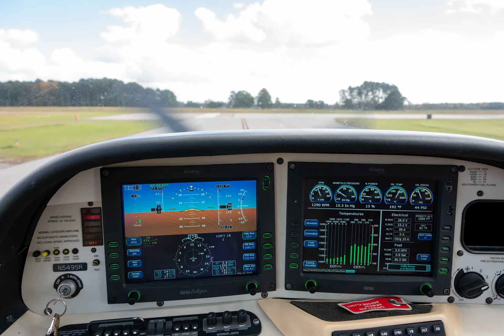

- Electronic Flight Information System (EFIS): Digital cockpit information display
  - Primary flight display (PFD)
  - Multi-function display (MFD)
- These are fed by various sub-systems
  - AHRS: Attitude and Heading Reference System (AHRS)
  - ADC: Air Data Computer: Processes pitot/static pressure and temperature information
  - Magnometer: Electronic compass
  - Computes airspeed, true airspeed, altitude, vertical speed
  - Feeds an electronic flight information display (EFIS)

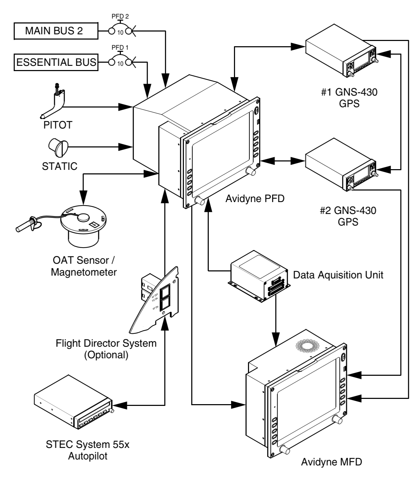

#### Primary Flight Display (PFD)

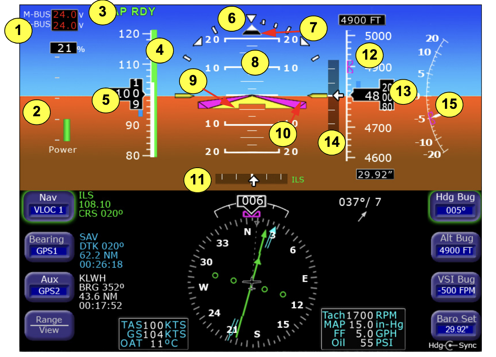

- Failure of components typically result in a red-X over the affected instrument

#### Multi-Function Display

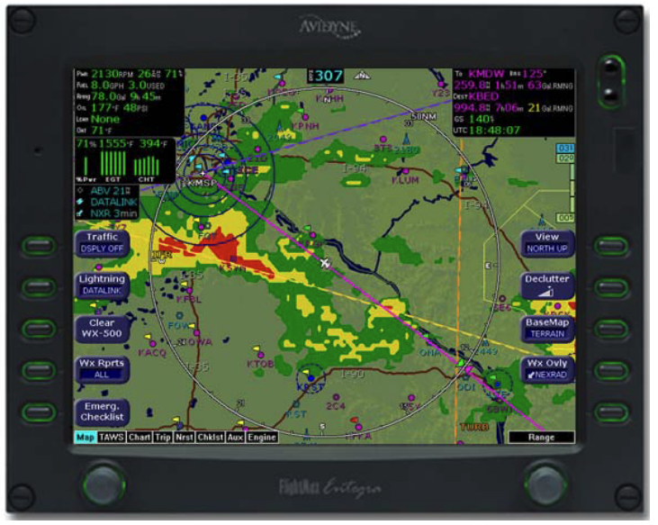

- Multi-function displays usually consist of a moving map, flight plan, terrain, and engine instrumentation

## References

- [Pitot Static System Simulator](https://www.luizmonteiro.com/Learning_Pitot_Sim.aspx)
- [Instrument Flying Handbook pg. 5-1](/_references/IFH/5-1)
- Backseat Pilot CFI-I Lesson Plans II.A.1
