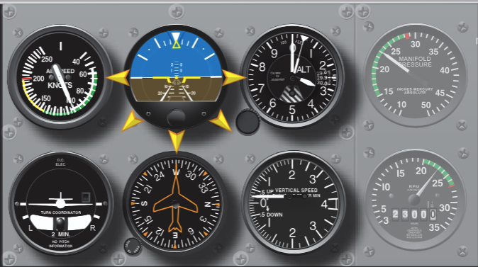
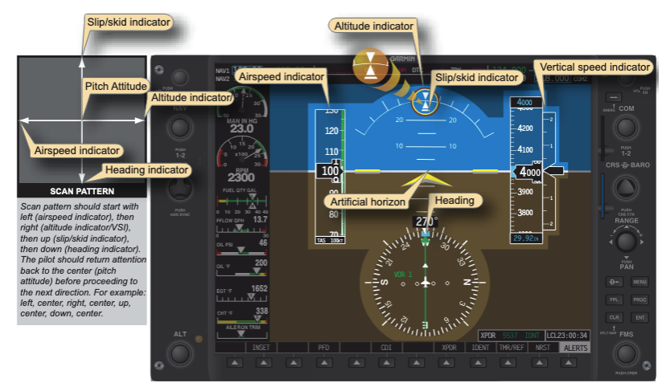
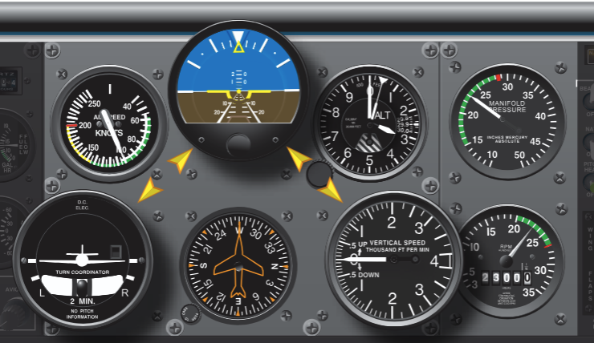
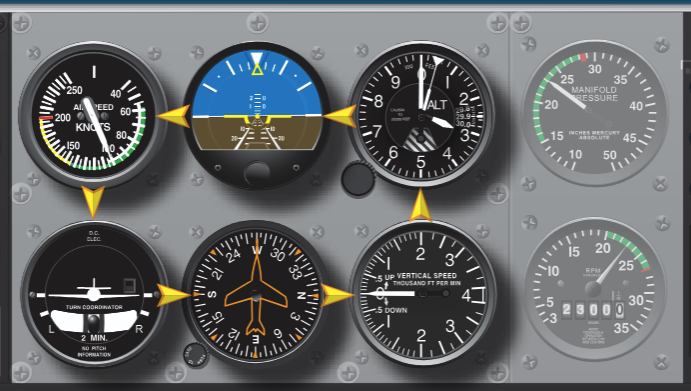

# Attitude Instrument Flying

## Objective

Introduce basic aircraft control using the standard instruments, covering instrument scan, the performance-control method, and instrument takeoffs.

## Timing

40 minutes

## Format

- Whiteboard

## Overview

- Instrument Scan
- Instrument Interpretation
- Aircraft Control
- Performance Instruments
- Control Instruments
- Primary Instruments
- Supporting Instruments
- Direct Indicating Instruments
- Indirect Indicating Instruments
- Instrument Takeoff

## Elements

### Instrument Scan

- Maintaining an instrument scan is fundamental to instrument flying
  - We want to view and interpret each instrument in rapid succession to get a clear sense of our attitude, performance, and navigation
- How fast: Recommended to change instruments faster than 1 per second
- Styles of instrument scan
  - Selected Radial Cross-Check
    - 
    - 
  - Inverted V Cross-Check
    - 
  - Rectangular Cross-Check
    - 
- Cross-check errors
  - **Fixation:** Staring at a single instrument (e.g., focusing only on the heading indicator during a turn).
  - **Omission:** Failing to include an instrument that provides critical information for the maneuver (e.g., omitting the heading indicator when recovering from a turn).
  - **Emphasis:** Placing too much reliance or attention on a single instrument instead of the combination necessary for attitude information.
- Instrument interpretation
  - Understanding each instrument's operating principles and **applying this knowledge to the performance of the aircraft** being flown
  - Recognizing what performance to expect and the combination of instruments needed to maintain or correct aircraft control
  - For example: What does a maximum performance climb look like with all your instruments?

### Control and Performance

- Control and performance is all about setting the aircraft into a known configuration, then confirming you're getting the performance that you expect
- Steps
  1. **Establish** a known pitch and power setting
  2. **Trim** to relieve control pressure
  3. **Cross**-check performance instruments
  4. **Adjust** pitch/power as necessary
     - Restrict the Attitude Indicator’s displacement to ½ - 1 bar width movements up or down
- Control Instruments
  - These instruments provide **immediate indications of attitude and power**. They are used primarily to **establish** the desired pitch and power settings.
  - Examples: Attitude Indicator and Power Indicators (e.g., manifold pressure, tachometer/RPM)
- Performance Instruments
  - These instruments indicate the aircraft's actual performance resulting from inputs made to the control instruments
  - Examples: Altimeter, Airspeed Indicator (ASI), Vertical Speed Indicator (VSI), Heading Indicator, and Turn Coordinator

### Primary and Secondary

- Instruments are grouped as they relate to control function and aircraft performance as pitch control, bank control, power control, and trim.
  - **Pitch** Instruments
    1. Attitude Indicator
    2. Altimeter
    3. Airspeed Indicator
    4. Vertical Speed Indicator (VSI)
  - **Bank** Instruments
    1. Attitude Indicator
    2. Heading Indicator
    3. Turn Coordinator
    4. Magnetic Compass
  - **Power** Instruments
    1. Manifold Pressure Gauge and/or Tachometer
    2. Airspeed Indicator
- Depending on the maneuver desired, you place different emphasis on different instruments.
- Each instrument provides a direct and/or indirect indication of attitude
  - Attitude indicator: Direct indication of pitch and bank
  - Airspeed indicator: Direct indication of power, indirect indication of pitch
  - Altimeter: Indirect indication of pitch
  - Turn coordinator: Indirect indication of bank
  - Heading indicator: Indirect indication of bank
  - Vertical speed indicator: Indirect indication of pitch

<table>
  <thead>
    <tr>
      <th>Flight Condition</th>
      <th>Pitch Instruments</th>
      <th>Bank Instruments</th>
      <th>Power Instruments</th>
    </tr>
  </thead>
  <tbody>
    <tr>
      <td>Straight and level</td>
      <td>
        <strong>Altimeter (primary)</strong>  
        Attitude Indicator (supporting)  
        VSI (supporting)
      </td>
      <td>
        <strong>Heading Indicator (primary)</strong>  
        Attitude Indicator (supporting)  
        Turn Coordinator (supporting)
      </td>
      <td>
        <strong>Airspeed (primary)</strong>  
        Tachometer and/or MP (supporting)
      </td>
    </tr>
    <tr>
      <td>Airspeed changes in straight and level flight</td>
      <td>
        <strong>Altimeter (primary)</strong>  
        Attitude Indicator (supporting)  
        VSI (supporting)
      </td>
      <td>
        <strong>Heading Indicator (primary)</strong>  
        Attitude Indicator (supporting)  
        Turn Coordinator (supporting)
      </td>
      <td>
        <strong>Tachometer and/or MP (primary)</strong>  
        Airspeed (supporting)
      </td>
    </tr>
    <tr>
      <td>Establishing a level standard rate turn</td>
      <td>
        <strong>Altimeter (primary)</strong>  
        Attitude Indicator (supporting)  
        VSI (supporting)
      </td>
      <td>
        <strong>Attitude Indicator (primary)</strong>  
        Turn Coordinator (supporting)
      </td>
      <td>
        <strong>Airspeed (primary)</strong>  
        Tachometer and/or MP (supporting)
      </td>
    </tr>
    <tr>
      <td>Stabilized standard rate turn</td>
      <td>
        <strong>Altimeter (primary)</strong>  
        Attitude Indicator (supporting)  
        VSI (supporting)
      </td>
      <td>
        <strong>Turn Coordinator (primary)</strong>  
        Attitude Indicator (supporting)
      </td>
      <td>
        <strong>Airspeed (primary)</strong>  
        Tachometer and/or MP (supporting)
      </td>
    </tr>
    <tr>
      <td>Change of airspeed in level turn</td>
      <td>
        <strong>Altimeter (primary)</strong>  
        Attitude Indicator (supporting)  
        VSI (supporting)
      </td>
      <td>
        <strong>Turn Coordinator (primary)</strong>  
        Attitude Indicator (supporting)
      </td>
      <td>
        <strong>Tachometer and/or MP (primary)</strong>  
        Airspeed (supporting)
      </td>
    </tr>
    <tr>
      <td>Straight and level to constant airspeed climb</td>
      <td>
        <strong>Attitude Indicator (primary)</strong>  
        Airspeed (supporting)  
        VSI (supporting)
      </td>
      <td>
        <strong>Heading Indicator (primary)</strong>  
        Attitude Indicator (supporting)  
        Turn Coordinator (supporting)
      </td>
      <td>
        <strong>Tachometer and/or MP (primary)</strong>  
        Airspeed (supporting)
      </td>
    </tr>
    <tr>
      <td>Straight constant airspeed climb</td>
      <td>
        <strong>Airspeed (primary)</strong>  
        Attitude Indicator (supporting)  
        VSI (supporting)
      </td>
      <td>
        <strong>Heading Indicator (primary)</strong>  
        Attitude Indicator (supporting)  
        Turn Coordinator (supporting)
      </td>
      <td>
        <strong>Tachometer and/or MP (primary)</strong>  
        Airspeed (supporting)
      </td>
    </tr>
    <tr>
      <td>Straight constant rate climb</td>
      <td>
        <strong>VSI (primary)</strong>  
        Attitude Indicator (supporting)
      </td>
      <td>
        <strong>Heading Indicator (primary)</strong>  
        Attitude Indicator (supporting)  
        Turn Coordinator (supporting)
      </td>
      <td>
        <strong>Airspeed (primary)</strong>  
        Tachometer and/or MP (supporting)
      </td>
    </tr>
  </tbody>
</table>

### Instrument Takeoff

- A sudden rapid transition from "visual" to "instrument" flight can result in serious disorientation and control problems
- Basic procedure

  1. Line up with the intended runway
  2. Hold the brakes firmly to avoid creeping
  3. Set the heading bug to the runway heading
  4. Apply takeoff power, confirm power, then release the brakes
  5. Cross-check the heading indicator and ASI during takeoff roll
  6. At rotation speed gently increase back-pressure (don't pull the airplane off the runway)
  7. Maintain runway heading during climb out, maintain coordination
  8. Cross-check ASI, altimeter, and VSI to determine climb performance
  9. At a safe altitude raise the flaps and gear

- Common Errors in Instrument Takeoffs
  1. **Failure to perform an adequate flight deck check before the takeoff**. Pilots have attempted instrument takeoffs with inoperative airspeed indicators (pitot tube obstructed), gyros caged, controls locked, and numerous other oversights due to haste or carelessness.
  2. **Improper alignment on the runway**. This may result from improper brake application, allowing the airplane to creep after alignment or from alignment with the nosewheel or tailwheel cocked. In any case, the result is a built-in directional control problem as the takeoff starts.
  3. **Improper application of power**. Abrupt application of power complicates directional control. Add power with a smooth, uninterrupted motion.
  4. **Improper use of brakes**. Incorrect seat or rudder pedal adjustment, with feet in an uncomfortable position, frequently cause inadvertent application of brakes and excessive heading changes.
  5. **Overcontrolling rudder pedals**. This fault may be caused by late recognition of heading changes, tension on the controls, misinterpretation of the heading indicator (and correcting in the wrong direction), failure to appreciate changing effectiveness of rudder control as the aircraft accelerates, and other factors. If heading changes are observed and corrected instantly with small movement of the rudder pedals, swerving tendencies can be reduced.
  6. **Failure to maintain attitude after becoming airborne**. If the pilot reacts to seat-of-the-pants sensations when the airplane lifts off, pitch control is guesswork. The pilot may either allow excessive pitch or apply excessive forward elevator pressure, depending on the reaction to trim changes.
  7. **Inadequate cross-check**. Fixations are likely during trim changes, attitude changes, gear and flap retractions, and power changes. Once an instrument or a control input is applied, continue the cross-check and note the effect during the next cross-check sequence.
  8. **Inadequate interpretation of instruments**. Failure to understand instrument indications immediately indicates that further study of the maneuver is necessary.

## References

- [Instrument Flying Handbook pg. 6-1](/_references/IFH/6-1)
- [Instrument Flying Handbook pg. 7-29](/_references/IFH/7-29)
- Backseat Pilot CFI-I Lesson Plans VI.A-E
- FlightInsight Airplane Knowledge Test Guide: Chapter 1 - Fundamentals of IFR
