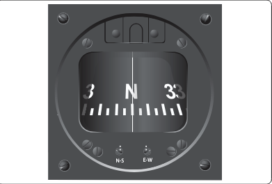
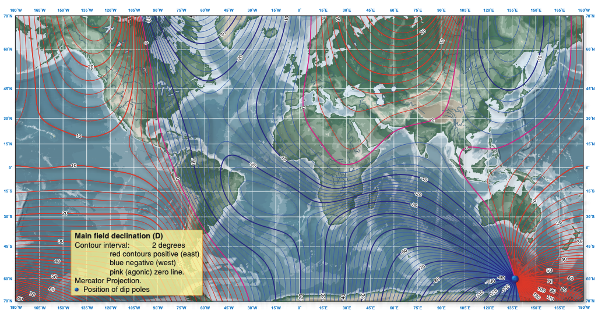

# Magnetic Compass

## Objective

Review the magnetic compass construction, operation, errors, and usage under IFR. Also introduce timed turns and partial panel turns.

## Timing

- 30 minutes

## Format

- Whiteboard

## Overview

- Magnetic Compass Construction
- Magnetic Deviation
- Magnetic Variation
- Magnetic Dip
- Northerly Turning Error
- Acceleration Error
- Oscillation Error
- Turns to Magnetic Compass Headings
- Emergency Alternatives to Magnetic Compass Turns
- Calibrating Turn Coordinator
- Timed Turns

## Elements

### Construction

- An aircraft magnetic compass has two small magnets attached to a metal float sealed inside a bowl of clear compass fluid similar to kerosene. The buoyancy of the float takes most of the weight off the pivot
- A graduate scale, called a card, is wrapped around the float and viewed through a glass window with a lubber line across it
- This jewel-and-pivot type mounting allows the float freedom to rotate and tilt up to approximately 18° angle of bank
- The compass card stays stationary, and the pilot turns around it
- Oscillation errors: Erratic movement of the card caused my turbulence or rough control inputs

### Magnetic Deviation

- Magnetic fields caused by aircraft electronics and wiring can effect the magnetic compass
  - This induced error is called **compass deviation**
  - The compass card in your airplane will show the error
  - Note: electronic heading indicators will internally compensate for magnetic deviation

### Magnetic Variation

- The location of true north (geographic north), and magnetic north are not the same place.
  - Magnetic north also changes over time as the Earth's magnetic field change
- **Magnetic variation** is the error caused by the difference between true and magnetic north
  - Corrected by **isogonic** lines, or lines of equal variation
  - These are dashed magenta lines on a sectional
  - **Agonic** Line: The line along which the two poles are aligned, and there is no variation
- Correcting for magnetic variation
  - True course ± variation = magnetic course
  - Remember: East is Least, West is Best
    - Subtract easterly variations to get a magnetic heading
    - Add westerly variations to get a magnetic heading

### Dip Errors

- Acceleration errors: On east or west heading, the compass will show a
  momentary turn to the north when accelerating, and to the sound when
  decelerating.
  - **A**ccelerate
  - **N**orth
  - **D**ecelerate
  - **S**outh
- Northerly turning errors: On north or south headings, the compass will lead
  in the north half of the turn, and lag in the south half of the turn.
  - **U**ndershoot
  - **N**orth
  - **O**vershoot
    - **S**outh

## Turns to Magnetic Compass Headings

- A **northerly** turn should be stopped prior to arrival at the desired heading
  - One rule of thumb to correct for this leading error is to stop the turn 15° plus half of the latitude (e.g. 15 + 45 = 60)
- A **southerly** turns, the aircraft should be allowed to pass the desired heading prior to stopping the turn

## Timed Turns

- A standard rate turn in **2 minutes for a 360&deg; turn**, or **60 seconds for a 180&deg; turn**
  - This is a turn rate of **3&deg; per second**
  - E.g., 45-degree turn: 15 seconds
- Instruments during a timed turn
  - Bank: Mini aircraft (turn coordinator)
  - Pitch: Altimeter
  - Power: Airspeed Indicator
- How to make a timed turn
  1. Smoothly enter a standard rate turn and start the clock (alternatively you can wait until the second hand passes a cardinal point on the clock)
  2. Maintain your scan and crosscheck for bank, airspeed, attitude
  3. Start your rollout when the time expires, cross-check your heading indicator
- Partial-panel timed turn
  - No heading or attitude indicator to reference
  - Turn coordinator still primary instrument; cross-check altimeter/VSI/ASI for pitch
  - Check magnetic compass after the completion of the turn

#### Turn Coordinator Calibration

1. Prior to performing timed turns, calibrate the turn coordinator to determine its accuracy
2. Note heading & start a standard rate turn as the second hand passes a cardinal direction (12, 3, 6, 9)
3. Hold standard rate and note heading changes every 10 seconds (should be 30o of turn)
4. If the amount of turn is more or less than 30o, adjust bank to obtain standard rate
5. Check the standard rate bank in both directions, use the corrected bank angle for all timed turns

## References

- [Instrument Flying Handbook pg. 5-10](/_references/IFH/5-10)
- Backseat Pilot CFI-I Lesson Plans: VI.F. Timed Turns to Magnetic Headings
