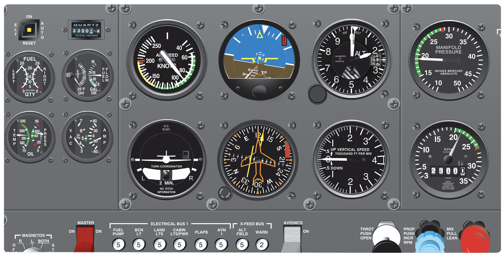

# Unusual Attitudes

## Objective

Understand vacuum system failures and how to transition to partial panel flight using conventional instruments. Also discuss "partial panel" flight using an Electronic Flight Information System (EFIS).

Discuss and understand unusual attitude recovery, both full and partial panel.

## Timing

30 minutes

## Format

- Whiteboard
- Aircraft model

## Overview

- Partial Panel Instrument Flight
- Unusual Attitude Recoveries - Full Panel
- Unusual Attitude Recoveries - Partial Panel

## Elements

### Partial Panel Instrument Flight

#### Traditional Panel Vacuum System Failure

- Vacuum system
  - In traditional 6-pack, the AI and heading indicator are vacuum-driven
  - Aircraft often have a vacuum suction gauge
- Vacuum system failure symptoms
  - Erroneous readings when compared with the electrically-driven turn coordinator and the pitot-static instruments is how you identify vacuum system failure
  - As the gyroscopes slow down, they may wander, which, if connected to the autopilot and/or flight director, can cause incorrect movement or erroneous indications
  - Importance of visual scan and cross-check
- How the instrument scan changes
  - **Altimeter, airspeed, and VSI** become primary pitch instruments
  - **Turn coordinator** becomes our primary bank indication
  - We rely on the magnetic compass for heading information
  - We utilize timed turns to turn to specific headings

#### EFIS Panel "Partial Panel"

- In EFIS or "glass cockpit" aircraft, the traditional gyroscopic instruments are replaced by the **Attitude and Heading Reference System (AHRS)** and the **Air Data Computer (ADC)**.
- Complete failure of the AHRS or ADC (or some intermediate component), results in a **Red X** displayed over the relevant EFIS component
- Some systems (like the G1000) have a reversionary mode
  - This puts the PFD on the MFD display
- For a complete electrical failure, rely on the backup instruments
- Use all tools at your disposal
  - Ask for radar vectors out of IFR conditions
  - Use your iPad's attitude indicator and map

### Unusual Attitude Recoveries - Full Panel

- Reasons for unusual attitudes
  - Turbulence
  - Disorientation
  - Instrument failure
  - Confusion
  - Preoccupation with flight deck duties
  - Carelessness in cross-checking
  - Lack of proficiency in aircraft control
- Nose-high attitudes
  - Identified by
    - Attitude indicator: **Nose-high**
    - Altimeter needle: **Climbing**
    - Vertical speed needle: **Positive**
    - Airspeed needle: **Falling**
  - Recovery
    1. Power: **Go-around power** ("Blue: power through")
    2. Elevator: **Lower the nose**
    3. Aileron and rudder: **Remove bank**
    4. Pitch attitude is indicated by the reversal and stabilization of altimeter and ASI
- Nose-low attitudes
  - Identified by
    - Attitude indicator: **Nose-low**
    - Altimeter needle: **Descending**
    - Vertical speed needle: **Negative**
    - Airspeed needle: **Increasing**
  - Recovery
    1. Power: **Idle** ("Brown: power down")
    2. Rudder and aileron: **Level the wings**
    3. Elevator: **Slowly pull** out of dive
    4. Pitch attitude is indicated by the reversal and stabilization of altimeter and ASI
- Tips
  - Recovery can be made almost simultaneously
  - Beware of over-controlling
- Some attitude indicators have bank/pitch limits
  - Exceeding these limits can cause the AI to "tumble" (these are called "spillable" AIs)
  - In this case we want to rely on our secondary instruments
  - Some instruments also experience errors up to 5&deg; at large bank/pitch angles
  - Electronic attitude indicators are not usually "spillable"

### Unusual Attitude Recoveries - Partial Panel

- Same procedure as full-panel recovery
- Secondary instruments become primary instruments:
  - Altimeter, ASI, VSI are primary pitch instruments
  - Turn coordinator is primary bank instrument

### Common Errors in Unusual Attitude Recovery

1. Failure to keep the airplane properly trimmed. A flight deck interruption when holding pressures can easily lead to inadvertent entry into unusual attitudes.
2. Disorganized flight deck. Hunting for charts, logs, computers, etc., can seriously distract attention from the instruments.
3. Slow cross-check and fixations. The impulse is to stop and stare when noting an instrument discrepancy unless a pilot has trained enough to develop the skill required for immediate recognition.
4. Attempting to recover by sensory sensations other than sight.

## References

- [Instrument Flying Handbook pg. 7-26](/_references/IFH/7-26)
