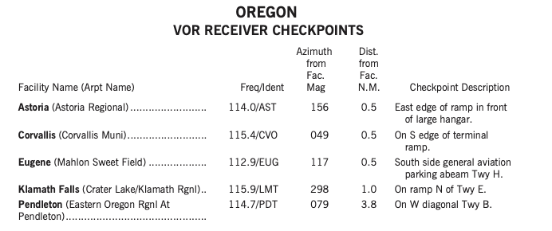
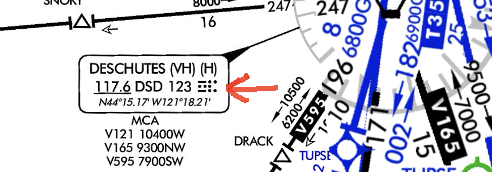
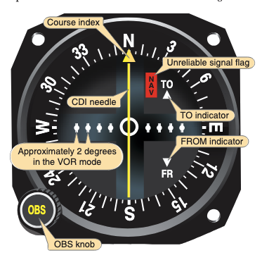

# VOR Fundamentals

## Objective

The student will develop a comprehensive understanding of VOR operating principles, capabilities, limitations, and standard operating procedures to accurately navigate, intercept, and track VOR courses solely by reference to instruments.

## Timing

## Format

## Overview

- VOR Principles of Operation, Transmitter, Receiver, Min Operational Network (MON)
- VOR Receiver Accuracy Check
- VOR Class Designations & Service Volumes
- VOR Errors & Irregularities
- VOR Tuning and Identifying
- VOR Orientation
- VOR Intercepting
- VOR Tracking / Wind Correction Techniques
- VOR Station Passage

## Elements

### VOR Principles of Operation, Transmitter, Receiver, MON

- The Very High Frequency Omni-Directional Range (VOR)
  - Transmits azimuth information referenced to **magnetic north**
  - Projecting 360 courses, or _radials_, extending outward from the ground station
  - Operate within the **108.0 – 117.95 MHz** frequency band.
- Signals are **subject to line-of-sight**
  - The signal cannot be obstructed from the aircraft to the station
- The airborne equipment consists of the antenna, receiver, and the VOR indicator instrument.
- The VOR **measures and presents information to indicate bearing TO or FROM** the navigation facility.
- **Minimum Operational Network (MON):**
  - The FAA is currently retaining a reduced network of VORs, known as the VOR MON
  - Serves as a backup if the Global Navigation Satellite System (GNSS) becomes unavailable
  - Designed to provide nearly continuous VOR signal coverage at **5,000 feet AGL** across the NAS, outside of the Western U.S. Mountainous Area (WUSMA).
  - MON Airports
    - Will have VORs and be accessible within **100 NM** in the contiguous United States (CONUS)
    - They will have ILS or VOR approaches

### VOR Receiver Accuracy Check

See [AIM 1-1-4](/_references/AIM/1-1-4)

- VOR equipment must be checked prior to its use in IFR flight
  - [91.171](/_references/14-CFR/91.171) VOR equipment check for IFR operations.
  - VOR equipment must be checked within the **preceding 30 days**
- Types of VOR checks
  - **Dual VOR Check**: Compare two onboard VOR receivers against each other (tolerance **$\pm$4°**)
  - **VOR Checkpoint**: Many airports have VOR checkpoint signs (tolerance **$\pm$4°**)
  - **VOR Test Facility (VOT)**:
    - VOT stations are listed in the Chart Supplement
    - The Course Deviation Indicator (CDI) must center when the Omnibearing Selector (OBS) reads **0° with a FROM indication**, or **180° with a TO indication**.
  - **Airborne check**: Use a prominent, identifiable point on the centerline of an airway
- The pilot must record in the aircraft logbook or record:
  - Date
  - Place
  - Bearing error
  - Pilot signature
- To find checkpoints in **ForeFlight**:
  - Documents > FAA > Chart Supplement > Northwest
    - Find VOR Recevier Checkpoints and VOR Test Facilities
    - E.g. Oregon (pg. 358)
  - VOT facilities and VOR checkpoints

### VOR Class Designations & Service Volumes

- VOR facilities are classed as Terminal, Low altitude, and High altitude
- Standard Service Volumes (SSVs) are defined by the following radial distances:
  - **Terminal (T):** Up to and including 12,000 feet AGL, out to **25 NM**.
  - **Low (L):** Up to and including 18,000 feet AGL, out to **40 NM**.
  - **High (H):** Ranges from 40 NM (below 14,500 feet) up to **130 NM** (between 18,000 and 45,000 feet AGL).
- New VOR service volumes (VL and VH) extend coverage out to **70 NM** above 5,000 feet AGL to support Performance Based Navigation (PBN) routes.

### VOR Errors and Irregularities

- **Accuracy:** Course alignment is accurate, generally within $\pm$1°.
- **Roughness/Oscillation:** Minor course roughness or needle oscillation may occur, especially in mountainous terrain, but should not cause instrument reports unless fluctuations exceed prescribed tolerances.
- **Propeller/Rotor Modulation:** Certain propeller or rotor speeds can induce errors up to $\pm$6° on the CDI.
- **Cone of Confusion:** Directly above the VOR station, the signal is unreliable, causing the CDI needle and TO/FROM indicator to fluctuate (zone of confusion).

### VOR Tuning and Identifying

- VOR procedure requires pilots to **Tune, Identify, and Monitor (TIM)** the facility.
  - **Tune:** Select the VOR frequency using the aircraft receiver.
  - **Identify:** Confirm the Morse code signal or voice announcement stating the name of the facility followed by "VOR".
  - **Signal Status:** A system malfunction or unreliable signal is indicated by an “OFF” flag or a blank TO/FROM indicator.
- If a VOR is out of service, the coded identification signal is removed.

### VOR Orientation

- A CDI makes no indication of **aircraft heading**
- A CDI with a "TO" flag reads the **bearing** to fly to reach the station
  - For instance, a centered CDI needle with the OBS set to **090&deg;** means the aircraft could fly a **90&deg;M** ground track to reach the station
- A CDI with a "FROM" flag reads the **radial** from the station
  - For instance, a centered CDI needle with the OBS set to **090&deg;** means the aircraft could fly a **270&deg;M** ground track to reach the station
- If the VOR is set to the reciprocal of the intended course (e.g., 90&deg; instead of 270&deg;), the CDI will be "reverse sensing"
  - The CDI needle would behave the opposite
- An error flag (or a lack of T/F flag) indicates no VOR signal is being received
- Full needle deflection from the center position to either side of the dial indicates the aircraft is **12° or more off** course
  - The outer edge of the center circle is **2°** off course
  - Each dot representing an additional **2°**

### VOR Intercepting - Doubling the Difference

1. Determine the difference between the radial to be intercepted and the radial on which the aircraft is located (205° – 160° = 045°).
2. Double the difference to determine the interception angle, which will not be less than 20° nor greater than 90° (45° × 2 = 090°).
   - 205° + 090° = 295° for the intercept
3. Rotate the OBS to the desired radial or inbound course.
4. Turn to the interception heading.
5. Hold this heading constant until the CDI centers, which indicates the aircraft is on course. (With practice in judging the varying rates of closure with the course centerline, pilots learn to lead the turn to prevent overshooting the course.)
6. Turn to the MH corresponding to the selected course, and follow tracking procedures inbound or outbound.

### VOR Intercept - 45&deg; Intercept

1. Determine the bearing TO the station that you are on (for example, the 060&deg; bearing TO the VOR)
2. Identify the bearing you want to intercept (e.g. 090&deg; radial TO)
3. Twist the OBS to our desired bearing (in this case 090&deg;)
4. Depending on the location of the CDI needle, add or subtract:
   1. If the needle is to the left: Subtract 45 degrees from the desired bearing (90&deg; - 45&deg; = 45&deg;)
   2. If the needle is to the right: Add 45 degrees from the desired bearing
5. Fly the computed intercept heading

### VOR Tracking / Wind Correction Techniques

- **Tracking:** Flying a constant heading to maintain the desired course over the ground.
  - If CDI deflects, turn **in the direction of the needle deflection** to intercept the course.
  - "Chase the needle"
- Pilot must establish a **wind correction angle (WCA)** to maintain track.
  - Use a bracketing technique to determine the correct angle
- **Homing:** Flying whatever heading keeps the needle centered (results in a circuitous path over ground).
- Tracking outbound: Set the desired radial with a FROM indication and maintain track.

### VOR Station Passage

- Indicated when the TO/FROM indicator **reverses**
- CDI needle **fluctuates rapidly** and deviates sharply (cone of confusion)
- If outbound, timing begins over or **abeam the holding fix**, whichever occurs later
- For a VOR, outbound timing begins when the **TO/FROM indicator reverses**

## References

- [Instrument Flying Handbook pg. 9-8](/_references/IFH/9-8)
- [AIM 1-1-4](/_references/AIM/1-1-4)
- Backseat Pilot CFI-I Lesson Plans: VII.A. Intercepting and Tracking Navigational Systems
- [BoldMethod How to Do a VOR Check](https://www.boldmethod.com/learn-to-fly/systems/vor-check-ifr/)
