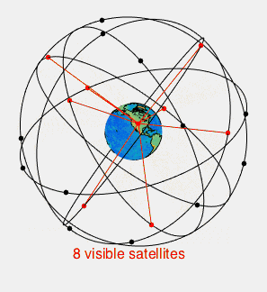
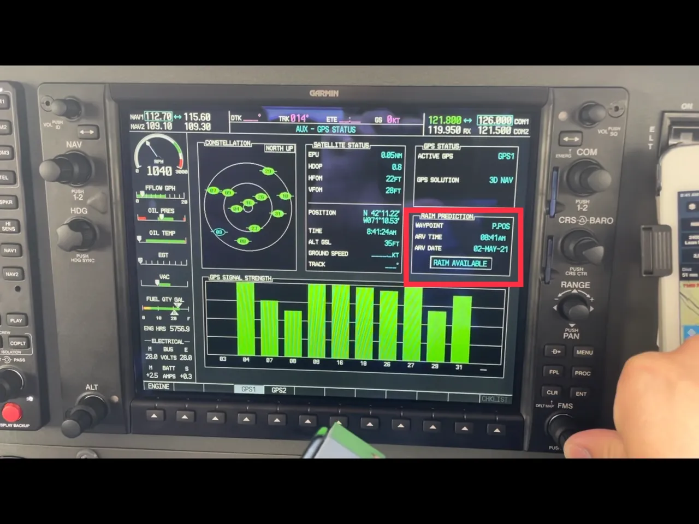
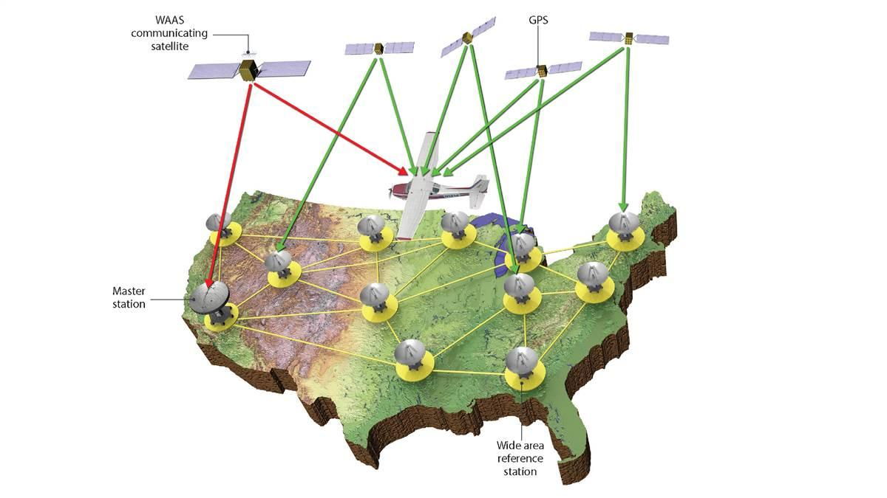
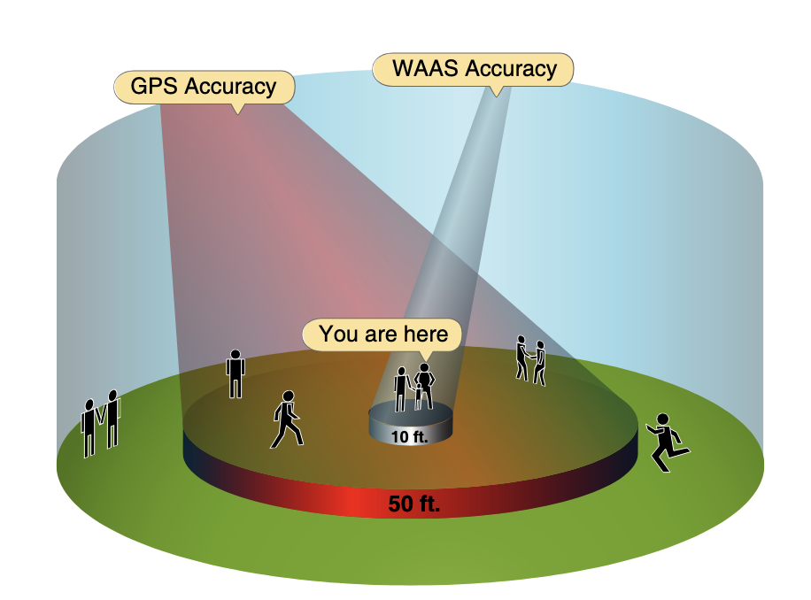
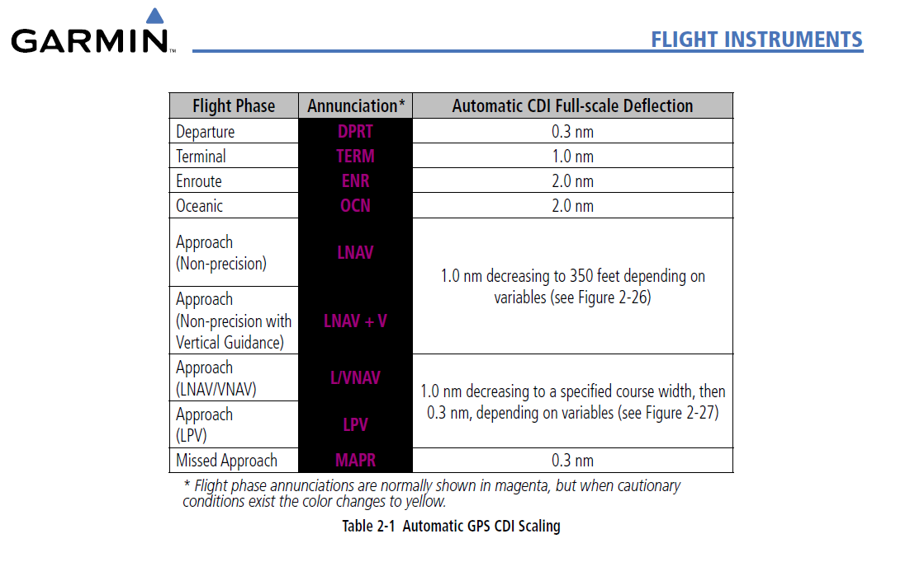
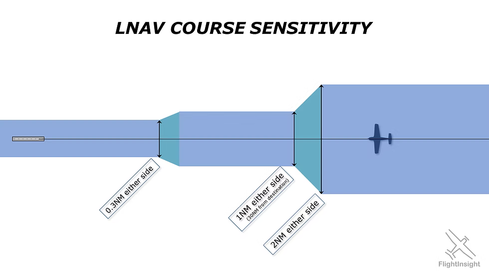
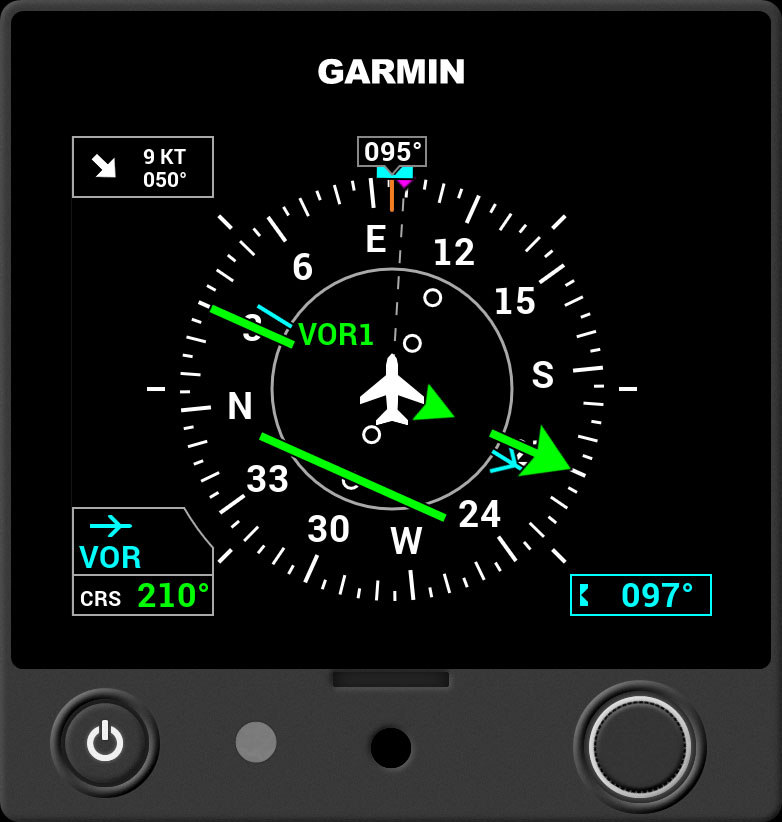

# GPS Usage under IFR

## Objective

The student will have knowledge of GPS operation, including its principles, capabilities, limitations, and the necessary procedures for utilizing the GPS system for navigation and instrument procedures under IFR

## Timing

## Format

## Overview

- GPS Principles of Operation
- Receiver Autonomous Integrity Monitoring (RAIM)
- GPS Errors & Irregularities
- Wide Area Augmentation System (WAAS)
- GPS Modes of Operation
- GPS Use Under IFR
- GPS CDI Scaling (En Route, Terminal, & Approach)
- GPS Waypoints
- GPS Direct-To Operations
- GPS Flight Plan Operations
- GPS Nearest Functions
- Substitution of GPS for Other Navigation Radios Under IFR
- Orientation, Position, and Waypoint Passage / Sequencing
- GPS Course Intercepting and Tracking Procedures / Wind Correction Techniques
- Computer / App Based GPS Procedures Simulator (from Appropriate GPS Manufacturer)
- Installed GPS Specific Procedures

## Elements

### GPS Principles of Operation

- GPS is a satellite-based radio navigation system
- **Space Element** consists of over 30 Navstar satellites
  - The satellites broadcast a pseudo-random code timing signal and data message,
  - Satellites transmit position, velocity, and precise timing,
  - At least five satellites are designed to be in view to a user worldwide
- **Control Element** is a network of ground-based monitoring and control stations
  - Monitoring stations ensure the accuracy of satellite positions and clocks
- **User Element** consists of antennas and receiver/processors onboard the aircraft
  - The receiver requires a minimum of four satellites for a three-dimensional position solution (latitude, longitude, and altitude)
  - The receiver computes distance based on signal travel time (pseudo-range)
  - Position is determined by triangulation using the pseudo-range and position information supplied by the satellite
- Other countries have their own sa

### Receiver Autonomous Integrity Monitoring (RAIM)

- RAIM is the capability of a GPS receiver to **monitor its own integrity**
  - It uses extra satellites to compute multiple positions
  - RAIM requires a **minimum of five satellites in view**, or four satellites and **barometric altimeter input (baro-aiding)**, to detect an integrity anomaly
- Some receivers are capable of **fault detection and exclusion (FDE)** require 6 satellites in view (or 5 satellites with baro-aiding)
  - FDE allows the receiver to isolate a corrupt signal and remove it from the position solution, while still providing an integrity-assured position,
- The two general types of RAIM messages are:
  - **Insufficient satellites** to provide integrity monitoring
  - RAIM integrity monitor detects a **potential error** exceeding the limit for the phase of flight

### GPS Errors & Irregularities

- GPS positioning data can be affected by various geometric factors and equipment characteristics, typically causing errors of **less than 100 feet**
- Small position errors or momentary loss of signal can be caused by:
  - Satellite atomic clock inaccuracies
  - Receiver/processors
  - Signals reflected from hard objects (multi-path)
  - Ionospheric and tropospheric delays
  - Satellite data transmission errors
- Loss of signals may occur in **valleys surrounded by high terrain**
- Loss of satellite reception may occur due to **aircraft dynamics** (changes in pitch or bank angle)
- **Jamming** (emissions that interfere with signal reception) and **spoofing** (emissions that mimic GNSS signals) are intentional unauthorized interference that can disrupt air navigation
- The U.S. government regularly conducts GPS testing that interferes with GNSS signals, which are **geographically limited, coordinated, scheduled, and advertised via NOTAMs**

### Wide Area Augmentation System (WAAS)

- WAAS is designed to improve the **accuracy, integrity, and availability** of GPS signals,
  - It is the U.S. version of a **satellite-based augmentation system (SBAS)**
  - Allows GPS to be used for **takeoff through Category I precision approaches**
- A network of **Wide-Area Reference Stations (WRS)** on the ground monitors GPS signals for errors
  - WRS relays data to a Wide-Area Master Station (WMS)
  - The WMS calculates correction information and uplinks a message to a **Geostationary Earth Orbit (GEO) satellite**
- The GEO satellite **broadcasts the WAAS-corrected signal** on the same frequency as GPS (L1, 1575.42 MHz) to WAAS receivers
  - The GEO satellite also provides an **additional pseudo-range measurement**, improving GPS availability
- The accuracy is good enough to provide **GPS/WAAS glide paths (vertical guidance)**
  - **LPV (Localizer Performance with Vertical Guidance)** uses WAAS accuracy to provide an approach similar to a Category I ILS
    - LPV minimums are published as a **Decision Altitude (DA)**
  - **LP (Localizer Performance)** is a WAAS-based line of minima that provides angular lateral guidance and is published as a **Minimum Descent Altitude (MDA)**

### GPS Modes of Operation

GPS CDI sensitivity changes based on the **phase of flight**

- **En Route:** Typically ±5 NM CDI sensitivity, but may be lower (see G1000 image above)
- **Terminal:** ±1 NM CDI sensitivity
  - Terminal mode automatically activates when the aircraft is within 30 NM of the airport
- **Approach:** ±0.3 NM CDI sensitivity
  - Approach mode becomes active when the aircraft is within 2 NM of the Final Approach Waypoint (FAWP)
  - CDI sensitivity smoothly changes (ramps down) from ±1 NM to ±0.3 NM at the FAWP
- **Missed Approach:** CDI sensitivity immediately changes to terminal (±1 NM) sensitivity

### GPS Use Under IFR

- GPS must be **TSO-certified** (C129, C196, C145, or C146) and the installation approved per AC 20-138
  - GPS operations must be conducted in accordance with the **AFM or flight manual supplement**
- Non-WAAS GPS (TSO-C129/C196) aircraft must be equipped with an **alternate approved and operational means of navigation**,
  - **GPS RAIM availability must be checked** before IFR operations
  - If a continuous RAIM loss is predicted for more than 5 minutes, the flight must be delayed, canceled, or re-routed
    - See [AIM 5-1-16](/_references/AIM/5-1-16) for more details
- **WAAS (TSO-C145/C146) users** do not need to perform RAIM prediction if WAAS coverage is confirmed along the entire route
  - The **onboard navigation database must be current and appropriate** for the operation
  - Procedures must be **retrievable by name** from the database; manual entry of waypoints is not permitted for approach procedures
- Pilot should review appropriate **NOTAMs** before GPS IFR operation

### GPS CDI Scaling (En Route, Terminal, & Approach)

- **En Route:** ±5 NM sensitivity
- **Terminal:** ±1 NM sensitivity
  - Terminal mode activates when within 30 NM of the airport
- **Approach:** ±0.3 NM sensitivity
  - Approach mode becomes active when within 2 NM of the FAWP
  - CDI sensitivity ramps smoothly from ±1 NM to ±0.3 NM at the FAWP,
- **Missed Approach:** CDI sensitivity changes immediately to terminal (±1 NM) sensitivity,
- **PHOTO PLACEHOLDER: Image demonstrating GPS CDI scaling changes.**

### GPS Waypoints

- Waypoint (WP) is a predetermined geographical position defined by latitude/longitude coordinates
- WPs are used to indicate a change in direction, speed, or altitude,
- **Fly-by (FB) Waypoints** are used when a turn should begin prior to reaching the waypoint (turn anticipation)
  - Chart symbol: Four-pointed star
- **Fly-over (FO) Waypoints** require the aircraft to fly over the point prior to starting a turn
  - Chart symbol: Four-pointed star enclosed in a circle
  - The MAWP is always a fly-over waypoint

### GPS Direct-To Operations

- A Direct to Fix (DF) leg defines an **unspecified track** from an undefined position to a specific database fix
- Often used by pilots in describing **off-airway routes**,
- When used by pilots in describing off-airway routes, points defining the direct route segments become **compulsory reporting points** unless under radar contact
- ATC may clear an aircraft **direct to a fix** when issuing approach clearance

### GPS Flight Plan Operations

- An IFR flight plan requires specific information about aircraft capabilities,
- For a GPS-equipped aircraft, **‘G’ is filed in Item 10a** for GNSS capability
- If the aircraft is PBN-approved, **‘R’ must be filed in Item 10a**, and the specific PBN levels must be listed in **Item 18 PBN/**
- The onboard navigation database should be checked for **current NOTAMs** relating to the IFR flight,
- The flight plan must include an alternate airport if the weather forecast 1 hour before to 1 hour after ETA is less than 2,000 feet ceiling and 3 SM visibility

### GPS Nearest Functions

- GPS displays can provide information on **nearest airports**
- The MFD can display up to **25 nearest airports** that meet specified criteria
- The display can show information including **runway length, surface, available approaches, and communication frequencies**
- The nearest airport function allows the pilot to **activate a Direct-To course** to the selected airport
- The function may allow the pilot to **auto-tune communication frequencies**

### Substitution of GPS for Other Navigation Radios Under IFR

- IFR-certified GPS systems may be used as a substitute for ADF and DME receivers in controlled airspace when conducting specific operations
- This application requires at least **en route RAIM or equivalent integrity**
- GPS can be substituted for ADF and DME to:
  - Fly a **DME arc**
  - Navigate **TO or FROM an NDB/compass locator**
  - Hold over an **NDB/compass locator**
  - Determine position over a **DME fix**
- GPS is **not authorized as the final approach navigation source** on procedures based on VOR, LOC, LDA, or NDB signals
  - Exception: GPS may be used on approaches with “or GPS” in the title,

### Orientation, Position, and Waypoint Passage / Sequencing

- GPS provides **linear course guidance** between waypoints
  - Position information
  - **Along Track Distance (ATD)** is displayed to the next active waypoint, not necessarily a ground-based NAVAID
- The receiver **sequences to the next waypoint** when the current one is passed
  - This may be prevented by placing the receiver in **non-sequencing mode** (often referred to as `OBS` or `HOLD`)
  - `SUS` mode indicates that automatic sequencing is suspended
- The **Missed Approach Waypoint (MAWP)** requires pilot action to sequence the receiver
- Waypoints can be designated **fly-over (FO)** or **fly-by (FB)**

### GPS Course Intercepting, Tracking Procedures, Wind Correction Techniques

- To intercept a desired GPS course, pilots must first **orient the aircraft’s position** with respect to the waypoint
- Match your current track (`TRK`) with the desired track (`DTK`)
- The difference between the aircraft’s **heading** and **ground track** visualizes **wind drift**
  - This information, often displayed on the MFD, simplifies crosswind corrections
  - To maintain the desired track (course), pilots must **crab the aircraft into the wind**
- Garmin HSI's show ground track as a magenta diamond

### Computer / App Based GPS Procedures Simulator (from Appropriate GPS Manufacturer)

- Computer-based tutorials or simulations are often provided by manufacturers to allow pilots to **become familiar with the equipment’s operation**
- Practice should include:
  - Programming approach procedures (especially procedure turns and arcs)
  - Programming and flying holding patterns
  - Programming and flying missed approaches
  - Indicating actions required for **RAIM failure**

### Installed GPS Specific Procedures

- Pilot must be familiar with the **specific GPS equipment** installed in the aircraft
- Operating procedures and limitations are found in the **POH/AFM or supplement**
- Pilots should be familiar with the manufacturer’s procedures for:
  - Setting **CDI sensitivity**
  - **Arming the approach mode** when within 30 NM of the airport
  - Placing the receiver in **non-sequencing mode** (HOLD or OBS) when receiving radar vectors

## References
