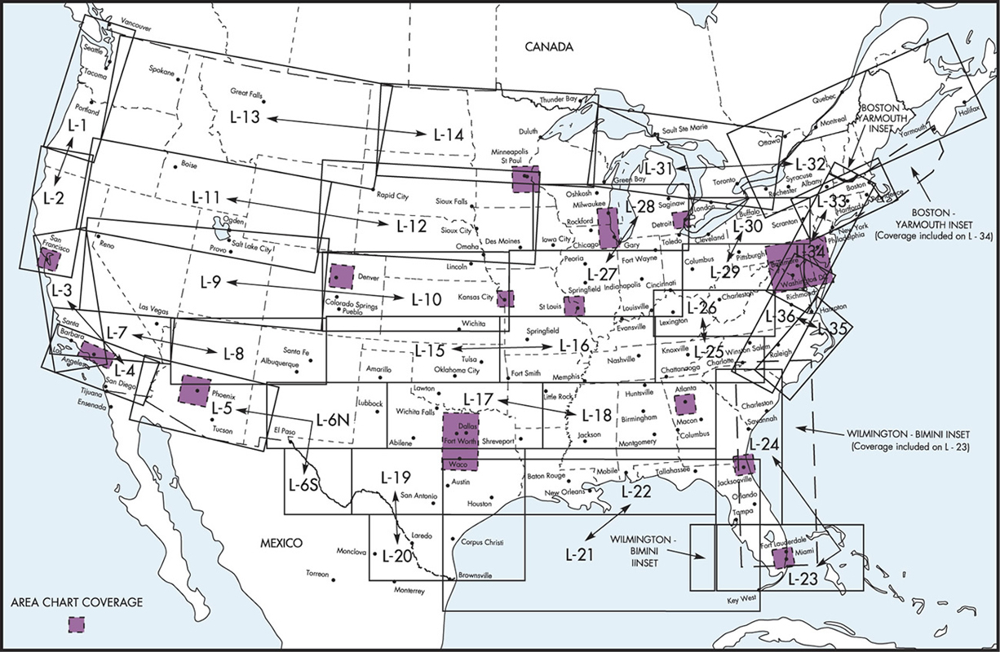

# Regulations and Publications

## Objective

The student will have a thorough knowledge of the Federal Aviation Regulations (FARs) contained in Title 14 of the Code of Federal Regulations (CFR) and the sections of the Aeronautical Information Manual (AIM) that pertain to instrument flight.

## Timing

45 minutes

## Format

- Whiteboard
- [cCFR](https://www.ecfr.gov/current/title-14/chapter-I/subchapter-F/part-91)

## Overview

- 14 CFR Regulations - Applicable to IFR Flight
  - Part 1
  - Part 43
  - Part 61
  - Part 91
  - Part 95
  - Part 97
  - NTSB 830
- AIM - Chapters Applicable to IFR Flight
  - Chapter 1: Air Navigation
  - Chapter 2: Aeronautical Lighting and Other Airport Visual Aids
  - Chapter 3: Airspace
  - Chapter 4: Air Traffic Control
  - Chapter 5: Air Traffic Procedure
  - Chapter 6: Emergency Procedures
  - Chapter 7: Safety of FLight
  - Chapter 9: Aeronautical Charts
- Instrument Flying Handbook
- Chart Supplement
- IFR Enroute Charts
- Terminal Procedure Publication
- Practical Test Standards (PTS) and Airmen Certification Standards (ACS)

## Elements

### 14 CFR

- Part 1: Contains Definitions
- Part 43: Maintenance
- Part 61: Certification Pilots Flight Instructors And Ground Instructors
  - [61.57](/_references/14-CFR/61.57): Recent Flight Experience
  - [61.65](/_references/14-CFR/61.65): Instrument Rating Requirements
- Part 91: General Operating and Flight Rules
  - [91.101](/_references/14-CFR/91.101): Applicability
  - [91.103](/_references/14-CFR/91.103): Preflight action
    - **NWKRAFT**: NOTAMs, weather forecasts/reports, known ATC delays, runway lengths, alternates, fuel requirements, takeoff and landing distances
  - [91.109](/_references/14-CFR/91.109): Safety pilots and flight training aircraft
    - Safety pilots must be at least a private pilot, rated in the category/class of airplane
  - [91.151](/_references/14-CFR/91.151): Fuel requirements for VFR flight
    - Fly to the first point of intended landing, then for 30 minutes during the day and 45 minutes at night
  - [91.167](/_references/14-CFR/91.167): Fuel requirements for IFR Flight
    - Destination + alternate + 45 minutes reserve
  - [91.169](/_references/14-CFR/91.169): IFR alternate requirements
    - An alternate does not need to be filed if, within **&pm;1** hour of ETA, the ceiling is forecast to be **&gt;2000'**, and visibility is **&gt;3 s.m.**
    - An alternate airport must have forecast weather at your ETA:
      - Airports with precision approach (ILS): **&gt;600'** ceiling / **2 s.m.** visibility
      - Airports with non-precision approach (VOR/GPS): **&gt;800'** ceiling / **2 s.m.**
      - Airports with no IAP: Basic descent from the MEA can be made in basic VFR conditions
      - Or, the alternate minimums specific in the airport's procedure
  - [91.171](/_references/14-CFR/91.171): VOR check and accuracy
    - VOR check must be completed every 30 days for use in IFR
    - Tolerances are &pm;4&deg; for ground-based and dual-VOR checks
    - Tolerances are &pm;6&deg; for flight-based checks
  - [91.173](/_references/14-CFR/91.173): ATC clearance and flight plan requirement
    - An IFR flight plan and ATC clearance is required to fly in _controlled airspace_ under _instrument flight rules_
  - [91.175](/_references/14-CFR/91.175): Takeoff and landing under IFR
    - Descent from the DA/DH is only allowed if
      1. A landing can be made using normal maneuvers and descent rate
      2. The _flight_ visibility is not less than prescribed
      3. One of the necessary visual references are in sight
  - [91.177](/_references/14-CFR/91.177): Minimum altitudes for IFR
    - The minimum altitude for IFR flight is the MEA or MOCA
    - If no MEA or MOCA is defined, then:
      - &gt; 1000' above the highest obstacle in non-mountainous terrain
      - &gt; 2000' above the highest obstacle in mountainous terrain
    - A climb to a higher MEA should be started at the waypoint
  - [91.179](/_references/14-CFR/91.179): IFR cruising levels
    - In controlled airspace, cruise at the level assigned by ATC
    - In uncontrolled airspace:
      - Maintain odd thousands (3000, 5000') on magnetic courses 0 thru 179
      - Maintain even thousands (4000, 6000') on magnetic courses 180 thru 359
  - [91.181](/_references/14-CFR/91.181): Course to be flown
    - Fly on the centerline of an airway, or direct course between fixes
  - [91.183](/_references/14-CFR/91.183): IFR communications
    - Report to ATC when passing mandatory reporting points, except when in radar contact
    - Report to ATC any unforseen weather, or information related to flight safety
  - [91.185](/_references/14-CFR/91.185): Two-way radio communications failure
    - Under VFR: Continue and land in VFR conditions
    - Under IFR:
      - Route: **AVE F**, the last assigned, vectored, expected, or filed route
      - Altitude: **MEA**: fly the highest of minimum altitude for IFR (MEA, MOCA), expected, or assigned altitude
    - If clearance limit is a fix from which an approach begins, leave the clearance limit as close to the expect further clearance time
    - If clearance limit is not a fix from which an approach begins, proceed to a fix where an approach begins and start an approach as close as possible to the filed ETA
  - [91.187](/_references/14-CFR/91.187): Equipment malfunctions under IFR
    - Report to ATC any malfunctions
  - [91.205](/_references/14-CFR/91.205): Requirement instruments and equipment
    - IFR flight requires all VFR-day equipment, plus IFR-required equipment (**GRABCARD**)
  - [91.411](/_references/14-CFR/91.411): Static pressure system inspection
    - IFR static pressure system check must be completed every **24 calendar months**
- Part 95: IFR Altitudes
  - 95.13: Defined "Mountainous" areas, as is relevant in 91.177
- Part 97: Standard Instrument Procedures
- Aeronautical Information Manual
  - Chapter 1: Air Navigation
  - Chapter 2: Aeronautical Lighting and Other Airport Visual Aids
  - Chapter 3: Airspace
  - Chapter 4: Air Traffic Control
  - Chapter 5: Air Traffic Procedure
  - Chapter 6: Emergency Procedures
  - Chapter 7: Safety of Flight
  - Chapter 9: Aeronautical Charts
- Instrument Flying Handbook
- Chart Supplement (formally the Airport Facility Directory)
- IFR Enroute Charts
  - Published every 56 days
  - 
- Terminal Procedure Publication
  - Charts are updated every 28 days
  - Paper TPP is published every 56 days
  - Front matter includes:
    - Approach procedure legend
    - Approach category speeds
    - RVR and visibility conversion chart
    - Cold weather compensation chart
- Practical Test Standards (PTS) and Airmen Certification Standards (ACS)
  - ACS are slowly replacing the existing practical test standards (PTS)

## References

- [Aeronautical Information Manual](/_references/AIM/1-1-1)
- [Instrument Flying Handbook](/_references/IFH/1-1)
- [Digital TPP](https://www.faa.gov/air_traffic/flight_info/aeronav/digital_products/dtpp/)
- [IFR Enroute Charts](https://www.faa.gov/air_traffic/flight_info/aeronav/digital_products/ifr/)
- [Practical Test Standards](https://www.faa.gov/training_testing/testing/test_standards)
- [Airmen Certification Standards](https://www.faa.gov/training_testing/testing/acs)
