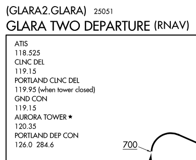

# IFR Clearances

## Objective

Understand the purpose and application of IFR clearances, their contents, and how to obtain them.

## Motivation

Every IFR flight will involve an IFR clearance.

## Timing

45 minutes

## Format

- Whiteboard

## Overview

- What is an IFR clearance?
- Why do we need one?
- Filing a flight plan
- Calling for a clearance
- Copy and readback
- Ways to obtain a clearance
- Departure clearances
- Approach clearances
- Pilot responsibilities
- Controller responsibilities

## Elements

### IFR Clearances

### What is an IFR clearance? Why do we need one?

- A clearance to operate in controlled airspace under IFR rules
- [91.173](/_references/14-CFR/91.173): No person may operate an aircraft in controlled airspace under IFR unless that person has filed an IFR flight plans and received an appropriate clearance.

### Filing a flight plan

- Via FSS or ForeFlight
- This gets sent to the tower, the departure radar facility, and appropriate ARTCC (center)
- Usually flight plans show up in the system 30 minutes the ETD on the flight plan, and remain for 2 hours after the ETD

### Calling for a clearance

- "Boeing Clearance, N2017E, IFR to Vancouver, ready to copy"

### Copy and Readback

- CRAFT
  - **Clearance limit**: Usually the airport, sometimes a fix
  - **Route**: Route to fly, or "as filed"
    - Must notify ATC if you can't comply (not equipped, performance limitations)
  - **Altitude**: Initial altitude to maintain
    - They can give you a "cruise" clearance here, which allows you to climb/descend from minimum IFR altitude to the cruise clearance altitude
  - **Frequency**: Frequency to contact after departure (Departure, approach, center)
  - **Transponder**: Squawk code
- Clearance readback
- Tips
  - Fill in CRAFT with everything you expect before receiving your clearance
- Example:
  - "Medford ground, N549SR IFR to KSAC, ready to copy IFR"
  - "N549SR, Medford ground, cleared to the KSAC airport via the Eagle Six departure, climb via the SID, expect 9000 10 minutes after departure. Departure frequency 124.85, squawk 4476"

### Ways to obtain a clearance

- At a towered airport
  - Ground frequency
  - Clearance delivery frequency
  - Some airports have digital digital pre-departure clearance (PDC), or you may be CPDLC-DCL equipped
- At a non-towered airport
  - On the ground via a published frequency or phone number
    - Departure procedure charts will list a frequency for CLNC DEL
    - 
  - Through FSS (1-800-WX-BRIEF)
  - Non-towered airport clearances will have a void time: "N2017E, cleared for IFR release, hold if not off in 3 minutes"
    - If the void time passes, you much contact ATC without departing
- In the air:
  - Calling center/tracon
  - Calling a FSS on 122.2
- Digitally
  - Some airports have digital digital pre-departure clearance (PDC)
    - This can be done through ForeFlight
    - Requires registering through a data provider for your tail number
    - Only one flight plan per airport per tail number is allowed in an 18 hour window
    - No flight plan amendments can be made
  - Another option is CPDLC-DC
    - This requires special hardware and avionics to receive the clearance (like a Garmin GDR 66)

### Departure clearances

- ODPs: Do not require a clearance to fly, though a controller may refer to the "published instrument departure procedure"
- DVA: ATC-assigned heading to fly after departure
  - If given this fly the heading given, not the ODP
- SID: If a SID is it will be included in your routing and readback
  - Fly the SID as published
  - ATC may amend some altitudes
- What if there's non SID or ODP?
  - If the airport has an IAP, then a departure assessment was not done
    - Follow the "non-charted procedure"
    - Fly runway heading until 400' AGL, then proceed as instructed (on course, vectors)
  - If the airport has _no_ IAP, then obstacle clearance is entirely up to you

### Approach Clearances

- PTAC:
  - Position from fix
  - Turn to intercept the final approach course
  - Altitude
  - "Cleared for approach"

### Pilot and Controller Responsibilities

- Pilot responsibilities
  - File and recieve an IFR clearance
  - Acknowledge reciept of a clearance
  - Request clarification if a clearance is not understood
  - Prompty compy with ATC directions
  - Determine if a safe departure can be made given aircraft performance
  - See-and-avoid traffic when in VMC
- Controller responsibilities
  - Issue clearances
  - Assign altitudes above the minimum for IFR
  - Ensure pilot readback is correct
  - Specify the departure process (SID or DVA explicitly, or ODP implicitly)

## Clearance Exercises

- "N549SR, cleared to the Astoria airport via the published departure procedure, then as filed. Maintain 5000, expect 8000 10 minutes after departure. Departure frequency 124.87. Squawk 4866."
- At KBLI, "N549SR cleared to the Spokane airport via the NRVNA ONE departure, then direct ZADON, then as filed. Climb via the SID maintain 5000, expect 11,000 10 minutes after departure. Departure frequency 119.2, squawk 4166."
- "Delta 134 is cleared to Denver via the HILAA Two Departure, BLH transition, then as filed. Maintain five thousand, expect FL350 10 minutes after departure. Departure frequency 124.3, squawk 4766, Delta 134."
- Departing SMO to : "Cleared to Big Bear airport via climb runway heading, at the LAX315 radial turn right heading 250, radar vectors SMO VOR, outbound SMO 125 degree radial, V64, SLI, V8, PDZ, V442, APLES intersection, V386, SOGGI intersection, direct. Maintian 3000, expect 11,000 15 minutes after depature. SoCal departure frequency 126.8, sqwak 4634"
- "3 miles from LOTKE, cross LOTKE at or above 3000, cleared ILS runway 31 approach Salem airport"

## References

- AIM 5-5-2
- Instrument Procedures Handbook
- [91.173](https://www.ecfr.gov/current/title-14/chapter-I/subchapter-F/part-91/subpart-B/subject-group-ECFRef6e8c57f580cfd/section-91.173)
