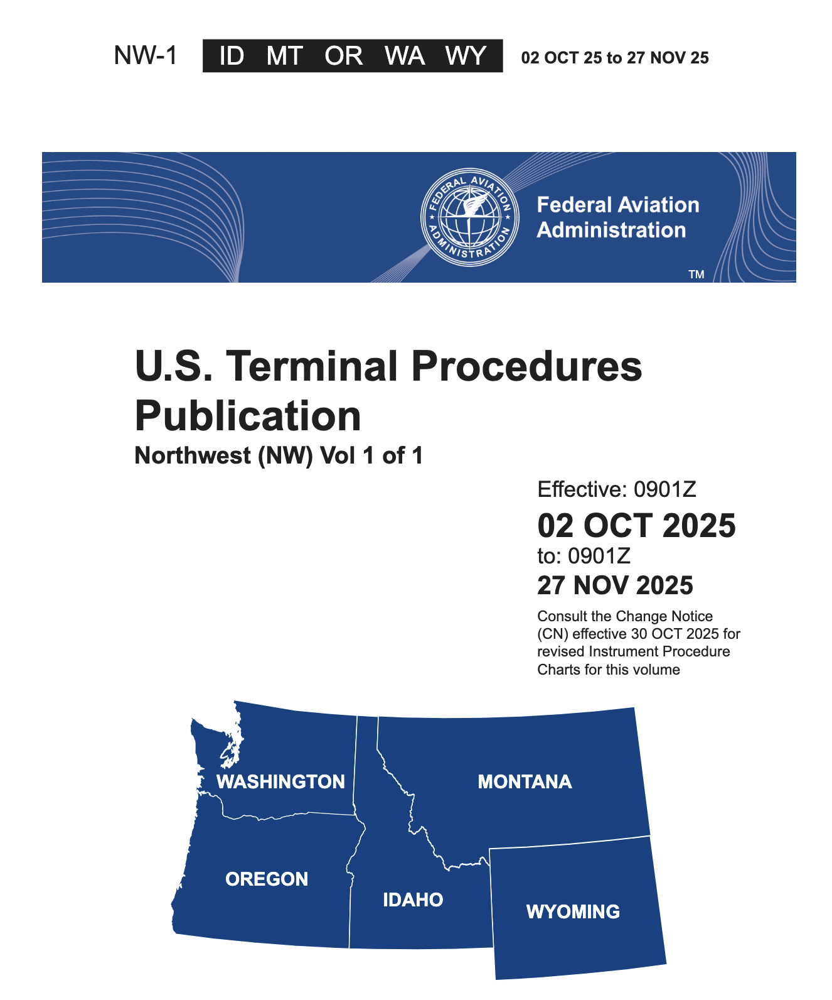
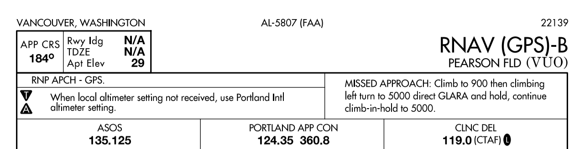
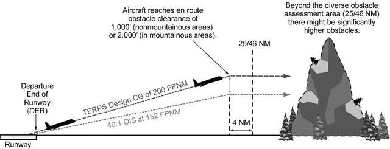
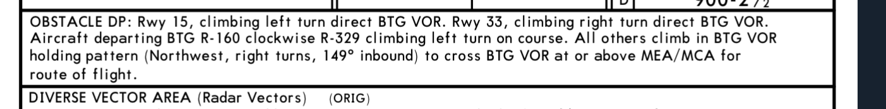
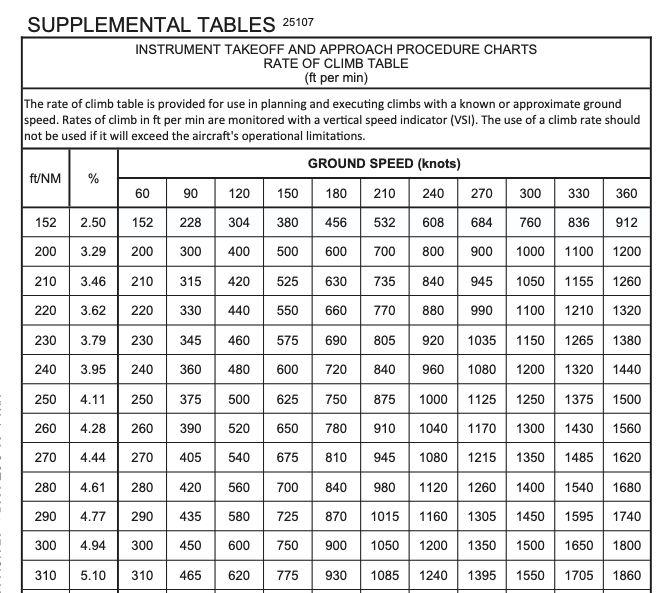
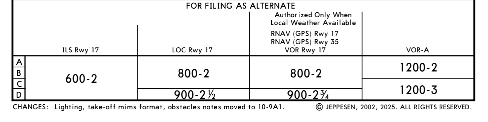
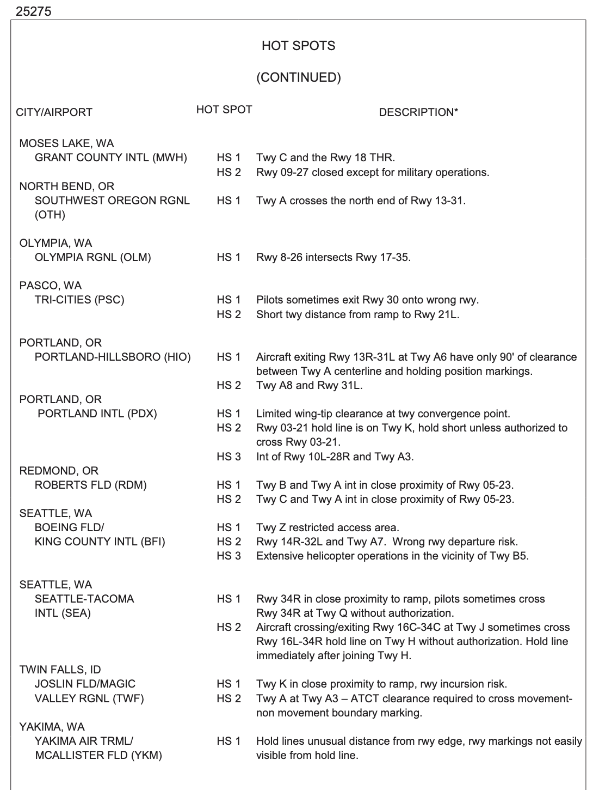
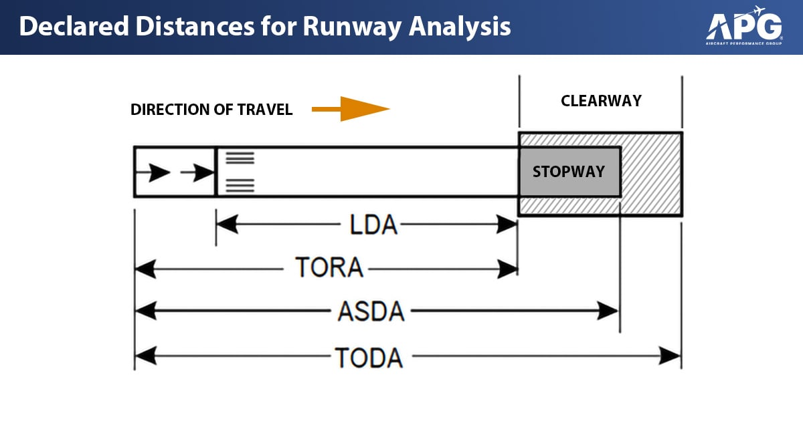
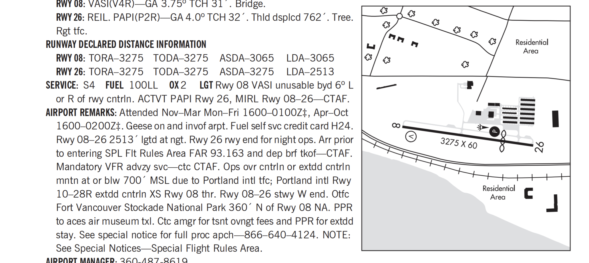

# Departure and Arrival Procedures

## Objective

Understand the use and purpose of standard departure and arrival procedures, their restrictions, and the expectations of ATC when using them. Also understand the purpose of IFR takeoff and alternate minimums.

## Timing

1 hour

## Format

- Whiteboard
- iPad Charts

## Overview

- Terminal Procedures Publication
- IFR Take-Off Minimums
- Published Departure Procedures
- Climb & Descent Tables
- Climb Via SID Clearance
- ATC Communication and Compliance with Departure Instructions
- Situational Awareness during Departure
- Descent Planning
- Standard Terminal Arrival Procedures
- Descend Via STAR Clearance
- IFR Alternate Minimums
- Airport Surface Hot Spots
- Declared Distance Information

## Elements

### Terminal Procedures Publication

- Published in regional volumes covering the conterminous U.S., Alaska, and Pacific territories
- Includes
  - Departure Procedures (DPs)
  - Standard Terminal Arrivals (STARs)
  - Instrument Approach Procedure (IAP)
  - Airport diagrams
  - Takeoff and alternate minimums
  - Rate of climb/descent tables
  - Inoperative components tables
- Publication frequency
  - Paper TPP is published **56 days** with a midpoint Change Notice
  - Digital TPP is published every **28 days** (ForeFlight and most avionics follow this cadence)

### IFR Take-Off Minimums

[91.175](/_references/14-CFR/91.175)

- Required for commercial operators under 14 CFR Parts 121, 125, 129, or 135
- Standard minimums:
  - **1 s.m. visibility** for 1-2 engines
  - **1/2 s.m. visibility** for more than 2 engines
  - Note: Part 91 operators not legally required to meet these, but compliance strongly encouraged
- Non-standard minimums indicated by the "Triangle T" symbol in the notes section of an approach chart
- May include ceiling requirements if necessary to see and avoid obstacles
- Reduced visibility takeoff may be authorized via specific Operations Specifications (OpSpecs)

### Published Departure Procedures

- When they add an instrument approach to an airport, they do a departure obstacle analysis

- If obstacles penetrate this envelope, then they will publish a departure procedure
- When departure procedures are designed they look at obstacles within
  - **25 NM** in non-mountainous areas, or
  - **46 NM** in mountainous areas
- Standard procedures assume you can climb:
  - **200 ft. / nm**
  - Assumes crossing DER at **35 feet**
  - Climb at least **400'** above the runway before turning
- Note: Some obstacles that are < 200' are defined as "low close-in obstacles"

#### Obstacle Departure Procedures (ODPs)

- Printed textually or graphically; primarily for obstacle avoidance
  - Textual ODPs are found in the "takeoff minimums" section
    - **Example KVUO ODP**
  - Graphical ODPs are published like SIDs, with "(Obstacle)" in the title
    - **Example KKLS Kelso 2 (Obstacle)**
  - Graphical ones can be added to flight plan with their ID (KELSO2.KELLNG)
  - Textual ODPs can be added to remarks section: "Will depart (airport) (runway) via textual ODP"
- Jeppesen Chart include ODPs on the airport info chart (or additional page)
- Must possess at least _textual_ description to accept a DP clearance
- ODPs do _not_ require a clearance to fly
  - You should always fly an ODP unless the weather is day VFR

#### Standard Instrument Departures (SIDs)

- Always printed graphically
- Designed for ATC flow, capacity, and workload reduction in addition to obstacle avoidance
- Types
  - Non-RNAV: For aircraft equipped with conventional avionics using ground-based navaids
  - RNAV: For aircraft equipped with RNAV avionics (GPS, VOR/DME, DME/DME)
  - Radar: Established when ATC has a need to vector aircraft to a particular route, navaid, or fix
- Broken up into the primary procedure, and transition routes (bold vs. dashed line on Jepp charts)
  - **Example: KPDX Cascade 4**
  - They'll say something like "Cascade 4 departure, JUDAH transition"
- When do you fly a SID?
  - Always require an ATC clearance
- "Climb Via" Clearance
  - A clearance for a SID which contains published altitude restrictions, which are mandatory
    - Cancels previously issued speed or altitude restrictions when issued
  - Examples:
    - "Cleared Cascade 4 departure, maintain 18,000" - Fly lateral + speed restrictions, up to 18,000
    - "Climb via Cascade 4 departure" - Fly lateral, altitude, and speed restrictions
    - "Climb via Cascade 4 departure, maintain 18,000" - Fly lateral, altitude, and speed restrictions
  - On initial contact with ATC, inform them of your position when climbing "via":
    - "Cactus Seven Eleven leaving two thousand for one-six thousand, climbing via the Laura Two departure."
- **Example KBFI CBAIN 1**

#### Diverse Vector Areas

- An area in which ATC may provide radar vectors for a climb above the MVA/MEA, in lieu of a ODP or SID.
- Usually requires a certain climb gradient for each runway
- **Example KUAO**

#### Visual Climb over Airport

- Alternative to complying with climb gradients greater than 200 feet per nautical mile for an ODP or SID
  - Developed to avoid obstacles greater than 3 statute miles from the departure end of the runway
- Visually conduct climbing turns over the airport to the published "at or above" altitude
- Takeoff minimums (or Jeppesen Airport Info Chart) will contain
  - Top altitude to climb to
  - Minimum weather needed for VCOA
- Ask ATC for this departure option; they won't prompt you for it
- Good option if the weather at the airport is good and you need to climb above terrain/weather before proceeding on course
- **Example: KBIH or KBFI**

### Climb & Descent Tables

- Located in the front matter of the Terminal Procedures Publication
  - In ForeFlight: Documents > FAA > Digital Terminal Procedures Supplemental
- Converts required climb gradient (FT/NM) into a rate of climb (FPM) based on groundspeed
- Non-standard climb gradients: $\text{Climb rate (ft / min)} = \frac{\text{Ground speed } * \text{ Climb gradient (ft / nm)}}{60}$
  - Example: 440 ft. / NM at 100 knots GS = 733 ft/min
- Can also be used for rate-of-descent to aid in a stabilized descent on final approach

### ATC Communication and Compliance with Departure Instructions

- Read back all altitudes, restrictions, and vectors in sequence
- Last clearance received supersedes all previous clearances
- Initial contact after takeoff includes call sign and current altitude leaving
  - "N12382 is 2000 climbing 8000"
- Pilots responsible for requesting amended clearance if a clearance deviates from regulations or safety
- State "NO SIDs" in remarks section of your flightplan if you are unable or unwilling to use them

### Situational Awareness during Departure

- Verify transponder and ADS-B are ON and squawking assigned code
- Monitor instruments to ensure continuous orientation to assigned route, especially when being vectored
- Note initial departure heading and last frequency for lost communication backup
- Review all pertinent NOTAMs and TFRs before departure

### Descent Planning

- Top-of-Descent (TOD) identifies where to begin descent from cruise
- Maintain "Sterile Cockpit" during critical phases of flight, including descent
- Heuristics for descent planning: At 500 fpm: 1000' descent takes 2 minutes
  - At **60** knots ground speed, we're going **1nm** per minute. So **2nm per 1000'**
  - At **90** knots ground speed, we're going **1.5nm** per minute. So **3nm per 1000'**
  - At **120** knots ground speed, we're going **2nm** per minute. So **4nm per 1000'**
- You can also use **ETE** data field on a GPS to determine when to start a descent

### Standard Terminal Arrival Procedures

- Transition aircraft from en route structure to the terminal environment
  - Serve multiple runways and sometimes multiple airports in a terminal area
  - Simplify clearance delivery and reduce radio frequency congestion
- The descent gradient is designed to be **250-350 ft/nm** into the airport
  - At 120 knots GS, this is 500-700 fpm
- Usually terminate at a fix where radar vectors begin, or connect to an IAP directly
- Often contains altitude restrictions or speed restrictions
- "Descend VIA STAR" clearance
  - Allow you to descend at pilot's discretion to meet published restrictions and laterally navigate on a STAR
  - Examples
    - "Descend via the Tyler One arrival" - Fly lateral, vertical, and speed restrictions
    - "Cleared Tyler One arrival." - Fly lateral STAR only
    - "Cleared Tyler One arrival, descend and maintain flight level two four zero." - Fly lateral and speed restrictions to 4000
- VNAV systems may be able to automate the path computation to achieve an efficient descent
- Must have at least textual description in possession to accept STAR clearance
- Put "NO STARs" in your flight plan if you are unable to fly one
- **Example: KBLI MADEE 6** or **KSEA CHINS5**

### IFR Alternate Minimums

Fuel requirements for IFR: [91.167](/_references/14-CFR/91.167),
Flight plan requirements: [91.169](/_references/14-CFR/91.169)

- Alternates are required if, within &plusmn;**1 hour of your ETA**, the weather is forecast with:
  - Ceilings **&lt; 2000'**, or
  - Visibility is &lt; **3 s.m.**, or
  - The destination does not have an instrument approach.
- If an alternate is required, they must be selected based on the following criteria:
  - For an airports with a **precision** approach, the weather must be better than:
    - **> 600' ceiling**, and
    - **> 2 s.m. visibility**
  - For an airports with a **non-precision** approach, the weather must be better than:
    - **> 800' ceiling**, and
    - **> 2 s.m. visibility**
  - If an airport contains a negative A on its approach plates, then it has non-standard alternate minimums.
    - 
  - In this case refer to the Alternate Minimums chart for the airport in the TPP:
    - In ForeFlight, this is listed under the Arrival section of the procedures
    - 
  - Jeppesen Charts include this on the Airport Info chart:
    - 
  - If an airport does not have an instrument approach, it can be used as an alternate if:
    - A decent to landing can be made from the **MEA** to the airport in [basic VFR conditions](/_references/14-CFR/91.155)
  - If the chart contains a negative "A" followed by "NA", then that airport cannot be used as an alternate.
    - This may be because the airport does not have weather reporting
- Commercial operators (Part 121/135) have more stringent, OpSpec-driven alternate requirements

### Airport Surface Hot Spots

- Areas that may cause confusion or have a higher potential for runway incursions
  - Typically involve complex or confusing taxiway geometry
  - Heightened pilot vigilance required when approaching or taxiing through these areas
- Marked on the airport diagram
- Read the hotspot information in the Chart Supplement

### Declared Distance Information

- Represent maximum distances suitable for takeoff and landing performance
  - **TORA**: Takeoff Run Available, runway length for ground run
  - **TODA**: Takeoff Distance Available, TORA + clearway length
  - **ASDA**: Accelerate-Stop Distance Available, runway + stopway length for aborted takeoff
    - A stopway is an area beyond the runway which can be used for deceleration in the event of a rejected takeoff
  - **LDA**: Landing Distance Available, runway length for ground run of landing aircraft
- Indicated on charts with a specific symbol referencing the Chart Supplement

## References

- [Instrument Flying Handbook pg. 1-12, 2-1 to 2-7, 10-1 to 10-10, G-1 to G-12](/_references/IFH/1-12)
- [AIM 4-4-1](/_references/AIM/4-4-1)
- [AIM 5-2-1](/_references/AIM/5-2-1)
- [AIM 5-3-1](/_references/AIM/5-2-1)
- [AIM 5-4-1](/_references/AIM/5-2-1)
- [AIM 5-5-1](/_references/AIM/5-2-1)
- TERPs Manual (FAA Order 8260.3): Chapters 1, 2, 3, and 13
- Instrument ACS: IR.V.B, IR.VI.D, IR.VI.E
- Instrument Procedures Handbook: Chapters 1, 2, and 3
- Backseat Pilot CFII Lesson Plans: II.C, V.A, V.B
- Aeronautical Chart Users Guide
