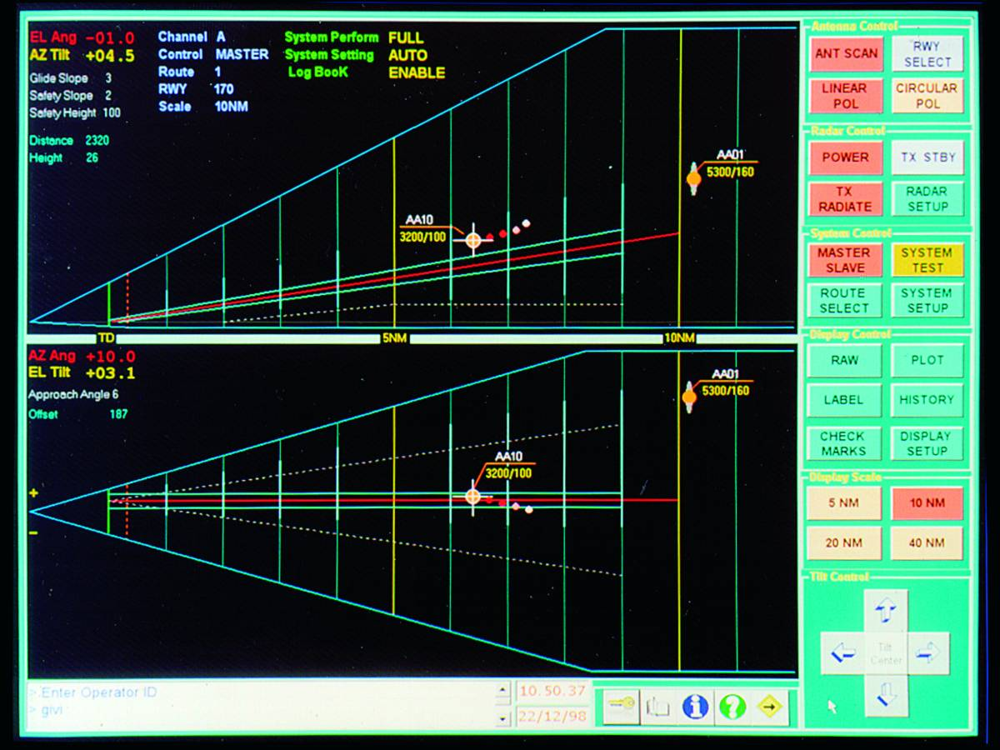
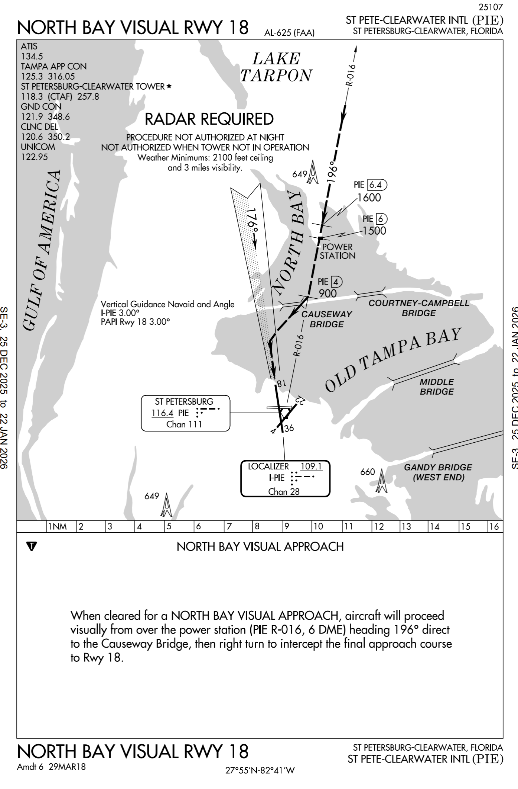
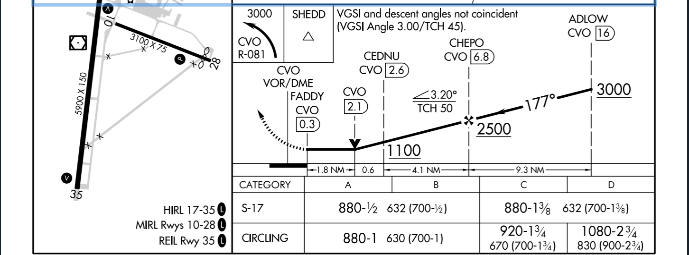
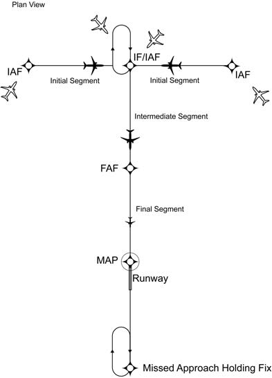
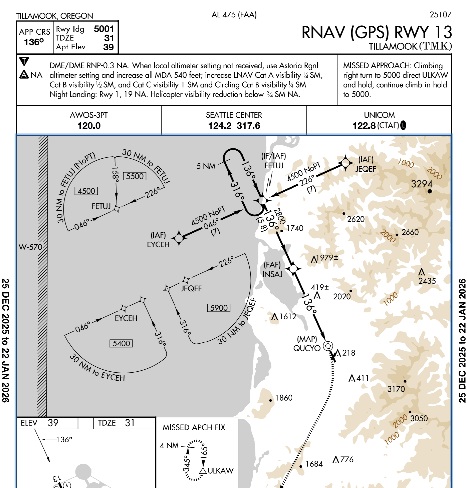

# Non-Precision Approaches

## Objective

Develop a comprehensive understanding of the planning, briefing, and execution of various instrument approach procedures (IAPs), including transitions to visual flight and the application of obstacle clearance and visibility criteria to ensure safety during the arrival and landing phases of flight.

## Timing

45 minutes

## Format

## Overview

- Non-precision Instrument Approaches
- Approach Briefing
- Missed Approach Procedures
- Visibility Minimums
- Timed Approaches
- Radar Approaches
- Visual Approaches
- Contact Approaches
- Charted Visual Flight Procedures
- Visual Descent Point
- Circling Approaches
- Vectored Approaches
- Procedure Turns
- Terminal Arrival Area (TAA) Approaches
- Lighting Systems

## Elements

### Non-precision Instrument Approaches

- Non-precision approaches are characterized by step-down fixes and a minimum descent altitude.
- Types of non-precision approaches
  - VOR - VOR approach
  - TACAN - TACAN approach
  - LOC - Localizer approach
  - LDA - Localizer directional aid
  - LOC BC - Localizer back course approach
  - ASR - Approach surveillance radar
- Step-down fixes allow descent to lower altitudes after clearing specific obstacles
- Stabilized descent encouraged using Vertical Descent Angle (VDA) data

### Approach Briefing

**W-WIRE**: Weather, waypoints, instruments, radios, everything else

- Complete briefing early while workload is low, use autopilot in single-pilot operations
- Includes validation of local altimeter setting and NOTAMs
- Verification that the aircraft is properly equipped and capable for the procedure

### Missed Approach Procedures

- Non-Precision missed approach point (MAP) can be indicated in different ways
  - **Time from the FAF to MAP** (determine time based on ground speed and distance)
  - **Specific fix** – Identified by DME, VOR cross radial, RNAV (GPS) waypoint, etc.
- Report "missed approach" to ATC immediately and request further clearance
- Memorize first 2-3 steps of procedure to reduce confusion

### Visibility Minimums

Approach landing limitations: [FAR 91.175](/_references/14-CFR/91.175)

- An aircraft may not descend from the DA/MDA unless:
  - Aircraft is continuously in a position from which a descent to a landing can be made on the intended runway
  - The descent can be made at a normal rate of descent using normal maneuvers
  - For 121/135 ops: A descent that allows for touchdown in the touchdown zone
  - The _flight_ visibility must be greater than prescribed on the chart
  - At least one of the following visual references for the intended runway is visible:
    - Approach lighting system: The red terminating bars of the ALS allow you to descend to 100' above TDZ, regardless of the approach you're flying
    - Threshold, threshold markings, threshold lights
    - Runway end identifier lights (REILs)
    - Visual glideslope indicator (PAPI/VASI)
    - Touchdown zone, markings, or lights
    - Runway or runway markings
    - Runway lights

Note: only the pilot can determine if the flight visibility meets the landing requirements.

- To summarize:
  - Normal descent + landing can be made
  - Visibility sufficient
  - Runway environment in sight

### Timed Approaches

- Requires an operating control tower and direct communications
- Used to sequence multiple aircraft to the final approach course from a holding fix
- Pilot must adjust flight path within the hold to leave the fix at the exact assigned time

### Radar Approaches

- Controller provides navigational guidance based on radar
  - **Precision Approach Radar (PAR)** provides highly accurate azimuth and elevation guidance
  - **Airport Surveillance Radar (ASR)** provides azimuth only; pilot advised of descent altitudes
- Ideal for "No-Gyro" approaches if heading indicators fail

### Visual Approaches

- Authorization for aircraft on IFR plan to proceed visually and clear of clouds
- Reported weather must be at least 1,000-foot ceiling and 3 SM visibility
- Pilot must have the airport or preceding aircraft in sight
- Pilot assumes responsibility for obstacle clearance and wake turbulence separation
- Not an IAP; has no missed approach segment

### Visual and Contact Approaches

- Visual approaches
  - If the airports has VFR weather, controllers can assign a visual approach
  - We're still IFR, so VFR cloud clearance (91.255) don't apply
  - We need visual separation from other aircraft
  - There is not set procedure here; at a controlled airport they will give you additional instructions if needed
- Charted visual procedures (ex. KPIE North Bay Visual)
  - Often used for noise-abatement
- Contact approaches
  - Gives us permission to descend to and land
  - Need ground-visibility >1 s.m.
  - Pilot needs to ask for a contact approach

### Visual Descent Point

- Used on non-precision approach charts
- Tells you the last point where a descent to the runway can be made at the established (often, but not always, aligning with the angle of the PAPI/VASI)
- For 3° slope: (Minimum descent height) / 300 = Distance in nm to VDP
- Example: KCVO VOR 17
  - VASI 3° angle: (632 MDH) / 300 = 2.1nm
  - Approach angle 3.2°: (632 / 354) = 1.8
- Depending on our aircraft, we should treat the VDP as the MAP
  - A 172 may be able to make a safe approach and landing at >3° descent angle
  - A Cirrus or a King Air should probably make a missed approach
  - Reminder that we need to land using normal maneuvers

### Circling Approaches

- Maneuver to align with a runway when straight-in alignment exceeds 30°
- Provides 300 feet of obstacle clearance within the protected area
- Radii for protected areas vary by aircraft category and MDA
- Pilot must keep the airport in sight; if lost, initiate missed approach for the procedure flown

### Vectored Approaches

- ATC gives altitudes and headings to establish you on an intercept to the final approach course (usually a few miles behind the FAF)
- Intercept angles typically 30° or less
- Maintain last assigned altitude until established on a published segment of the approach
- Procedure turns are prohibited when receiving radar vectors

### Procedure Turns

- Procedure turn: Published turn area which
  - Usually says "Remain within 10NM" on profile view
  - Types of turns: 45/180, 80/260, teardrop, racetrack
- Hold-in-Lieu of Procedure Turn is a published hold used for course correcting
  - Fly standard hold entry and begin the approach
- When should you _not_ fly a PT/HILPT? - SNoRT
  - S:"Straight-in approach" from ATC
  - No: NoPT on approach chart
  - R: Radar vectored
  - T: Timed approach from a fix

### Terminal Arrival Area (TAA) Approaches

- Transition from en route to terminal environment for RNAV-equipped aircraft
  - Think of it like a "mini STAR"
  - Based on a "Basic T" design: two IAFs, one IF/IAF, one FAF, and one MAP
  - Contains Straight-in, Left Base, and Right Base areas with specific minimum altitudes
- Provides minimum altitudes with standard obstacle clearance when operating within the TAA boundaries
- TAA altitudes replace Minimum Safe Altitudes (MSA)
- Once cleared for the approach, pilots may descend in the TAA sector to the minimum altitude depicted within the defined area/subdivision, unless instructed otherwise by air traffic control
  - If you haven't been cleared for the approach, you _cannot_ descent to the TAA sector altitude

### Lighting Systems

- Approach Light Systems (ALS) facilitate the transition from instrument to visual flight
- Includes configurations like ALSF-1, ALSF-2, MALSR, and ODALS
- Visual Glide Slope Indicators (VASI/PAPI) provide vertical guidance to touchdown
  - The VASI/PAPI angle will be shown on the approach chart
- Runway End Identifier Lights (REIL) are flashing white lights on the runway ends
- Pilot-Controlled Lighting (PCL) allows airborne activation of systems at non-towered airports

## References

- [Instrument Flying Handbook pg. 1-12 to 1-30, 9-35 to 9-48, 10-13 to 10-22](/_references/IFH/)
- [AIM 1-1-1](/_references/AIM/1-1-1)
- [AIM 5-4-1](/_references/AIM/5-4-1)
- [AIM 7-3-1](/_references/AIM/7-3-1)
- TERPS Manual (FAA Order 8260.3): Chapters 2, 3, 10, 11, and 12
- Instrument ACS: Area of Operation VI, Tasks A-E
- Instrument Procedures Handbook: Chapters 3 and 4
- Backseat Pilot CFII Lesson Plans: VIII.A-E
