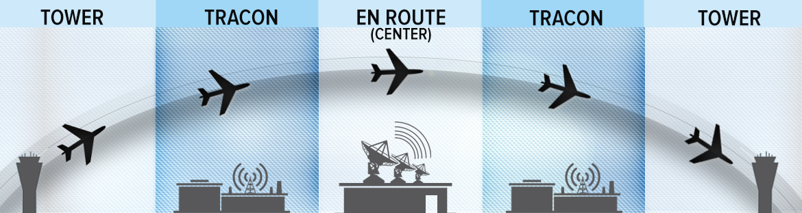
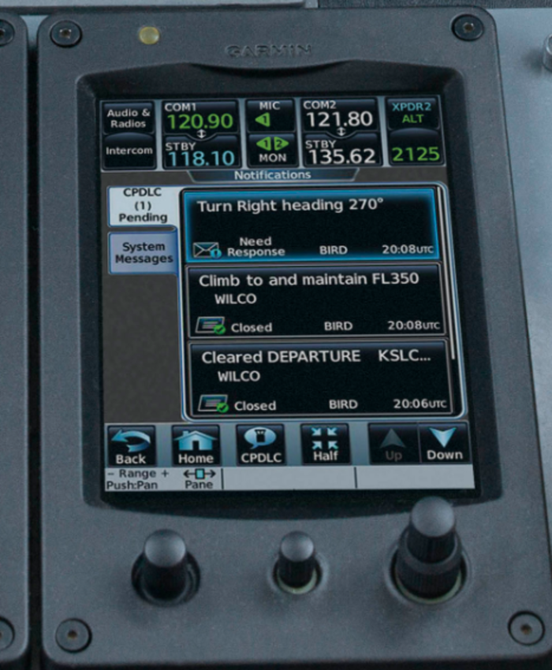
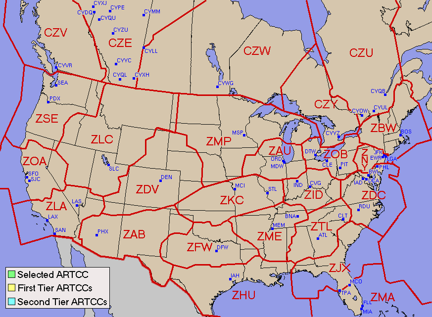
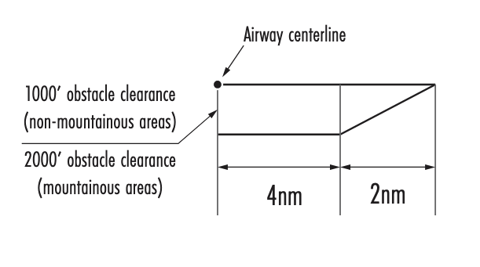

# ATC System

## Objective

Develop a comprehensive understanding of the Air Traffic Control (ATC) infrastructure, the specific roles of various control positions, and the procedural requirements for planning, filing, and closing IFR flight plans within the National Airspace System (NAS).

## Timing

30 minutes

## Format

- Whiteboard
- iPad Charts

## Overview

- Clearance Delivery
- Ground Control
- Tower Control (Local Control)
- Terminal Approach Control Facilities
- Approach Control
- Departure Control
- Final Controller
- Air Route Traffic Control Centers (ARTCC)
- Tower En Route Control (TEC)
- Federal Airways
- Uncontrolled Airspace
- IFR Flight Planning and Filing Procedures
- Closing an IFR Flight Plan

## Elements

### Clearance Delivery

- Responsible for transmitting IFR clearances to departing aircraft
- Usually the first ATC point of contact at towered airports
- Clearances follow the **C-R-A-F-T** format:
  - Clearance limit
  - Route
  - Altitude
  - Frequency
  - Transponder code
- May use automated systems like Pre-Departure Clearance (PDC) or Controller Pilot Data Link Communication (CPDLC-DCL)
- Pilots should call no more than 10 minutes before the proposed taxi time

### Ground Control

- Responsible for safe movement of aircraft on airport taxiways and non-active runways
- ATC must issue an explicit clearance for every runway crossing
- Pilots required to provide a full readback of all "hold short" instructions
- Usually on 121.\*, like 121.6 and 121.9 MHz
  - Sometimes this will be call "Ground point 6", meaning 121.6

### Tower Control (Local Control)

- Responsible for separation of aircraft operating on active runways and within Class D airspace
- Issues takeoff and landing clearances
- Coordinates with Departure Control for an IFR "release" prior to authorizing takeoff
- Primary surveillance in VFR conditions is a visual scan of the airport and local area
- May use Digital Bright Radar Indicator Tower Equipment (DBRITE) to identify aircraft exact locations

### Terminal Approach Control Facilities

- Commonly known as TRACON (Terminal Radar Approach Control)
- Provides the link between the departure airport and the en route structure
- Also controls approaches into other airports in the region (not the primary airport)
- Airspace typically extends **30 NM** from the facility up to **10,000 feet MSL**
- Radar system based around the primary airport
  - Uses Airport Surveillance Radar (ASR) to track primary and secondary targets
  - Automated Radar Terminal Systems (ARTS) receives transponder signals
- Authorized to assign altitudes below published procedural minimums using Minimum Vectoring Altitudes (MVA)

### Approach Control

- Responsible for controlling instrument flights within a designated terminal area
- Sequences arriving aircraft to the final approach course
- Maintains separation between IFR and participating VFR aircraft in Class B, Class C, or TRSA airspace
- Radar service is automatically terminated once the landing is complete or the pilot changes to advisory frequency

### Departure Control

- Ensures separation between departing aircraft
- Clears aircraft out of the terminal area using radar vectors, DVAs, or published DPs
- Verifies that the aircraft's Mode C altitude matches the pilot's reported altitude on initial contact
- Maintains control until the aircraft is released on course or handed off to an ARTCC

### Final Controller

- A controller providing information and final approach guidance during PAR and ASR approaches
  - In PAR, provides highly accurate azimuth and elevation guidance until the aircraft reaches the DH
  - In ASR, provides azimuth guidance and advises the pilot of the MAP location
- In simultaneous parallel approaches, a "monitor controller" ensures aircraft do not penetrate the No Transgression Zone (NTZ)

### Air Route Traffic Control Centers (ARTCC)

- Maintains separation between IFR flights in the en route structure
- Each "Center" manages thousands of square miles of airspace divided into high and low sectors
- Radars (Air Route Surveillance Radar) have a wider range but slower update rate than terminal radar
- Provides "Approach Control" services to airports not served by a TRACON
- Uses flight progress strips to assess the traffic situation and avoid conflicts

### Tower En Route Control (TEC)

- An ATC program linking adjacent approach control areas, used to control short flights in congested airspace
- Enables IFR flight entirely within terminal radar airspace without entering the Center environment
- Generally restricted to non-turbojet aircraft operating below 10,000 feet
- Abbreviated filing procedures available by including "TEC" in flight plan remarks
- TEC routes are published in the Chart Supplement

### Federal Airways

- Victor airways, jet routes, and T-routes
  - **Victor airways (V-prefix)** are Class E airspace from 1,200 feet AGL up to, but not including, 18,000 feet MSL
  - **Jet routes (J-prefix)** extend from 18,000 feet MSL to FL 450
  - **T-Routes (T-prefix)**: RNAV airways which do not use VORs
- Standard airway width is 8 NM (4 NM on each side of the centerline)
- Airway segments are divided at Changeover Points (COPs) to ensure continuous signal reception

### Uncontrolled Airspace

- Airspace not designated as Class A, B, C, D, or E is Class G
- ATC does not exercise control or provide separation in Class G
- Pilots must obtain IFR clearances via phone or radio prior to entering controlled airspace
- PIC is responsible for terrain and obstruction clearance when operating on unpublished routes in Class G

### IFR Flight Planning and Filing Procedures

- Flight plans must be filed at least 30 minutes before the proposed departure time
- ICAO format (FAA Form 7233-4) is now the standard for all IFR flight plans
- Requires assessment of weather, fuel (destination + alternate + 45 minutes), and NOTAMs
- Alternate airport must be filed if the "1-2-3" rule applies

[Flight Plan Form Information](https://www.faa.gov/air_traffic/publications/atpubs/aip_html/appendix1.html)

### Closing an IFR Flight Plan

- IFR flight plans at _towered airports_ close automatically upon landing
- At non-towered airports, the pilot is responsible for closing the flight plan
  - Cancellation can be done via radio with ATC in the air or on the ground
  - Or by calling a FSS after landing
- Failure to close within 30 minutes of ETA results in the initiation of Search and Rescue (SAR)
- Pilots can cancel IFR while airborne in VMC conditions outside Class A airspace

## References

- Aeronautical Information Manual (AIM): Chapters 1, 2, 3, 4, 5, 9
- Instrument Flying Handbook (FAA-H-8083-15): Chapters 1, 2, 9, 10
- Instrument Procedures Handbook (FAA-H-8083-16): Chapters 1, 2, 3, 4
- U.S. Standard for Terminal Instrument Procedures (TERPS) (Order 8260.3)
- Pilot-Controller Glossary
- Backseat Pilot CFII Lesson Plans: Sections II.C, V.A, V.B, V.X
