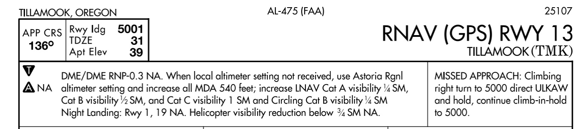
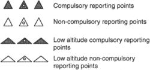

# Pilot-Controller Responsibilities

## Objective

Understand the specific roles and shared responsibilities of pilots and air traffic controllers across various IFR operations, ensuring safety, regulatory compliance, and efficient coordination within the National Airspace System.

## Timing

45 minutes

## Format

- Whiteboard

## Overview

- Air Traffic Clearance
- Contact Approach
- Visual Approach
- Instrument Approach
- Missed Approach
- Radar Vectors
- Safety Alerts
- Speed Adjustments
- Visual Separation
- Instrument Departures
- Wake Turbulence Separations
- Compulsory Reporting Points
- Loss of Communications
- Land and Hold Short Operations (LAHSO)
- Practice Instrument Approaches
- IFR Separation Standards
- See and Avoid
- Traffic Advisories
- VFR-On-Top
- Minimum Fuel Advisory

## Elements

### Air Traffic Clearance

- Pilot:
  - Acknowledge receipt and understanding of **ATC** clearance
  - Read back any **hold short** instructions verbatim
  - Request clarification or amendment if clearance is not understood or considered unsafe
  - Comply promptly unless an emergency necessitates deviation
- Controller:
  - Issue appropriate clearances for the specific operation
  - Assign altitudes at or above **Minimum IFR Altitude (MIA)**
  - Ensure pilot acknowledgement and correct distorted or incomplete readbacks

[AIM 5-5-2](/_references/AIM/5-5-2), [Instrument Flying Handbook pg. 10-3](/_references/IFH/10-3)

### Contact Approach

- Pilot:
  - Must request a contact approach and makes it in lieu of a standard or special instrument approach
  - Indicate aircraft is clear of clouds and has at least **1 s.m.** flight visibility
  - Assume full responsibility for **obstruction clearance**
  - Advise **ATC** immediately if unable to maintain **1 s.m.** visibility or clear of clouds
- Controller:
  - Verify reported ground visibility at destination is at least **1 s.m.**
  - Provide separation from other **IFR** or **Special VFR (SVFR)** traffic

[AIM 5-5-3](/_references/AIM/5-5-3), [Pilot-Controller Glossary](/_references/Pilot-Controller-Glossary/)

### Visual Approach

- Pilot:
  - Must have airport or preceding aircraft in sight at all times
  - Remain clear of clouds and follow the preceding aircraft as instructed
  - Responsible for **wake turbulence** separation and safe landing interval behind preceding traffic
  - Advise **ATC** immediately if sight of airport is lost or clouds cannot be avoided
  - In the event of a go-around, pilot is responsible to maintain terrain and obstruction avoidance until reaching an ATC assigned altitude if issued
- Controller:
  - Clearance authorized only if weather is at least **1,000-3**
  - Provide separation unless pilot is applying **visual separation**
  - Inform pilot if the preceding aircraft is a **Heavy** or **B757**

[AIM 5-5-11](/_references/AIM/5-5-11), [Instrument Flying Handbook pg. 10-20](/_references/IFH/10-20)

### Instrument Approach

- Pilot:
  - Follow all procedures shown on the approach chart, including restrictive notations
  - Maintain last assigned altitude until established on a segment of a published route
  - Comply with **Minimum Altitude** for **IFR**
- Controller:
  - Issue clearance based on known traffic only
  - Assign appropriate maintenance altitude until established on a published segment

[AIM 5-5-4](/_references/AIM/5-5-4), [Instrument Flying Handbook pg. 10-13](/_references/IFH/10-13)

### Missed Approach

- Pilot:
  - Execute immediately if landing requirements not met at **MAP** or **DA/DH**
  - Advise **ATC** and include reason for the miss
  - Fly the lateral navigation path to the **MAP** before turning if executing early
  - Request clearance for specific next action (alternate, re-try, etc.)
  - If a cold-weather adjustment has been applied, notify ATC
- Controller:
  - Issue alternate instructions if published procedure is not desired
  - Vector radar-identified aircraft when operationally advantageous

[AIM 5-5-5](/_references/AIM/5-5-5), [Instrument Flying Handbook pg. 10-21](/_references/IFH/10-21)

### Radar Vectors

- Pilot:
  - Promptly comply with assigned headings and altitudes
  - Question any instruction believed to be incorrect
  - Advise ATC if compliance would cause a violation of any FAR
- Controller:
  - Vector in controlled airspace for separation, noise abatement, or operational advantage
  - Vector IFR aircraft at or above **Minimum Vectoring Altitude (MVA)**
  - Assign altitude (and speed if necessary) when vectoring off a procedure with restrictions

[AIM 5-5-6](/_references/AIM/5-5-6), [Instrument Flying Handbook pg. 2-11](/_references/IFH/2-11)

### Safety Alerts

- Pilot:
  - Initiate appropriate action immediately upon receipt of an alert
  - Aware that service is not always available due to controller workload or radar limitations
- Controller:
  - Issue alert if aware that aircraft is at an altitude placing it in unsafe proximity to terrain or obstructions (**Terrain/Obstruction Alert**)
  - Issue alert if aware of another aircraft placing both in unsafe proximity (**Aircraft Conflict Alert**)

[AIM 5-5-9](/_references/AIM/5-5-9), [AIM 2-1-6](/_references/AIM/2-1-6)

### Speed Adjustments

- Pilot:
  - Advise **ATC** if **True Airspeed (TAS)** at cruise varies by **10 knots** or **5%** (whichever is greater) from flight plan
  - Comply with adjustments within **±10 knots** or **0.02 Mach**
  - Advise **ATC** immediately if unable to comply
- Controller:
  - Assign speeds when necessary for spacing, but not as a substitute for good vectoring
  - Adhere to **JO 7110.65** restrictions on speed adjustment application

[AIM 5-5-7](/_references/AIM/5-5-7), [Instrument Flying Handbook pg. 10-4](/_references/IFH/10-4)

### Visual Separation

- Pilot:
  - Acceptance of instructions to follow or provide separation acknowledges pilot will maneuver as necessary
  - Maintain constant visual surveillance until the other aircraft is no longer a factor
  - Notify **ATC** immediately if visual contact is lost
- Controller:
  - Apply in terminal area when both aircraft are in sight or by instructing pilot to maintain it
  - Apply in en route airspace when aircraft are on opposite courses and pilot reports they have passed

[AIM 5-5-12](/_references/AIM/5-5-12), [Instrument Flying Handbook pg. 10-4](/_references/IFH/10-4)

### Instrument Departures

- Pilot:
  - Consider terrain and obstructions near the departure airport
  - Determine if obstruction avoidance can be maintained visually or by following a **Departure Procedure (DP)**
  - Advise **ATC** early if intending to fly a **Visual Climb Over Airport (VCOA)**
- Controller:
  - Specify takeoff direction, turn, or initial heading consistent with **DP** or **Diverse Vector Area (DVA)**
  - Obtain pilot concurrence at non-towered airports before specifying takeoff direction

[AIM 5-5-14](/_references/AIM/5-5-14), [Instrument Flying Handbook pg. 10-5](/_references/IFH/10-5)

### Wake Turbulence Separations

- Pilot:
  - Exercise vigilance and adjust flight path as necessary to avoid vortices
  - Acceptance of instructions to follow an aircraft or a visual approach clearance acknowledges responsibility
- Controller:
  - Apply no less than minimum required separation to aircraft behind a **Super** or **Heavy**
  - Issue "**CAUTION - WAKE TURBULENCE**" to **VFR** aircraft adversely affected

[AIM 7-3-9](/_references/AIM/7-3-9), [AIM 7-3-10](/_references/AIM/7-3-10)

### Compulsory Reporting Points

- Pilot:
  - Report passage of each compulsory point (solid waypoint on enroute charts) when not in radar contact
  - Discontinue reporting when informed of "**Radar Contact**"
  - Include actual altitude when operating on a "**VFR-on-top**" clearance
- Controller:
  - Monitor reports in non-radar environments to provide separation
  - Inform pilots when **radar contact** is established or lost

- Mandatory reports in radar contact
  - **S**: Safety of flight compromised
  - **T**: Time/altitude reaching a holding fix
  - **A**: Airspeed (TAS) change of >5 knots, or 10% (whichever is greater)
  - **L**: Loss of navigation equipment
  - **L**: Leaving a holding fix
  - **M**: Missed approach
  - **U**: Unable to climb descend 500 FPM
  - **U**: Unforecast weather
  - **V**: Vacating previously assigned altitude
  - **A**: Altitude change during VFR on top
- Mandatory reports when not in radar contact:
  - **C**: Compulsory reporting points
  - **E**: ETA change by more than 2 minutes
  - **F**: FAF inbound on a non-precision approach
  - **O**: Outer marker inbound on a precision
    approach
- Position reports, required when not in radar contact. Should include:
  1. Identification
  2. Position
  3. Time
  4. Altitude or flight level
  5. Type of flight plan (not required in IFR position reports made directly to ARTCCs or approach control)
  6. ETA and name of next reporting point
  7. The name only of the next succeeding reporting point along the route of flight
  8. Any pertinent remarks.

[AIM 5-3-2](/_references/AIM/5-3-2), [Instrument Flying Handbook pg. 10-7](/_references/IFH/10-7)

### Loss of Communications

- Pilot:
  - Squawk **7600**
  - If in **VMC**, continue flight under **VFR** and land as soon as practicable
  - If in **IMC**, follow **91.185** for route (**AVE F**) and altitude (**MEA**)
    - Route: Minimum of assigned, vectored, expected, or filed
    - Altitude: Minimum for IFR, expected altitude, assigned altitude
- Controller:
  - Predicate service on pilot compliance with **91.185**
  - Initiate overdue aircraft procedures if no contact for **30 minutes**

[AIM 6-4-1](/_references/AIM/6-4-1), [14 CFR 91.185](/_references/14-CFR/91-185)

### Land and Hold Short Operations (LAHSO)

- Pilot:
  - Final authority to accept or decline a **LAHSO** clearance
  - Determine aircraft can safely stop within **Available Landing Distance (ALD)**
  - Read back full clearance including "**HOLD SHORT OF...**"
- Controller:
  - Issue clearance only at controlled airports
  - Provide **ALD** data upon request
  - Obtain a full read back of the clearance

[AIM 4-3-11](/_references/AIM/4-3-11), [Instrument Flying Handbook pg. 1-5](/_references/IFH/1-5)

### Practice Instrument Approaches

- Pilot:
  - State "**practice**" when making requests to **ATC**
  - Comply with basic **VFR** and see-and-avoid responsibilities
  - Request specific authorization for a missed approach if **VFR**
- Controller:
  - Provide separation between **VFR** and **IFR** if resources permit
  - Instruct **VFR** aircraft to maintain **VFR** to avoid status misunderstandings

[AIM 4-3-21](/_references/AIM/4-3-21), [Instrument Flying Handbook pg. 10-15](/_references/IFH/10-15)

### IFR Separation Standards

- Pilot:
  - Responsible for avoiding other aircraft when weather permits
  - Maintain vigilance while operating on "**VFR-on-top**"
- Controller:
  - Effect separation vertically by assigning different altitudes
  - Effect separation longitudinally by controlling time/distance intervals
  - Effect separation laterally by assigning different flight paths

[AIM 4-4-11](/_references/AIM/4-4-11), [Instrument Flying Handbook pg. 10-4](/_references/IFH/10-4)

### See and Avoid

- Pilot:
  - Direct responsibility to **see and avoid** other traffic when weather permits
  - Regardless of flight plan type or radar control status
- Controller:
  - Provide traffic information to identified aircraft outside positive control airspace on workload permitting basis
  - Issue safety advisories for unsafe proximity to terrain, obstacles, or other aircraft

[AIM 5-5-10](/_references/AIM/5-5-10), [Instrument Flying Handbook pg. 3-8](/_references/IFH/3-8)

### Traffic Advisories

- Pilot:
  - Acknowledge receipt and inform if traffic is in sight
  - Request vector to avoid traffic if desired
  - Aware that some aircraft may not appear on radar
- Controller:
  - Issue to the maximum extent consistent with higher priority duties
  - Provide vectors to assist in avoidance when requested

[AIM 5-5-8](/_references/AIM/5-5-8), [Instrument Flying Handbook pg. 2-11](/_references/IFH/2-11)

### VFR-On-Top

- Pilot:
  - Assume sole responsibility for see-and-avoid
  - Fly appropriate **VFR** altitudes and comply with **VFR** visibility/cloud clearance
  - Advise **ATC** prior to any altitude change
- Controller:
  - May clear aircraft to maintain this status if requested by pilot
  - Inform pilot of reported height of tops or if no report available

[AIM 5-5-13](/_references/AIM/5-5-13), [Instrument Flying Handbook pg. 10-26](/_references/IFH/10-26)

### Minimum Fuel Advisory

- Pilot:
  - Advise **ATC** when fuel state reached where undue delay cannot be accepted
  - Not an emergency, but an advisory that an emergency is possible if delayed
  - Declare an emergency and report fuel remaining in minutes if priority is needed
- Controller:
  - Not responsible for providing traffic priority

[AIM 5-5-15](/_references/AIM/5-5-15), [Instrument Flying Handbook pg. 10-4](/_references/IFH/10-4)

### References

- **Aeronautical Information Manual (AIM)**:
  - [5-5-2](/_references/AIM/5-5-2)
  - [5-5-3](/_references/AIM/5-5-3)
  - [5-5-4](/_references/AIM/5-5-4)
  - [5-5-5](/_references/AIM/5-5-5)
  - [5-5-6](/_references/AIM/5-5-6)
  - [5-5-7](/_references/AIM/5-5-7)
  - [5-5-8](/_references/AIM/5-5-8)
  - [5-5-9](/_references/AIM/5-5-9)
  - [5-5-10](/_references/AIM/5-5-10)
  - [5-5-11](/_references/AIM/5-5-11)
  - [5-5-12](/_references/AIM/5-5-12)
  - [5-3-2](/_references/AIM/5-3-2)
  - [6-4-1](/_references/AIM/6-4-1)
  - [4-3-11](/_references/AIM/4-3-11)
  - [4-3-21](/_references/AIM/4-3-21)
  - [4-4-11](/_references/AIM/4-4-11)
  - [5-5-13](/_references/AIM/5-5-13)
  - [5-5-14](/_references/AIM/5-5-14)
  - [5-5-15](/_references/AIM/5-5-15)
  - [7-3-9](/_references/AIM/7-3-9)
  - [7-3-10](/_references/AIM/7-3-10)
- **Instrument Flying Handbook (IFH)**:
  - 1-5, 2-11, 3-8, 10-3, 10-4, 10-5, 10-7, 10-13, 10-15, 10-20, 10-21, 10-26
- **TERPS Manual (FAA Order 8260.3)**:
  - Chapters 1, 2, 4, 11, 15, 16
