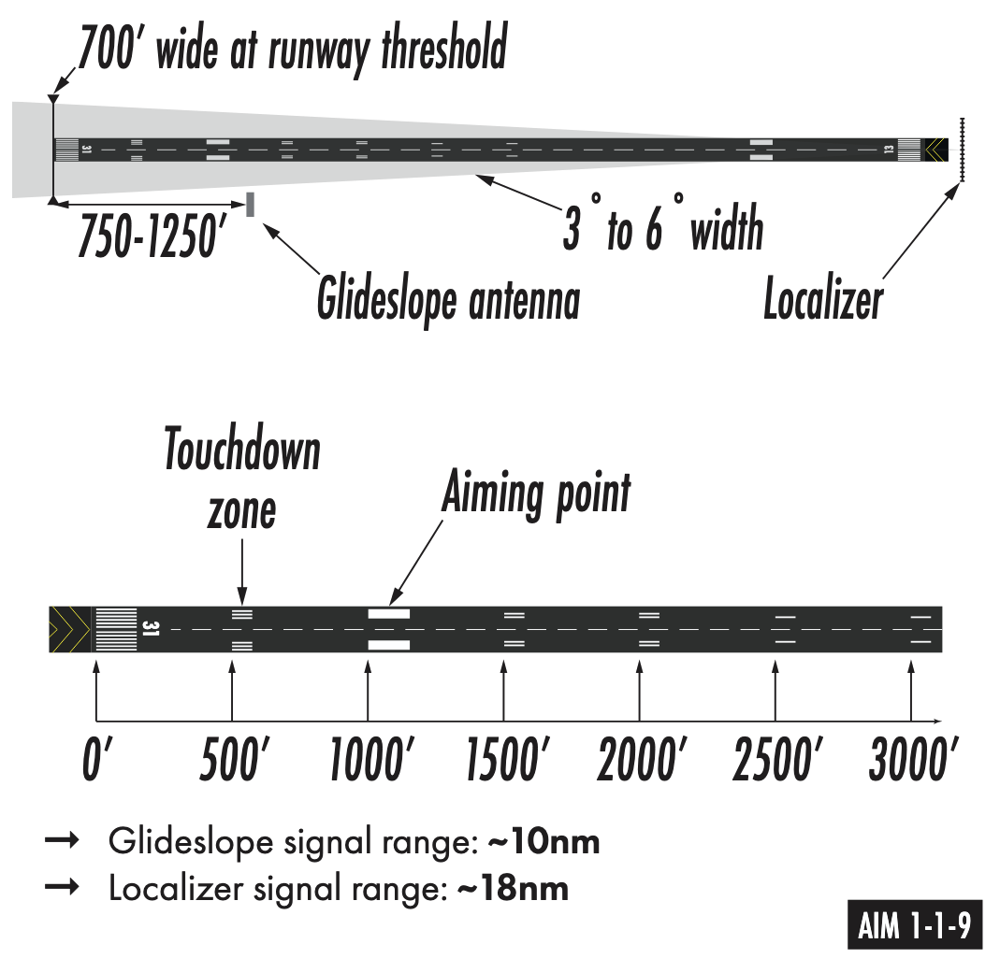
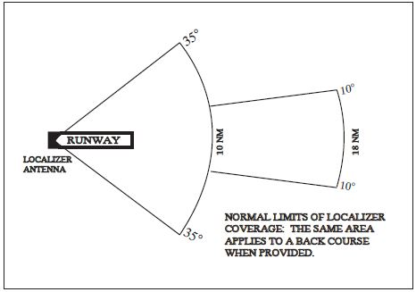
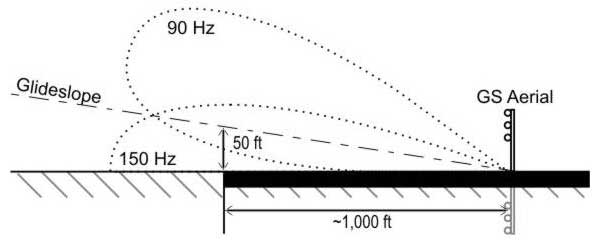
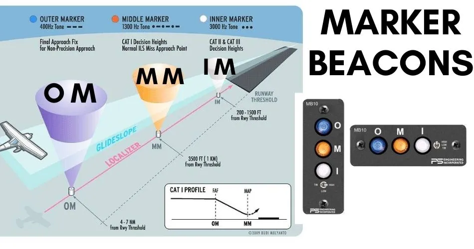
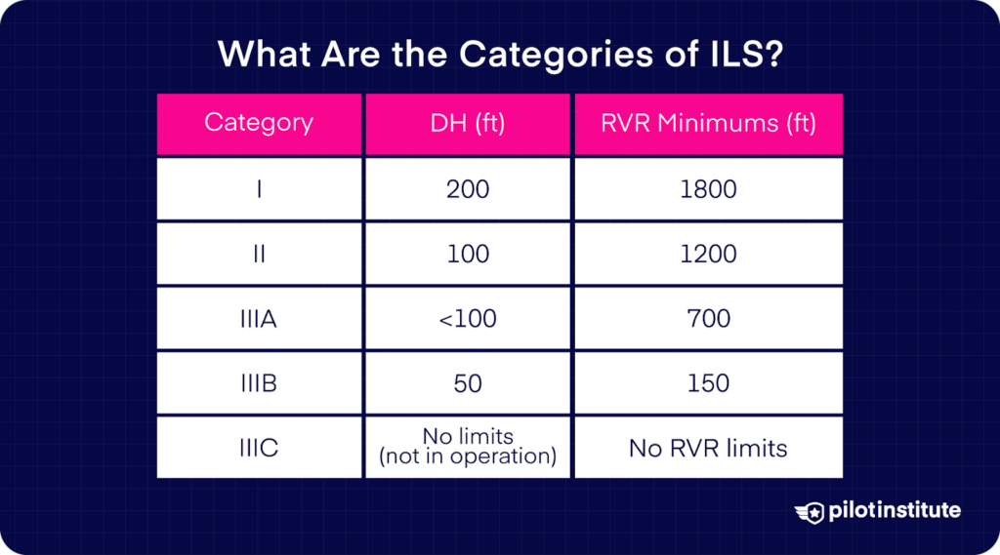
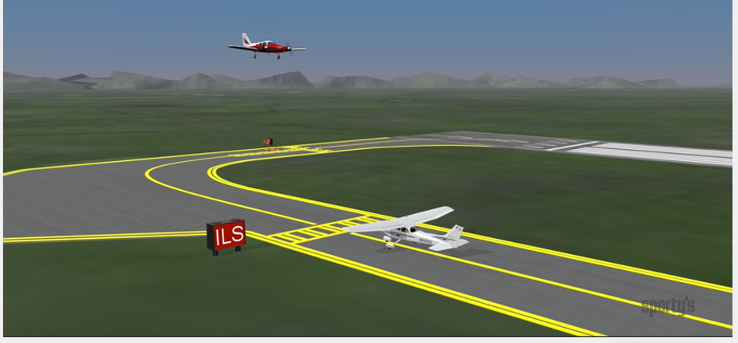
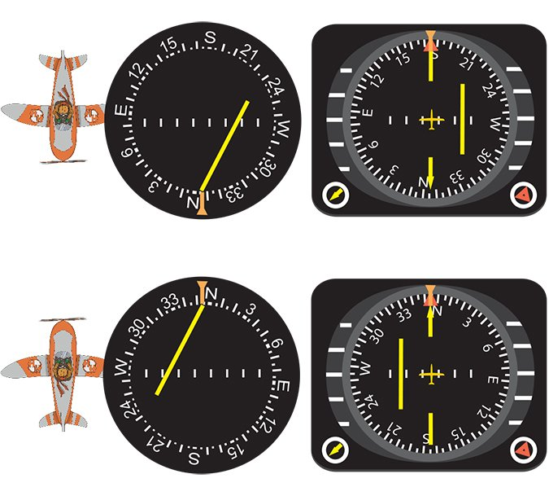
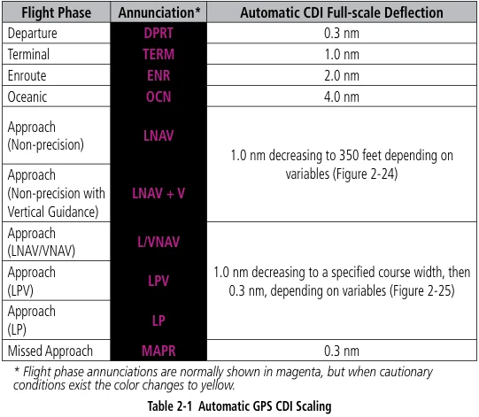

# Precision Approaches

## Objective

## Timing

## Format

## Overview

- Precision Approach Types
- Localizer Principles of Operation
- Glideslope Principles of Operation
- Marker Beacons
- ILS Receiving Equipment
- ILS Categories
- ILS Errors and Irregularities
- Localizer and Glideslope Critical Areas
- Precision Instrument Approaches
- Back Course Approaches
- APV Instrument Approaches and GPS Approaches

## Elements

### Precision Approach Types

Precision approaches are characterized by vertical and horizontal guidance that positions the aircraft close to the runway.

- PAR - Precision approach radar
- GLS - GBAS landing system
- ILS - Instrument landing system

### Localizer Principles of Operation

- Provides horizontal guidance along the extended runway centerline
- Transmitter located at the far end of the runway
- Operates on 40 channels within the 108.10 MHz to 111.95 MHz frequency range (odd tenths)
- Adjusted for a course width of 700 feet at the runway threshold
- Normal service volume extends to 18 NM within 10° of centerline and 10 NM within 35°
- Identification consists of a three-letter Morse code designator preceded by the letter "I"
  - The morse code identifier is printed on approach and enroute charts

### Glideslope Principles of Operation

- Provides vertical guidance toward the runway touchdown point
- Frequency is automatically paired with the localizer frequency
- Operates in the UHF frequency range between 329.15 MHz and 335.00 MHz
- Transmitter located 750 to 1,250 feet from the approach end and offset 250 to 600 feet from centerline
- Normally adjusted to a projection angle of 3° above horizontal
- Provides a usable signal to a distance of 10 NM

### Marker Beacons

- VHF transmitters operating on 75 MHz to provide range information along the approach path
- Antenna array produces an elliptical pattern above the station
- Types of markers
  - **Outer Marker (OM):** Located 4 to 7 miles out; indicates glidepath intercept point; blue light and low-pitch dashes
  - **Middle Marker (MM):** Located ~3,500 feet from threshold; indicates ~200' altitude above threshold; amber light and alternate dots/dashes
  - **Inner Marker (IM):** Indicates Decision Height for CAT II approaches; white light and high-pitch dots
  - **Back Course Marker:** Indicates the final approach fix for a back course approach; white light and pairs of dots
- Markers beacons have mostly been decommissioned, except for inner markers required for CAT-III approaches at large airports. Per [AIM 1-1-9](/_references/AIM/1-1-9), the following may be substituted for an outer marker:
  - DME fix
  - VOR or VOR intersection
  - Suitable RNAV/GPS system
  - NDB in certain scenarios

### ILS Receiving Equipment

- Combined VOR/Localizer receiver with common tuning
  - Navigation indicator includes localizer (vertical) and glideslope (horizontal) needles
  - Warning flags (NAV, GS, or OFF) appear if signal strength is insufficient or equipment fails
- Audio switch panel used to monitor Morse code identifiers and marker beacon tones
- Selective sensitivity on some marker beacon receivers (usually on the audio panel)

### ILS Categories

- **Category I:** DH 200 feet and RVR 2,400 feet (1,800 feet with TDZ/CL lighting or HUD/Autopilot)
  - **Special Authorization CAT I:** DH 150 feet and RVR 1,400 feet using HUD to DH
- **Category II:** DH 100 feet and RVR 1,200 feet (1,000 feet with special authorization)
  - **Special Authorization CAT II:** DH 100 feet and RVR 1,200 feet with reduced lighting
- **Category IIIa:** No DH or DH below 100 feet; RVR not less than 700 feet
- **Category IIIb:** No DH or DH below 50 feet; RVR between 150 and 700 feet
- **Category IIIc:** No DH and no RVR limitation

### ILS Errors and Irregularities

- **Reflection**: Surface vehicles or aircraft below 5,000 feet AGL may cause signal disturbances
- **False glideslope**:
  - Inherent GS signals at higher vertical angles (typically 9°– 12°)
- **Backcourse glideslope**: A glideslope signal may also be received when flying the BC of an ILS; it should be ignored
- Needle "chasing" often results from poor planning or over-controlling
- Guidance anomalies may occur below 100' above the DA
  - In this case it's best to fly a known good heading and maintain the established descent rate

### Localizer and Glideslope Critical Areas

- Areas near antennas established to prevent signal interference by vehicles or aircraft
- ATC provides protection when ceiling is < 800 feet or visibility is < 2 miles
- Arriving aircraft inside the OM (or fix in lieu) triggers protection for both LOC and GS areas

### Precision Instrument Approaches

- Requires pilot adherence to depicted altitudes, paths, and weather minimums
- GS should be captured from below the intercept altitude to avoid false courses.
- The Precise Final Approach Fix (PFAF) is the point of glideslope intercept at the published altitude
- Stabilized approach concept (constant rate and configuration) is critical below 1,000 feet AGL
- Descent rates exceeding 1,000 FPM are generally unacceptable on final

### Back Course Approaches

- Approach using the localizer signal in the opposite direction of the front course
- Identified as "LOC BC" on approach charts
- Reverse sensing occurs on standard VOR indicators (fly away from the needle)
- HSI eliminates reverse sensing if set to the front course heading
  - The HSI OBS should be set to the front course of the runway (180&deg; off of aircraft heading)
- Glideslope is not provided; vertical guidance must be ignored if received
- For autopilot-coupled approaches, ensure it is configured to track a backcourse signal

### APV Instrument Approaches and GPS Approaches

RNAV = Random Area Navigation

- RNAV Approaches with Vertical Guidance
  - LPV - Localizer Performance with Vertical guidance
    - ILS-like minimums (200' minima) and is flown similar to an ILS
    - Gives L/R angular guidance, similar to an ILS
    - Not technically a "precision approach" (for the purposes of alternate planning)
  - LNAV/VNAV - Lateral/vertical navigation (Garmin L/VNAV)
    - Final approach has fixed 0.3NM sensitivity (not angular like an ILS or LPV)
    - Doesn't require a WAAS-based navigator
    - These were initially design for baro-aided FMS systems
- RNAV Non-precision approaches
  - LP - Akin to a LOC approach
  - LNAV - Lateral guidance
  - GPS overlay approaches
- GPS Sensitivity
  - ENR, TERM, LNAV, LP
- Advisory Vertical Guidance (LP +V, LNAV+V)
  - GPS units can provide advisory vertical guidance which meets the steps downs
  - This approach still has an MDA however

## References

- Instrument Flying Handbook: 9-35 to 9-43
- Aeronautical Information Manual: Chapter 1, Section 1; Chapter 5, Section 4; Chapter 5, Section 5
- TERPS Manual (FAA Order 8260.3): Chapters 1, 3, 10, and 12
- Pilot-Controller Glossary: 1952, 1954, 1975, 1984, 1986, 2041
