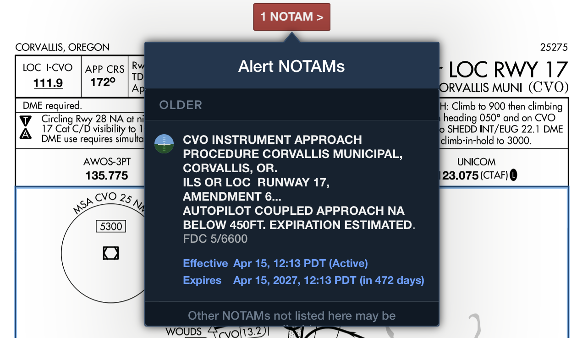
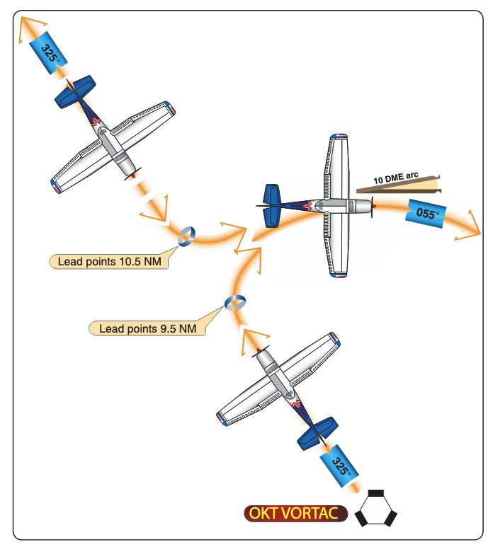

# Autopilot Approaches

## Objective

Provide an understanding of the use of autopilot for IFR approach operations, including their limitation, modes, and use. Also discuss the principle of DME and how it used in IFR flight. Finally, a discussion of partial-panel instrument approaches.

## Timing

45 minutes

## Format

- Whiteboard
- iPad Charts

## Overview

- Autopilot Approach Operations and Limitations
- Nonprecision Approaches with an Autopilot
- APV Approaches with an Autopilot
- Precision Approaches with an Autopilot
- Back Course Approaches with an Autopilot
- Missed Approach Procedures with an Autopilot
- Holding Procedures with an Autopilot
- DME Principles of Operation
- DME Errors and Irregularities
- DME Arc Interception
- DME Arc Tracking
- Use of GPS as Substitute for DME
- Instrument Approaches with Loss of Primary Flight Instrument Indicators (Partial Panel)

## Elements

### Autopilot Approach Operations and Limitations

- Know the limitations of your aircraft, autopilot, and NOTAMs

### Non-precision Approaches with an Autopilot

- Use NAV or GPS mode, as appropriate for you autopilot

### APV Approaches with an Autopilot

- Monitor GPS annunciations and ensure correct mode (LPV, LPV+V, LNAV+V)

### Precision Approaches with an Autopilot

- Some autopilot will activate GS mode automatically (GFC90 and GFC500)
- Ensure modes are armed and GS is correctly captured near the FAF
  - This will require coordinated configuration of power/flaps

### Back Course Approaches with an Autopilot

- HSI may need to be tuned to the front course (for the Avidyne/DFC90)

### Missed Approach Procedures with an Autopilot

- Some systems have go-around button (GA), for instance the GFC500
  - This system puts the aircraft into PIT mode, node up of 7&deg;
- Other systems require you to change into a climb mode
- Be sure to unusupend the GPS sequencing

### Holding Procedures with an Autopilot

- Modern autopilots will fly the proper hold entry and execute the hold course
- Note the CDI will still display relative to the holding inbound course

### DME Principles of Operation

- System uses **paired pulses** sent from aircraft (**interrogation**) to ground station
  - Ground **transponder** replies with pulses on a different frequency
  - Airborne unit measures **elapsed time** to compute distance
- Distance displayed as **Slant Range** in **Nautical Miles (NM)**
- Operates on **UHF** frequencies from **960 MHz** to **1215 MHz**
- Typically frequency-paired with **VOR** or **LOC** facilities
- **Morse Code** identification transmitted once for every three or four **VOR** IDs
- **DME High (DH)** and **DME Low (DL)** define standard service volumes
  - Reliable signal range up to **199 NM** at **line-of-sight** altitudes
- Accuracy within **1/2 mile** or **3%** of distance, whichever is greater

### DME Errors and Irregularities

- **Slant Range Error** is the primary inherent limitation
- Measures straight-line distance, not horizontal ground distance
- Error is greatest when directly over or near the station at high altitudes
- Instrument displays **altitude in NM** when passing over the facility
- Error is negligible if **1 NM** away for every **1,000 feet** above facility elevation
- Signals restricted to **line-of-sight**; blocked by terrain or earth curvature
- **DME** usually lost first when flying "over the horizon" due to higher frequency

### DME Arc Interception

- Requires use of a **Lead Point** to transition from a radial to the arc
- Standard lead point of **0.5 NM** for groundspeeds $\leq$ **150 knots**
- Start turn approximately **90$^{\circ}$** from arrival radial to intercept arc
- Minimum arc radius for **TERPS** design is **7 NM** (**15 NM** for high altitude)
- Maximum arc radius for final approach segments is **30 NM**
- Adjust rollout heading based on **DME** movement during the turn

### DME Arc Tracking

- Flown as a series of short straight legs to approximate a circle
- Using **RMI**: maintain **Relative Bearing (RB)** of **90$^{\circ}$** or **270$^{\circ}$**
- Allow pointer to move **5$^{\circ}$–10$^{\circ}$** behind wingtip, then turn **10$^{\circ}$–20$^{\circ}$** ahead
- Correction technique: change **RB** **10$^{\circ}$–20$^{\circ}$** for each **0.5 NM** deviation
- Easier to stay slightly **inside the curve** as the arc turns toward the aircraft
- Using **VOR CDI**: maintain heading near the **90$^{\circ}$** or **270$^{\circ}$** reference points
- Recenter **CDI** whenever needle moves **2$^{\circ}$–4$^{\circ}$** from center
- Intercept **Lead Radials** to transition from the arc to a final approach course

### Use of GPS as Substitute for DME

- Substitution of RNAV computed distance to or from a NAVAID in place of DME distance is permitted when holding
  - However, the actual holding location and pattern flown will be further from the NAVAID than designed due to the lack of slant range in the position solution
- GPS systems, certified for IFR en route and terminal operations, may be used as a substitute for ADF and DME receivers for the following operations:
  - Determining the aircraft position over a DME fix
  - Flying a DME arc

[AIM 1-2-3](/_references/AIM/1-2-3)

### Instrument Approaches with Loss of Primary Flight Instrument Indicators (Partial Panel)

- ATC Notification: Promptly report the failure to ATC, including the specific equipment affected and the degree to which your ability to operate under IFR is impaired.
- Approach Selection:
  - Choose the simplest procedure available, such as one provided by radar vectors
  - Often this an RNAV LPV which will provide lateral/vertical guidance
  - Consider requesting a "no-gyro" approach from ATC
- Pitch and Bank Control:
  - Maintain pitch by using the **altimeter** as the primary instrument
  - Cross-check the **airspeed indicator** and **VSI**
- For bank control
  - Use the **turn coordinator** as the primary reference for wings-level flight, and for standard-rate turns
- Control Inputs:
  - Utilize small, gentle control pressures and allow time for the instruments to stabilize to avoid overcontrolling
  - Avoid "chasing" needles and large inputs, which can lead to spatial disorientation
- Heading and Timing: Use the **magnetic compass** for heading information
  - Be careful to account for **ANDS** and **UNOS** errors
  - Use timed, standard-rate turns and cross-check with the compass
- Backup Systems: In aircraft with electronic flight displays, transition to the **standby instruments** (typically an analog airspeed indicator, attitude indicator, and altimeter) and use the moving map on the MFD to maintain situational awareness.

[Instrument Flying Handbook pg. 7-36](/_references/IFH/7-36)

## References

- **Aeronautical Information Manual (AIM)**: Chapter 1, Section 1; GEN 3.4
- **Instrument Flying Handbook (IFH)**: Chapters 5, 7, and 9-17
- **TERPS Manual (FAA Order 8260.3)**: Chapters 2 and 5
- **Instrument ACS**: IR.V.A
- Instrument Flying Handbook, Chapter 7, Section I & II
- Instrument Procedures Handbook, Chapter 4
- Aeronautical Information Manual, Chapter 5
- Avidyne [DFC90 Pilot's Guide](https://flymaa.org/assets/dfc90-autopilot-pilot-s-operating-handbook.pdf)
- Garmin [G5 Pilot's Guide](https://static.garmin.com/pumac/190-01112-12_B.pdf)
