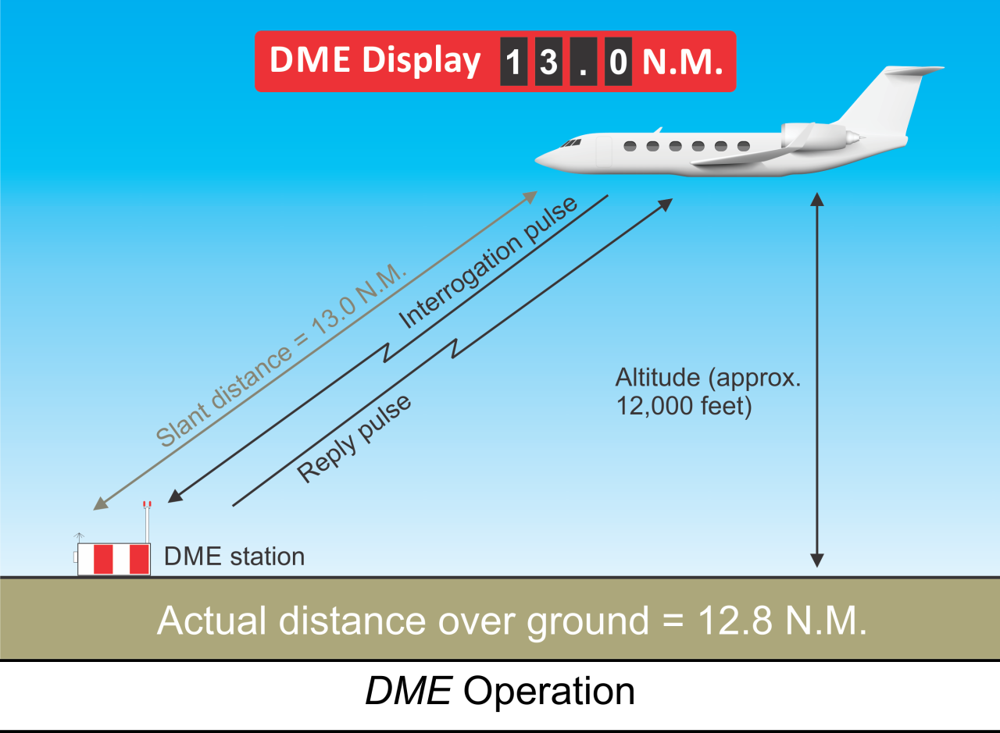

# Autopilot Approaches

## Objective

## Timing

## Format

## Overview

- Autopilot Approach Operations and Limitations
- Nonprecision Approaches with an Autopilot
- APV Approaches with an Autopilot
- Precision Approaches with an Autopilot
- Back Course Approaches with an Autopilot
- Missed Approach Procedures with an Autopilot
- Holding Procedures with an Autopilot
- DME Principles of Operation
- DME Errors and Irregularities
- DME Arc Interception
- DME Arc Tracking
- Use of GPS as Substitute for DME
- Instrument Approaches with Loss of Primary Flight Instrument Indicators (Partial Panel)

## Elements

### DME Principles of Operation

- System uses **paired pulses** sent from aircraft (**interrogation**) to ground station
  - Ground **transponder** replies with pulses on a different frequency
  - Airborne unit measures **elapsed time** to compute distance
- Distance displayed as **Slant Range** in **Nautical Miles (NM)**
- Operates on **UHF** frequencies from **960 MHz** to **1215 MHz**
- Typically frequency-paired with **VOR** or **LOC** facilities
- **Morse Code** identification transmitted once for every three or four **VOR** IDs
- **DME High (DH)** and **DME Low (DL)** define standard service volumes
  - Reliable signal range up to **199 NM** at **line-of-sight** altitudes
- Accuracy within **1/2 mile** or **3%** of distance, whichever is greater

### DME Errors and Irregularities

- **Slant Range Error** is the primary inherent limitation
- Measures straight-line distance, not horizontal ground distance
- Error is greatest when directly over or near the station at high altitudes
- Instrument displays **altitude in NM** when passing over the facility
- Error is negligible if **1 NM** away for every **1,000 feet** above facility elevation
- Signals restricted to **line-of-sight**; blocked by terrain or earth curvature
- **DME** usually lost first when flying "over the horizon" due to higher frequency

### DME Arc Interception

- Requires use of a **Lead Point** to transition from a radial to the arc
- Standard lead point of **0.5 NM** for groundspeeds $\leq$ **150 knots**
- Start turn approximately **90$^{\circ}$** from arrival radial to intercept arc
- Minimum arc radius for **TERPS** design is **7 NM** (**15 NM** for high altitude)
- Maximum arc radius for final approach segments is **30 NM**
- Adjust rollout heading based on **DME** movement during the turn

### DME Arc Tracking

- Flown as a series of short straight legs to approximate a circle
- Using **RMI**: maintain **Relative Bearing (RB)** of **90$^{\circ}$** or **270$^{\circ}$**
- Allow pointer to move **5$^{\circ}$–10$^{\circ}$** behind wingtip, then turn **10$^{\circ}$–20$^{\circ}$** ahead
- Correction technique: change **RB** **10$^{\circ}$–20$^{\circ}$** for each **0.5 NM** deviation
- Easier to stay slightly **inside the curve** as the arc turns toward the aircraft
- Using **VOR CDI**: maintain heading near the **90$^{\circ}$** or **270$^{\circ}$** reference points
- Recenter **CDI** whenever needle moves **2$^{\circ}$–4$^{\circ}$** from center
- Intercept **Lead Radials** to transition from the arc to a final approach course
- **PHOTO PLACEHOLDER: RMI display showing bearing pointer positions for maintaining a DME arc**

## References

- **Aeronautical Information Manual (AIM)**: Chapter 1, Section 1; GEN 3.4
- **Instrument Flying Handbook (IFH)**: Chapters 5, 7, and 9-17
- **TERPS Manual (FAA Order 8260.3)**: Chapters 2 and 5
- **Instrument ACS**: IR.V.A
