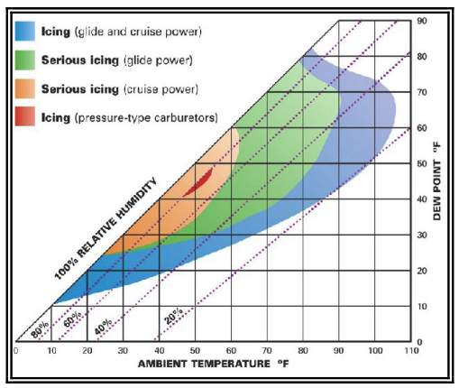
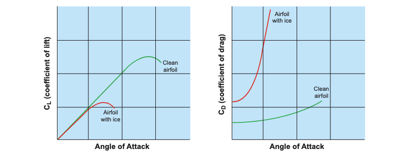
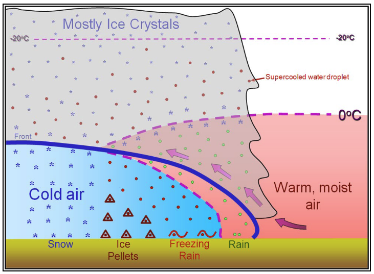

# Icing and FIKI

## Objective

To understand the formation, dangers, and mitigation of in-flight icing and how to avoid it.

## Timing

30 minutes

## Format

- Slides

## Overview

- What is icing?
- Hazards of icing
- When does icing form?
- Kinds of icing
- Accumulation rates
- Ground icing
- Icing weather products
- Icing in and around thunderstorms
- Ice accumulation playbook
- Flight into known icing certification (FIKI)

## Elements

- What is icing?
  - Aircraft icing is ice that accumulates on the structure or in the induction system and is associated with a variety of hazards.
- Induction system icing (e.g. carburetor ice)
  - Carburetor ice occurs due to the effect of fuel vaporization and the decrease in
    air pressure in the venturi, which causes a sharp temperature drop in the
    carburetor.
  - If water vapor in the air condenses when the carburetor temperature is at or
    below freezing, ice may form on internal surfaces of the carburetor, including
    the throttle valve.
  - Carburetor ice is most likely to occur when temperatures are below **70&deg;F**
    (°F) and the relative humidity is above **80%**.
  - Due to the sudden cooling that takes place in the carburetor, icing can occur
    even in outside air temperatures as high as **100&deg;F** and humidity as low as
    **50%**.
  - 
- Structural icing: Ice that forms on the airplane's exterior structure
  - Ice tends to form on small or narrow objects
  - Types of structural icing
    - Rime ice: Rough, milkly, opaque ice
      - Forms by instantaneous or rapid freezing of super-cooled droplets as they strike the aircraft's surface
      - Formed by lower temperatures, smaller amounts of water, and smaller droplets
    - Clear ice: Slow accumulation causes smooth, clear, "glazey" ice to form
      - Formed by larger amounts of water, high aircraft speed, and large droplets
      - Water melts and "runs back" along the wing before it freezes. This can be out-of-reach of you de-icing system
      - Typically more dangerous that rime ice
    - Mixed ice: A combination of clear and rime ice
- Hazards of structural icing
  - Ice alters the shape of an airfoil, reducing the AOA at which the aircraft stalls
    - Note: This may have no effect in cruise but pose a significant risk during approach and landing
    - 
  - Ice can partially block or limit control surfaces, making movement ineffective
  - Ice also increase aircraft weight
  - Roll upset can occur with self-deflection of the aileron
  - Ice-Contaminated Tailplane Stall (ICTS)
    - Since the horizontal stab is thinner than the main wing, it will accumulate ice quicker
    - A tailplane stall can occur when the tailplane exceeds its negative AoA, often after deploying flaps
    - This causes the nose to drop
    - Be on the lookout for: Sudden changes in elevator effectiveness, force, trim changes, pulsing, osilications or vibrations
    - If you suspect a tailplane stall:
      - Retract the flaps, if lowered
      - Add power and use previous airspeed/attitude combination which gave you S&L flight
  - Propeller icing
    - Ice tends to form on the spinner and inner radius of the propeller
    - This results in a loss of thrust as the propeller is less aerodynamically efficient
  - Other icing
    - Windshield icing: May severely limit forward visibility
    - Stall warning systems: May become immovable (for instance the AoA indicator on a Cirrus)
    - Antenna icing: Antennas that do not lay flush with the aircraft’s skin tend to accumulate ice rapidly
      - Radio reception may become distorted
      - Antennas can also break off with enough ice accumulation
- Factors which affect ice accumulation
  - Water content
  - Temperature
  - Droplet size
  - Aircraft design
  - Airspeed
- PIREP Accumulation rates ([AIM 7-1-19](/_references/AIM/7-1-19))
  - **Trace**: Ice becomes noticeable. The rate of accumulation is slightly greater than the rate of sublimation
  - **Light**: Occasional requires manual activation of the deicing systems. May become hazardous after an hour in the icing conditions
  - **Moderate**: Requires continuous use of the deice system
  - **Severe**: Conditions where the deice system fails to remove ice and accumulates in places normally not prone to icing
- Ground icing: Frost
  - Frost may form overnight when the temperature is below freezing and dew forms on the wings
  - Just like airframe ice, this can have a significant effect of the aerodynamics of the airfoil and adds weight to the airplane
  - Any accumulation of ice or frost should be removed before attempting flight
  - How to remove frost: Rag with deicing fluid, deicing fluid spray, or a light brush
- Conditions which form ice
  - There is potential for icing anytime you're in visible moisture and the temperature is near or below freezing
    - Most ice forms between **-20&deg;** and **0&deg;**
    - About half of reports are between **-8 °C** and **-12 °C**, and between **5,000** and **13,000 ft**.
  - Cumulus clouds and thunderstorms
    - Ice can form in all levels of a cumulus cloud
    - Updrafts make SLDs and cold temperatures in the upper levels of a cumulus
  - Strataform clouds:
    - Generally trace to light
    - Often you can climb/descend out of the cloud, or descend to warmer air
  - Freezing rain: Severe ice can accumulate extremely quickly
  - Warm fronts can create the potential for freezing rain and supercooled large droplets (SLD)
    - 
    - 
  - Freezing fog
- Icing weather products
  - Freezing level chart
  - AIRMETs: Moderate icing and low freezing levels
  - SIGMETs: Severe icing
- Ice accumulation playbook
  1. Pitot heat ON
  2. Ice protection system (TKS, boots) ON
  3. Windshielf defrost: ON
  4. Determine course out of icing conditions (climb, descend, turn)
  5. Aircraft-specific inadvertent icing encounter checklist
- Removal of aircraft ice in flight
  - Ice will sublimate after moving to clear air, but this can be very slow
  - Ice will melt if moving to warmer air
- Landing with accumulated ice
  - Be very caution of configuration changes, particularly flaps. Deploy flaps in stages
  - Perform a reduced-flap landing on a long runway, if possible
  - Carry a higher-than-normal power setting into the approach
  - Refer to the POH/AFM for approach airspeed with ice
    - Increase approach airspeed by at least 25 percent above non-icing airspeed for the applicable flap setting
- Icing regulations: [91.527](/_references/14-CFR/91.527)
  - "No pilot may take off an airplane that has frost, ice, or snow adhering to any propeller, windshield, stabilizing or control surface; to a powerplant installation; or to an airspeed, altimeter, rate of climb, or flight attitude instrument system or wing"
  - No pilot may fly under IFR into known or forecast light or moderate icing conditions, or under VFR into known light or moderate icing conditions, unless the aircraft is FIKI-certified.
- Flight into known icing certification (FIKI)
  - "Flight into known icing": Any flight conditions where you’d expect the possibility of ice forming or adhering to the aircraft based on all available preflight information
  - Note: Even airplanes approved for flight into known icing conditions should not fly into **severe** icing, **freezing rain** or **freezing drizzle**.

## References

- [91.527](/_references/14-CFR/91.527)
- [Instrument Flying Handbook pg. 4-13](/_references/IFH/4-13)
- [AIM 7-1-19](/_references/AIM/7-1-19): PIREPs Relating to Airframe Icing
- [AIM 7-1](/_references/AIM/7-1): Icing Weather Products
- [AIM 7-6-15](/_references/AIM/7-6-15): Operations in Ground Icing Conditions
- [Aviation Weather Handbook pg. 20-2](https://www.faa.gov/sites/faa.gov/files/FAA-H-8083-28A_FAA_Web.pdf)
- [AC 91-74B](https://www.faa.gov/documentLibrary/media/Advisory_Circular/AC_91-74B.pdf)
