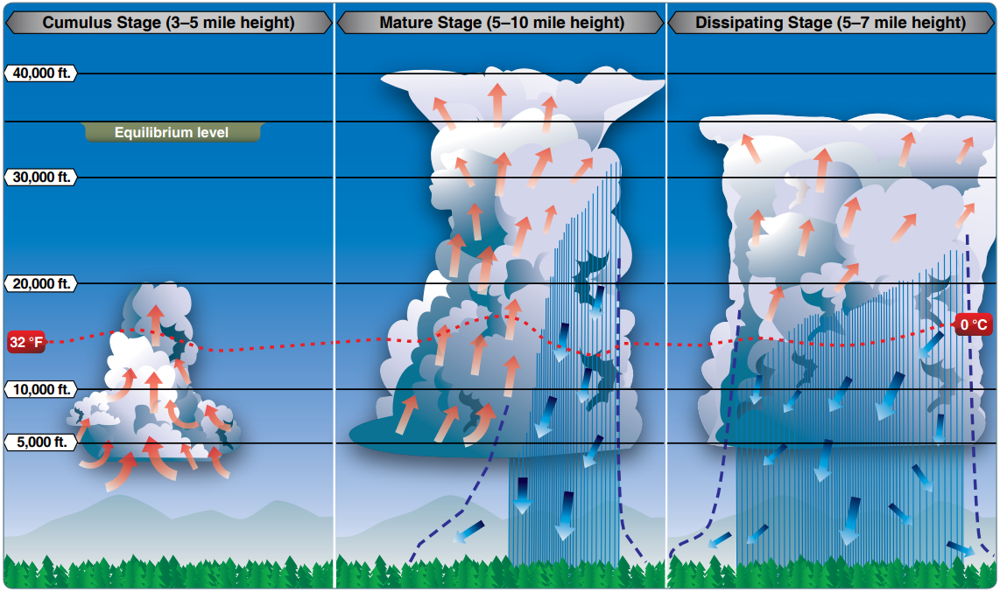
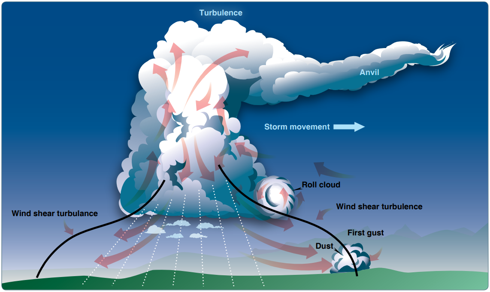
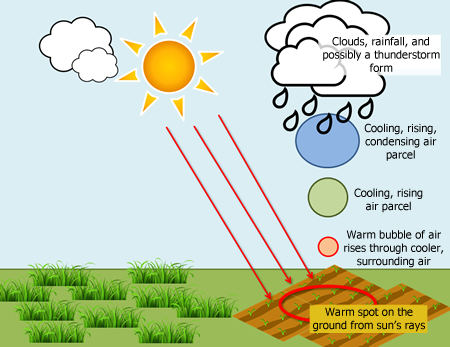
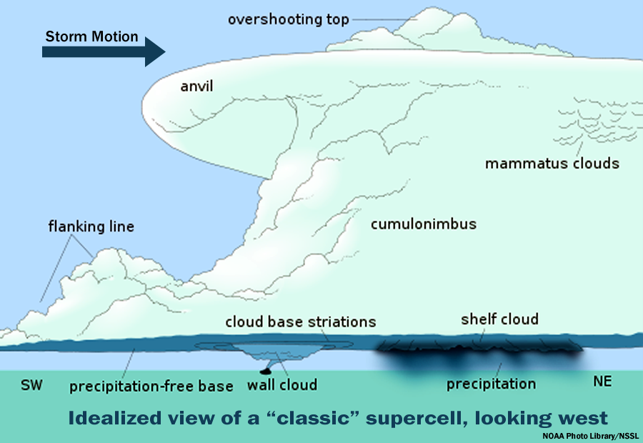
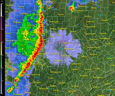
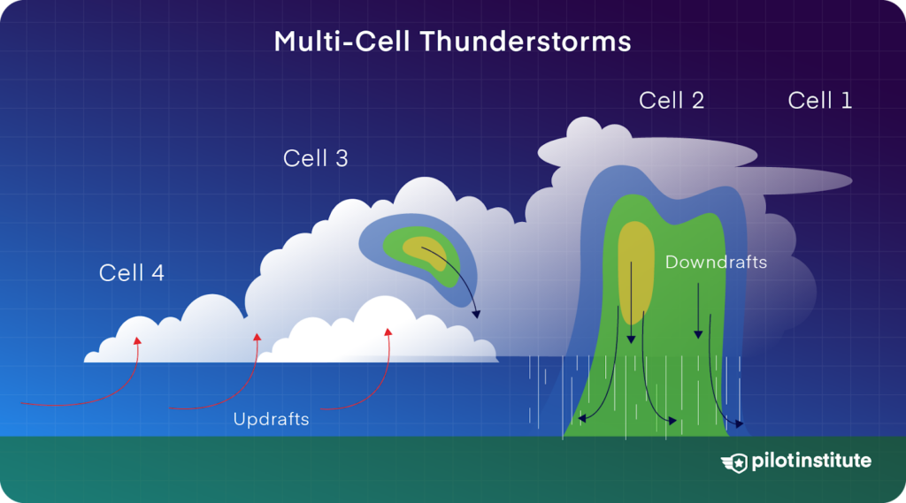
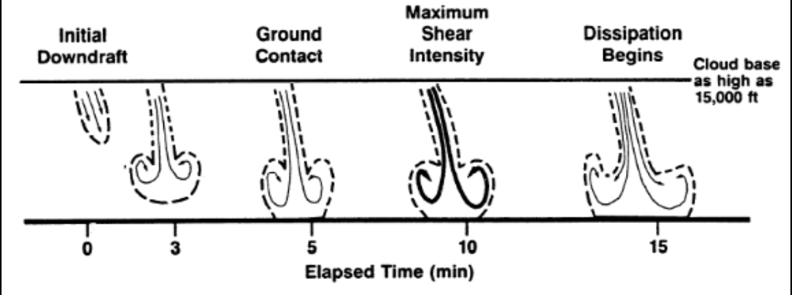
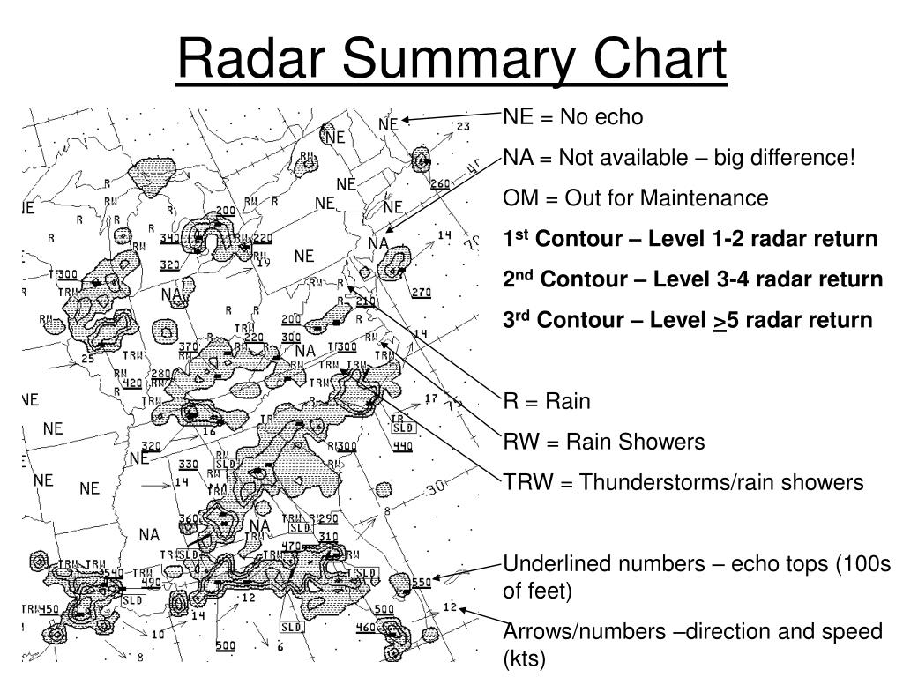
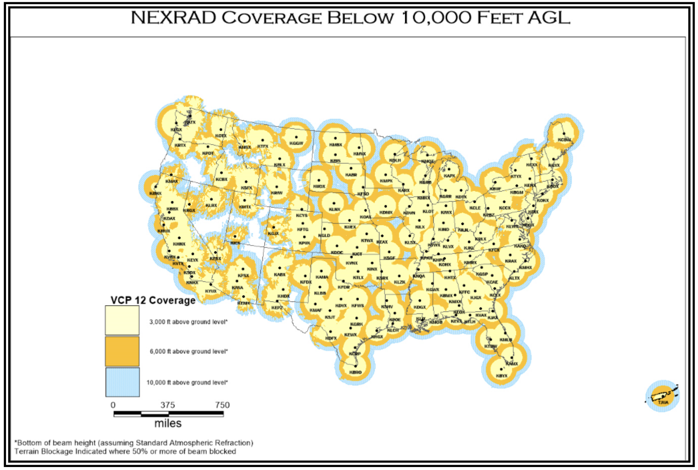
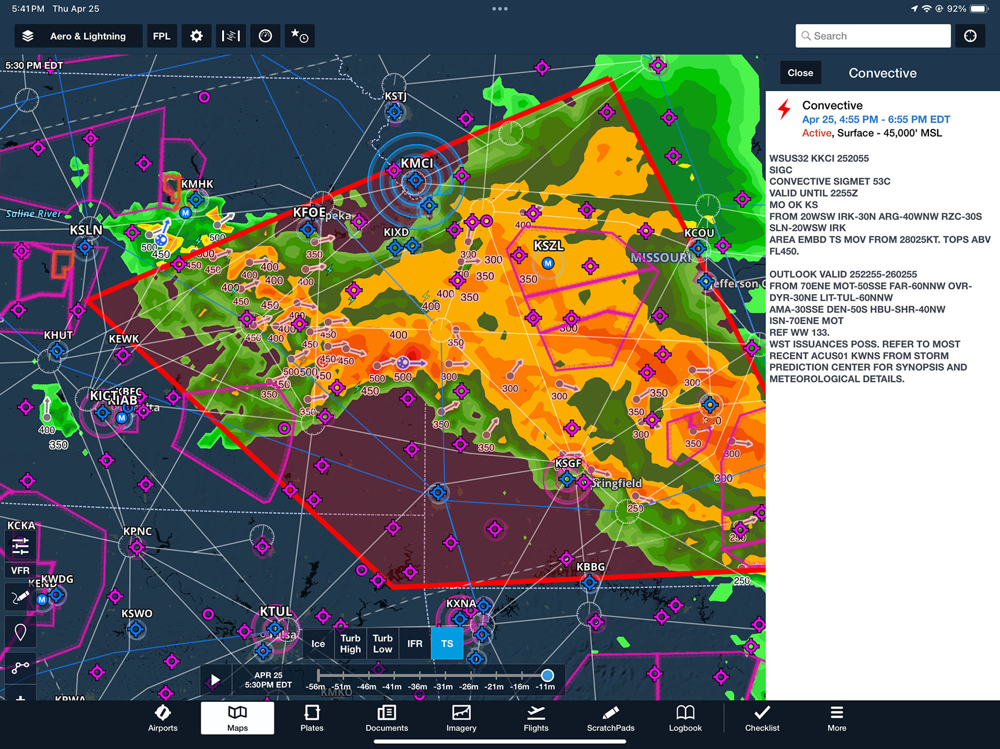

# Thunderstorms

## Objective

Understand the formation, classification, and lifecycle of thunderstorms, identify associated aviation hazards, interpret relevant weather products, and apply established safety strategies for avoidance and inadvertent encounters.

## Timing

- 45 minutes

## Format

- Whiteboard
- ForeFlight weather products

## Overview

- Conditions Required for Thunderstorms
- Thunderstorm Lifecycle
- Air Mass Thunderstorms
- Steady State Thunderstorms
- Squall Line Thunderstorms
- Embedded Thunderstorms
- Frontal Thunderstorms
- Hazards Associated with Thunderstorms
- Forecasts Associated with Thunderstorms
- Radar Summary Chart
- Convective SIGMETs
- Thunderstorm Avoidance Strategies
- Inadvertent Thunderstorm Encounter Strategies

## Elements

### Conditions Required for Thunderstorms

Three essential ingredients:

1. Water vapor
2. Unstable air
3. A lifting mechanism

- Conditionally unstable air allows for release of convective energy
- Lifting mechanisms: converging winds, fronts, upslope flow, drylines, or local wind circulations
- A rapid decrease in temperature with altitude may indicate a unstable air mass

### Thunderstorm Lifecycle

Three distinct stages: **Towering Cumulus**, **Mature**, and **Dissipating**

1. **Towering Cumulus** stage features strong updrafts exceeding **3,000** fpm
2. **Mature** stage features both updrafts and downdrafts; hazards at peak intensity
3. **Dissipating** stage dominated by downdrafts as moisture supply is cut off

### Air Mass Thunderstorms

- Form on scattered basis due to uneven surface heating and instability
- Also called **popcorn convection**
- Typically small, short-lived, and rarely severe
- Usually dissipate shortly after sunset and heating of the ground stops

### Steady State Thunderstorms

- **Supercells** are long-lived (more than 1 hour) thunderstorms
- Characterized by significant instability, strong surface winds
- Supercells are typically "tilted"
  - Rain falls ahead of the storm, outside of the updraft, preventing the storm from collapsing on itself
- Updrafts of supercells are commonly larger than a typical thunderstorm
  - Can be as large as 10 miles in diameter and up to 60,000 feet tall
  - Updraft speeds can reach **9,000** fpm or **100** knots

### Squall Line Thunderstorms

- Narrow band of active cells extending hundreds of miles
- Often form ahead of cold fronts associated with midlatitude low pressure systems
- Generate approximately **25** percent of all **U.S.** tornadoes
- Most effective **barrier** to air traffic due to height and length

### Embedded Thunderstorms

- Thunderstorm cells obscured by massive cloud layers
- Difficult to circumnavigate visually
- Differentiated in **SIGMETs** as **EMBD TS**

### Frontal Thunderstorms

- Triggered by cold, warm, or occluded frontal lift
- Cold fronts act as a snowplow, forcing air upward abruptly
- Warm fronts produce gradual lift, leading to widespread stratiform clouds and **embedded** cells
- Can occur in a narrow band along the frontal boundary

### Hazards Associated with Thunderstorms

- **Severe turbulence** exists between updrafts and downdrafts
  - Greatest turbulence is found around the perimeter of the storm, where the stormy air is mixing with the air around it
  - Usually the turbulence is strongest on the front side of the storms
  - 20 fpm gusts: Moderate turbulence, 30 fpm gusts: Severe turbulence
  - Gustfront can extend **15-20 miles** in front of a strong storm, surface winds can change rapidly in speed and direction
- **Hailstones** &ge;**0.75** inches cause significant structural damage
- **Lightning** strikes most common at temperatures between -5&deg;C and +5&deg;C
- **Static electricity** (**P-static**) can cause complete loss of **VHF** communications
- **Tornado** wind speeds can exceed **200** knots
- Rapid pressure changes can cause altimeter errors **> 100** feet

#### Microbursts

**Microbursts** produce downdrafts up to **6,000** fpm and headwind losses of **30–90** knots

- Microburst are small-scale, intense downdrafts that spread out symmetrically when reaching the ground

### Forecasts Associated with Thunderstorms

- **Terminal Aerodrome Forecast** (**TAF**) provides point-specific thunderstorm projections
- **Convective Outlook** (**AC**) forecasts severe potential over **8** days
- **Graphical Forecasts for Aviation** (**GFA**) website displays forecast **TS** areas

### Radar Summary Chart

- Graphically depicts collection of radar weather reports (**SDs**)
- Shows precipitation intensity, echo tops, and cell movement
- Identifies weather watches using heavy dashed lines
- **NE** indicates no echoes detected; **NA** indicates no information

### Convective SIGMETs

- Coded as **WST**
- Issued hourly at **H+55** for **Eastern**, **Central**, and **Western U.S.**
- Valid for up to **2** hours
- Criteria:
  - Surface winds &gt;**50** knots, hail &ge;**3/4** inch, or tornadoes
  - Tornados, lines of thunderstorms, embedded or severe thunderstorms
  - Area of very strong storms affecting **3000 square miles** and covering at least **40%** of the area
- Based on a convective outlook, which is also available

### Thunderstorm Avoidance Strategies

Avoid thunderstorms by at least **5** miles, and **20** miles for severe storms.

- Avoid by at least **20** mi any thunderstorm identified as **severe** or giving an **intense**, **heavy**, or **extreme** radar echo
  - Especially true under the anvil of a large cumulonimbus
  - Large echoes should be separated by at least **40** mi before flying between echoes
  - Separation distances may be reduced for avoiding weaker echoes.
- Regard any storm with tops **&gt;35,000** feet as extremely hazardous
- Circumnavigate areas with **6/10** or more thunderstorm coverage
- Do not land or take off in the face of an approaching thunderstorm
- Do not fly under the anvil of a thunderstorm due to clear-air turbulence (**CAT**) risk

[Aviation Weather Handbook pg. 22-21](/_references/AWH/22-21)

### Inadvertent Thunderstorm Encounter Strategies

- Maintain a straight course through the storm to minimize time in hazards
- Set power for recommended turbulence penetration speed (VA)
- Focus on maintaining a level attitude; allow altitude and airspeed to fluctuate
- Disengage **Altitude Hold** and **Speed Hold** modes on autopilot
- Turn cockpit lights to maximum to reduce lightning blindness

[Aviation Weather Handbook pg. 22-22](/_references/AWH/22-22)

## References

- Aviation Weather Handbook: 22-1 to 22-21, 24-3, 24-5, 24-36, 26-2 to 26-10, 27-7 to 27-21
- Instrument Flying Handbook: 2-11, 10-24 to 10-25, 11-2
- Instrument Procedures Handbook: 4-5, A-1
- Aeronautical Information Manual: 7-1-26, 7-1-27
- Backseat Pilot CFI-I Lesson Plans: III.A (Weather Information), III.A (Weather Theory)
- [Purdue Thunderstorms](https://www.mrcc.purdue.edu/living_wx/thunderstorms)
