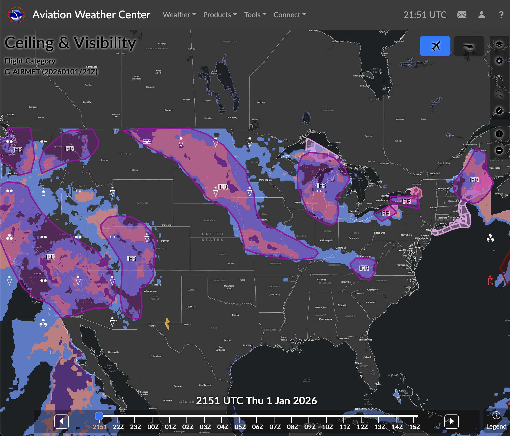
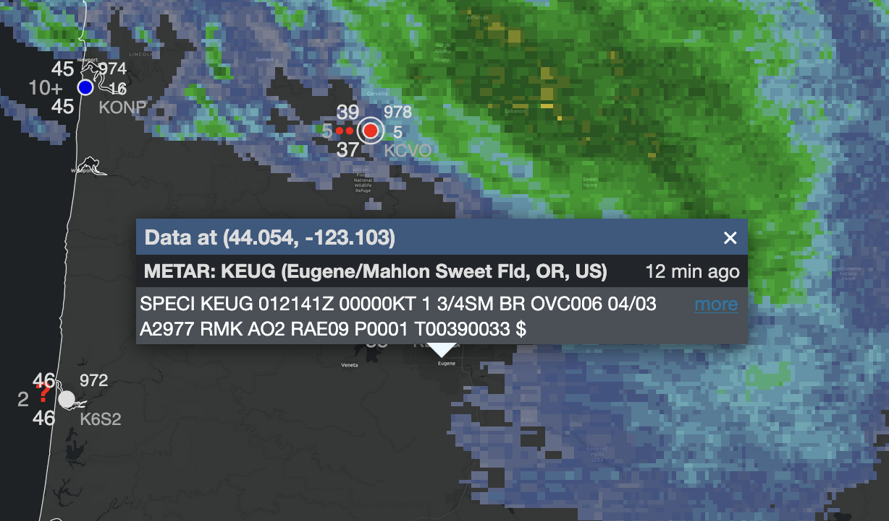
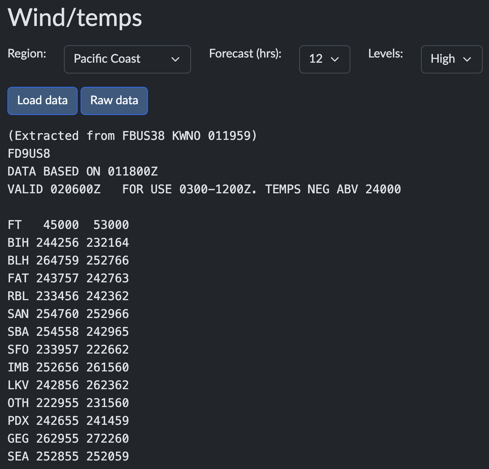
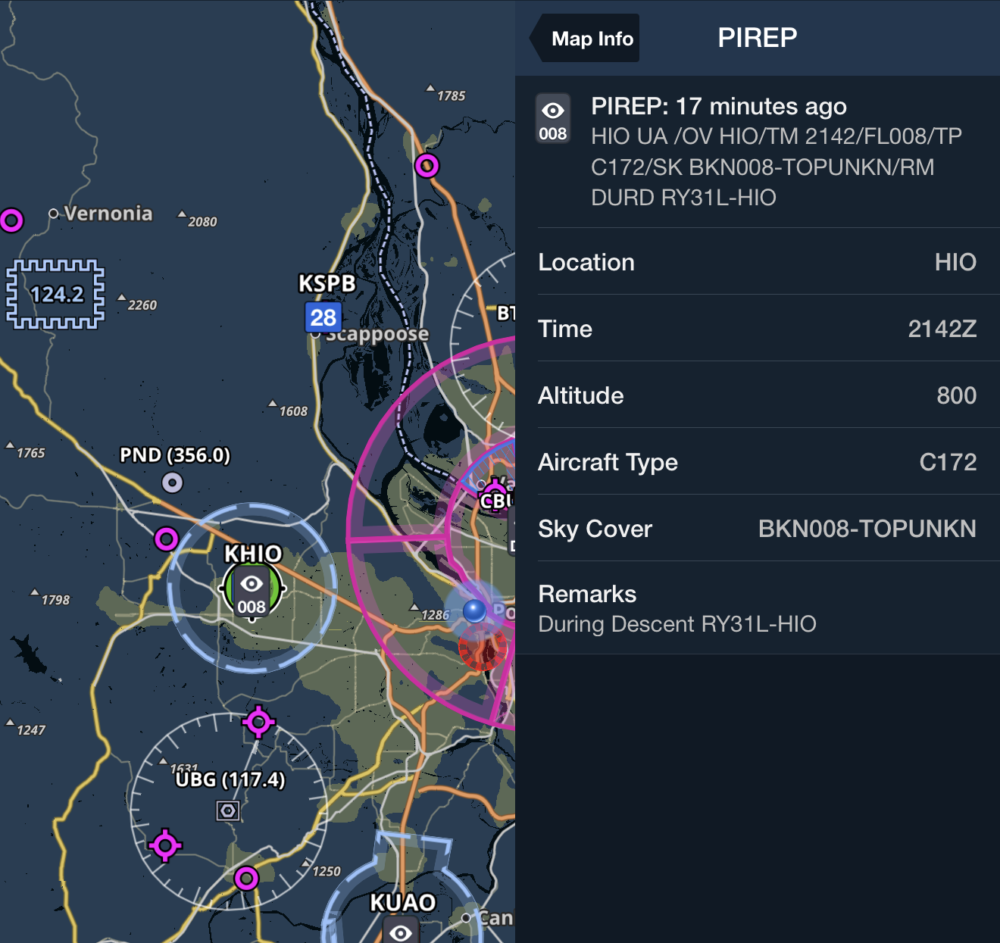
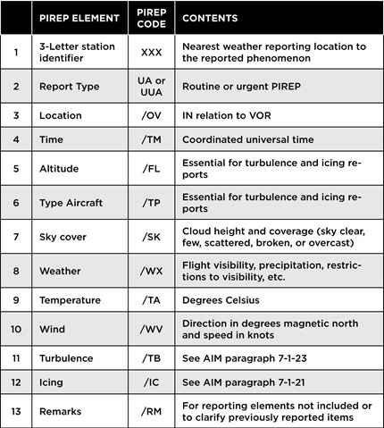
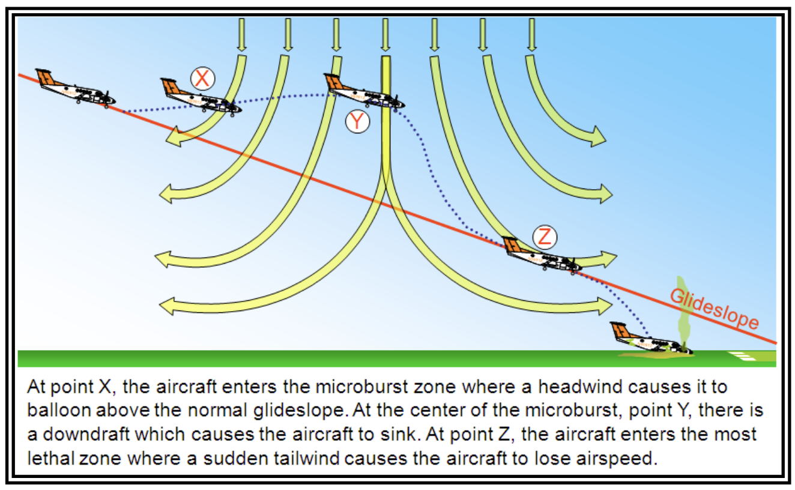

# Weather Reports and Forecasts

## Objective

Demostrate the ability to locate, interpret, and analyze various aviation weather reports and forecasts, correlating this data to identify hazards and make informed go/no-go decisions for **IFR** operations.

## Timing

45 minutes

## Format

- iPad weather briefing overview

## Overview

- Graphical Forecasts for Aviation
- Terminal Aerodrome Forecasts
- METARs
- Winds / Temperatures Aloft
- Pilot Reports
- Radar Observations
- Surface Analysis Chart
- Freezing Level Chart
- Upper Level Charts
- Significant Weather Prognostic Charts
- SIGMETs, AIRMETs, and Convective SIGMETs
- Recognition of Critical Weather Situations
- Windshear Avoidance

## Elements

### Graphical Forecasts for Aviation

- Web-based interactive tool replacing legacy area forecasts (FA) products for the CONUS
- Covers **CONUS**, **Gulf of Mexico**, **Caribbean**, and portions of the **Atlantic** and **Pacific**
- Displays observational data and forecasts from **14** hours past to **15** hours future
- Provides hourly model data for thunderstorms, clouds, flight category, precipitation, icing, and wind

### Terminal Aerodrome Forecasts

- Coded statement of expected conditions within the terminal area (**5 SM** of airport center)
- Standard valid periods are **24** or **30** hours
  - Scheduled for issuance **4** times daily at **0000Z**, **0600Z**, **1200Z**, and **1800Z**
- Uses **FM** for rapid changes and **TEMPO** for temporary fluctuations lasting **< 1** hour
- **PROB30** indicates a **30%** probability of thunderstorms or precipitation
- Only **CB** cloud types are included in the forecast text

### METARs

- Routine aviation weather reports transmitted hourly
- **SPECI** reports issued for significant weather changes between hours
- Standard format includes: Type, Station **ID**, Time, Wind, Visibility, **RVR**, Weather, Sky Condition, Temp/Dewpoint, Altimeter, and Remarks
- Visibility reported in **statute miles** (**SM**)
- Ceiling defined as lowest layer reported as **BKN** or **OVC**
- **RVR** reported when visibility is $\leq$ **1 SM** or **RVR** $\leq$ **6,000** feet

### Winds / Temperatures Aloft

- **FB** forecasts of wind direction, speed, and temperature
- Direction referenced to **true north**
- Issued **4** times daily
- Wind speed **100–199** knots: add **50** to direction and subtract **100** from speed
- Temps above **24,000** feet **MSL** are assumed negative (minus sign omitted)
- Winds not forecast within **1,500** feet of station elevation; temps not forecast within **2,500** feet

### Pilot Reports

- Volunteered observations of in-flight conditions
- Two types: Routine (**UA**) and Urgent (**UUA**)
  - **UUA** required for tornadoes, **severe** icing/turbulence, **hail**, and **LLWS** $\pm$ **10** knots
- Elements include:
  - **/OV** (location)
  - **/TM** (time)
  - **/FL** (altitude)
  - **/TP** (aircraft type)
  - **/WX** (weather)
  - **/TB** (turbulence)
  - **/IC** (icing)

#### Reporting a PIREP

- **Who**: Tailnumber and type, if needed
- **Where**: Relative to an airport or NAVAID
- **When**: Zulu time of the report
- **What**: One or more of the following
  - Clouds
    - Cloud Type
      - Stratus
      - Cumulus
      - Towering Cumulus
      - Cirrus
      - Cumulonimbus
    - Cloud Coverage
      - **Clear**: no coverage
      - **Few**: >0 to 2/8 coverage
      - **Scattered**: 3/8 to 4/8 coverage
      - **Broken**: 5/8 to 7/8 coverage
      - **Overcast**: 8/8 coverage
  - Turbulence (See [Pilot-Controller Glossary T](https://www.faa.gov/air_traffic/publications/atpubs/pcg_html/glossary-t.html))
    - **Light:** Momentarily causes slight, erratic changes in altitude and/or attitude.
    - **Light Chop**: Slight, rapid, and somewhat rhythmic bumpiness without appreciable change in altitude or attitude. Occupants feel a slight strain against their seatbelts.
    - **Moderate**: Changes in altitude and/or attitude occur but the aircraft remains in positive control. It usually causes variations in indicated airspeed.
    - **Moderate Chop**: Causes rapid bumps or jolts without appreciable changes in altitude or attitude. Occupants feel a definite strain against their seatbelts, and unsecured objects will be dislodged.
    - **Severe**: Causes large, abrupt changes in altitude and/or attitude. It usually causes large variations in indicated airspeed and the aircraft may be momentarily out of control. Occupants are violently forced against their seatbelts, and unsecured objects are tossed throughout the cabin.
    - **Extreme**: Aircraft is violently tossed about and is practically impossible to control. It may cause structural damage.
  - Icing ([AIM 7-1-19](/_references/AIM/7-1-19))
    - **Trace**: Ice is just becoming noticeable; accumulation slightly exceeds sublimation. Can be managed for longer periods but still requires monitoring
    - **Light**: Occasional use of deicing systems is needed. Can be hazardous for an hour or more
    - **Moderate**: Continuous use of ice protection systems is needed. Diversion or exit from icing conditions
    - **Severe**: Ice protection systems cannot remove faster than accumulation. Immediate exit from icing conditions is required
  - Visibility and type of precipitation

### Radar Observations

- Primary tool for detecting coverage, intensity, and movement of precipitation
- **WSR-88D** (**NEXRAD**) network updated every **4–10** minutes
- Intensity levels:
  - **LIGHT**
  - **MODERATE**
  - **HEAVY**
  - **EXTREME**
- Radar cannot detect clouds, fog, or turbulence directly
- **Composite Reflectivity** displays maximum intensity found in a vertical column
- **Datalinked** radar mosaics may have a latency of **15–20** minutes
  - Beware of NEXARD data displayed in the cockpit

### Surface Analysis Chart

- Computer-prepared analysis transmitted every **3** hours
- Depicts pressure systems, fronts, and station models
- Plotted **Sea Level Pressure** (**SLP**) uses **3** digits (tens, units, tenths)
- Station models show wind, temperature, dewpoint, sky cover, and present weather
- Isobars depict lines of equal pressure, typically at **4 MB** intervals
- **PHOTO PLACEHOLDER: A portion of a Surface Analysis Chart with legends for front types**

### Freezing Level Chart

- Analyzes the height of the lowest freezing level in hundreds of feet **MSL**
- Supplements forecast information in **AIRMET Zulu**
- Color-coded graphics used to assess icing risks
- Updated to help pilots avoid clear, rime, and mixed icing

### Upper Level Charts

- Constant-pressure charts representing conditions at specific pressure surfaces
- Standard levels include **850 MB** (**5,000** ft), **700 MB** (**10,000** ft), and **500 MB** (**18,000** ft)
- Depicts height contours (isohypses) and isotherms
- Used to locate the **jet stream** at **300 MB**, **250 MB**, and **200 MB**
- Source for identifying ridges, troughs, and upper-air stability

### Significant Weather Prognostic Charts

- Provides "snapshots" of forecast weather over large areas
- Low-Level Chart covers **SFC** to **FL240** at **12** and **24** hour intervals
- Depicts flying categories (**IFR**, **MVFR**, **VFR**), turbulence, and freezing levels
- Mid-Level Chart covers **10,000** ft to **FL450**
- High-Level Chart covers **FL250** to **FL630**
- Depicts jet streams, **CB** cloud areas, and tropopause heights

### SIGMETs, AIRMETs, and Convective SIGMETs

- **AIRMET** (**WA**): Advisories for phenomena hazardous to light aircraft, issued every **6** hours
  - **SIERRA**: **IFR** and mountain obscuration
  - **TANGO**: Moderate turbulence, **SFC** winds &gt; **30** kt, and **LLWS**
  - **ZULU**: Moderate icing and freezing levels
- **SIGMET** (**WS**): Non-convective hazards to all aircraft (Severe turb/icing, ash, dust)
  - Valid for **4** hours (**6** for hurricanes/volcanic ash)
- **Convective SIGMET** (**WST**): Issued for hazardous convective activity in **CONUS**
  - Criteria: Surface winds &ge;**50** kt, hail &ge;**3/4** inch, or tornadoes
  - Issued hourly at **H+55** and valid for up to **2** hours

### Recognition of Critical Weather Situations

- Identify hazards like **thunderstorms**, **icing**, and **windshear** through chart interpretation
- Monitor in-flight resources: **FSS**, **ATC**, **FIS-B**, and **PIREPs**
- Watch for small temperature/dewpoint spreads indicating potential **fog**
- Analyze stability indices (**LI** and **K Index**) on charts to predict convection
- Constant reevaluation of the go/no-go decision based on actual vs. forecast conditions

### Windshear Avoidance

- Sudden, drastic change in wind speed and/or direction
- Associated with thunderstorms, fronts, and temperature inversions
- Avoid **thunderstorms** by at least **20** miles due to potential **severe turbulence**
- A **Microburst** can produce headwind losses of **30–90** knots

## References

- Aviation Weather Handbook: 3-7 to 3-12, 24-5 to 24-25, 26-2 to 26-21, 27-3 to 27-58
- Instrument Flying Handbook: 2-11, 10-22 to 10-25
- Instrument Procedures Handbook: 4-2 to 4-7
- Aeronautical Information Manual: 7-1-3, 7-1-5, 7-1-26
- Pilot-Controller Glossary: 2137, 2151, 2174, 2180, 2318
- Backseat Pilot CFII Lesson Plans: III.A (Weather Information)
- [AOPA PIREP Safety Spotlight](https://www.aopa.org/training-and-safety/online-learning/safety-spotlights/pireps-made-easy/creating-a-pirep)
