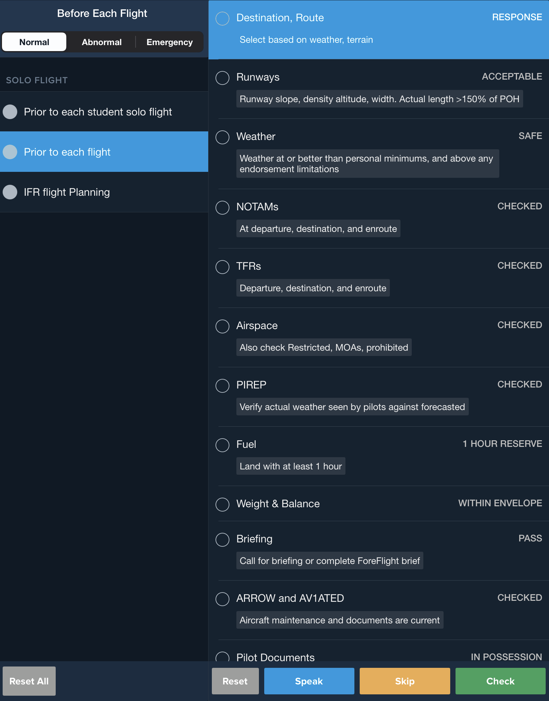
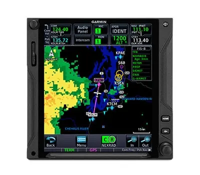

# IFR Flight Planning

## Objective

Demonstrate the ability to plan an IFR cross-country flight, including selecting appropriate routes and altitudes, interpreting weather data and NOTAMs, managing fuel requirements, and understanding the requirements for filing, copying, and complying with ATC clearances.

## Timing

- 45 minutes

## Format

- ForeFlight demo
- Whiteboard

## Overview

- Filing an IFR Flight Plan
- Copying / Understanding IFR Clearances
- Dealing with En Route Weather
- Preparation of an IFR Navigation Log
- Planning Departures and Arrivals
- Power / Fuel Management

## Elements

### Filing an IFR Flight Plan

- Mandatory for all flights in controlled airspace under **IFR**
- Submit via **ICAO** format (FAA Form **7233-4**)
  - This is what ForeFlight will submit as when you file
- File at least **30** minutes prior to estimated time of departure (**ETD**)
  - Flight plans show up in the ATC system **30 minutes** prior to your ETD and remain active for 3-4 hours depending on the facility
- Utilize **1-2-3** rule for alternate necessity: **1** hour before/after **ETA**, **2,000**' ceiling, **3** **SM** visibility
- Identify **PBN** and **RVSM** equipment capabilities in blocks 10 and 18
- Include aircraft identification, type, and color for search and rescue

### Briefing a Flight

- Retrieve a weather briefing before departure
- Recall [91.103](/_references/14-CFR/91.103), preflight planning must include:
  - **N**OTAMs
  - **W**eather forecasts and reports
  - [**K**nown ATC delays](https://nasstatus.faa.gov/)
  - **R**unway lengths at airports of intended use
  - **A**lternate if the flight cannot be completed as planned
  - **F**uel requirements
  - **T**akeoff and landing distance information from the AFM/POH
- Use a standard briefing checklist which covers your NWKRAFT items, airworthiness, and personal minimums

### Copying / Understanding IFR Clearances

- Use **C-R-A-F-T** format, fill in everything you know beforehand:
  - **C**learance limit
  - **R**oute
  - **A**ltitude
  - **F**requency
  - **T**ransponder
- Verify clearance void time when departing non-towered fields
  - Start a timer when given a void time to keep track
- Read back all altitudes, restrictions, headings, and "hold short" instructions in sequence

### En Route Weather

- Monitor **SIGMETs** for non-convective hazards like severe icing or turbulence
- Track **AIRMETs** (**SIERRA, TANGO, ZULU**) for conditions hazardous to light aircraft
- Avoid thunderstorms identified as severe by at least **20** miles
- Circumnavigate convective areas with **6/10** or more cell coverage
- Use **FIS-B** via **ADS-B** for strategic planning only, accounting for **15-20** minute latency
- Report unforecast weather or hazardous conditions to **ATC** immediately

### Preparation of an IFR Navigation Log

- Manual creation of navigation log
  - List all fixes/waypoints for each leg of the flight
  - Correct for magnetic deviation and variation, as appropriate
  - Record magnetic courses, distances, true airspeed and fuel burn from the POH
  - Determine **TAS**, **GS**, and **ETE** for each segment based on winds/temperatures aloft
  - Include navigation frequencies on your flight plan
- With ForeFlight
  - Configure an aircraft profile, either a basic or advanced profile based on tables from your POH
  - Create a flight plan and select a cruise profile
  - Cross-check profile with reasonable POH values

### Planning Departures and Arrivals

- Check for published **ODPs** or **SIDs** to ensure terrain clearance during climb-out
  - Standard climb gradient is **200** **FPNM** (assumes crossing **DER** at **35** feet and climbing to **400** feet before turns)
  - Non-standard climb gradients: $\text{Climb rate (ft / min)} = \frac{\text{Ground speed } * \text{ Climb gradient (ft / nm)}}{60}$
  - Confirm eligibility and possession of charted **SIDs** and **STARs** before accepting clearances
  - Comply with "Climb Via" or "Descend Via" instructions to meet all published restrictions
  - Load procedures directly from a current database by name
    - This is required for RNAV terminal procedures
- Notify ATC as early as possible if intending to use a visual climb over airport (**VCOA**) departure
- Class G airports do not have published ODPs or SIDs
  - You must maintain **your own obstacle clearance** before entering controlled airspace

### Power / Fuel Management

- Legal fuel requirements must be met [91.167](/_references/14-CFR/91.167):
  1. Enough fuel to fly to first airport of intended landing
  2. Then to your alternate, if an alternate was filed
  3. Then for 45 minutes at normal cruising speed
- Sensible fuel requirements: **Land with >1 hour of fuel**
- Select cruise power settings from the POH based on desired cruise speed and fuel burn
- For low-wing airplanes
  - Use a recurring alert as a reminder to switch tanks
  - Record the level of each fuel when swapping tanks to prevent fuel imbalance
- Advise ATC of "Minimum Fuel" status when fuel supply allows for little or no undue delay
- Declare an emergency and report remaining fuel in minutes if priority is needed

## References

- **Instrument Flying Handbook**: 1-12, 10-2 to 10-9, 10-22 to 10-25, 10-31 to 10-33
- **Instrument Procedures Handbook**: 1-16 to 1-42, 2-13 to 2-43, 3-10 to 3-24
- **Aeronautical Information Manual**: 5-1-6, 5-1-15, 5-2-9, 5-3-2, 5-5-2, 5-5-15, 7-1-5
- **Aviation Weather Handbook**: 3-10 to 3-12, 26-2 to 26-21, 27-7 to 27-21, D-6 to D-10
- **TERPS Manual (FAA Order 8260.3)**: 2-1, 3-5
- **14 CFR Part 91**: 91.103, 91.167, 91.169, 91.173, 91.177, 91.185
- **Backseat Pilot CFII Lesson Plans**: III.B, V.A, V.B, XI.A
- [IFR Magazine Flight Plans](https://ifr-magazine.com/system/flight-plans/)
