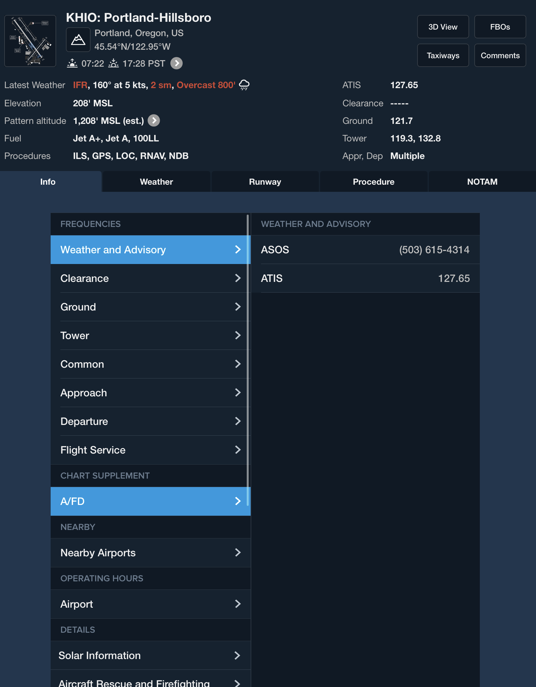

# IFR Cross-Country Planning, Symbology, and Reporting

## Objective

The student will demonstrate the ability to utilize **IFR** planning publications and charts, interpret complex en route symbology, and adhere to mandatory position and status reporting requirements to maintain safety and separation in the **National Airspace System (NAS)**.

## Overview

- Chart Supplements
- En Route Low Altitude IFR Chart
- En Route Chart Symbology
- Air Traffic Service (ATS) Route System
- Intersections and Changeover Points
- ATS Route Course Changes
- Flight Deck Management
- Position Reporting Requirements
- Additional Reporting Requirements
- Loss of Communications Procedures (IMC and VMC)

## Elements

## Chart Supplements

- Published by Aeronautical Information Services in regional booklets every **56** days
- Contains the Airport/Facility Directory (**A/FD**) with detailed data on public-use airports
  - Includes runway dimensions, surface types, load capacities, and lighting codes
  - Lists weather data sources, communication frequencies, and **NAVAID** status
- Features full-page airport diagrams and "Hot Spot" locations for complex layouts
- Provides Preferred **IFR** Routes and **TEC** route descriptions

## En Route Low Altitude IFR Chart

- Provides aeronautical info for **IFR** navigation below **18,000** feet **MSL**
- Depicts Victor airways (**VOR**-based) and **T-routes** (**RNAV**-based)
- Shows limits of controlled airspace, **VHF** **NAVAIDs**, and reporting points
- Includes minimum en route altitudes (**MEA**) and obstruction clearance altitudes (**MOCA**)
- Contains **OROCA** for situational awareness and emergency use
- Charts are revised every **56** days

## En Route Chart Symbology

- **NAVAID** boxes show name, identifier, frequency, and Morse code
- Compulsory reporting points depicted as solid triangles
- "On request" reporting points depicted as open triangles
- **MEA** is the lowest altitude between fixes ensuring signal reception and obstacle clearance
- **MOCA** (preceded by \*) ensures signal coverage only within **22** **NM** of a **VOR**
- **MRA** (preceded by symbol) is the lowest altitude to receive an off-course **NAVAID** to identify a fix
- **MCA** (preceded by symbol) is the altitude required to cross a fix when climbing to a higher **MEA**

<table>
  <tr>
    <th>Altitude</th>
    <th>Name</th>
    <th>Obstruction Clearance</th>
    <th>Navaid Signal</th>
  </tr>
  <tr>
    <td>MEA</td>
    <td>Minimum Enroute Altitude</td>
    <td className="center">✅</td>
    <td className="center">✅</td>
  </tr>
  <tr>
    <td>MOCA</td>
    <td>Minimum Obstruction Clearance Altitude</td>
    <td className="center">✅</td>
    <td className="center">Within 22nm (25 s.m.) of NAVAID</td>
  </tr>
  <tr>
    <td>MCA</td>
    <td>Minimum Crossing Altitude</td>
    <td className="center">✅</td>
    <td className="center">✅</td>
  </tr>
  <tr>
    <td>MRA</td>
    <td>Minimum Reception Altitude</td>
    <td className="center">✅</td>
    <td className="center">✅</td>
  </tr>
  <tr>
    <td>MAA</td>
    <td>Maximum Authorized Altitude</td>
    <td className="center">✅</td>
    <td className="center">✅</td>
  </tr>
  <tr>
    <td>OROCA</td>
    <td>Off-route Obstruction Clearance Altitude</td>
    <td className="center">✅</td>
    <td className="center">❌</td>
  </tr>
</table>

## Air Traffic Service (ATS) Route System

- Generic term including **VOR** Federal airways, colored airways, jet routes, and **RNAV** routes
- Victor airways are identified by "**V**" and exist from **1,200**' **AGL** up to **18,000**' **MSL**
- Jet routes are identified by "**J**" and exist from **18,000**' **MSL** to **FL** **450**
- **RNAV** routes include **Q-routes** (high) and **T-routes** (low) depicted in aeronautical blue
- Standard airway width is **8** **NM** (**4** **NM** each side of centerline)
- Routes are contained within Class **E** (low) or Class **A** (high) airspace

| Airway Type         | Chart Type                  | Identifier Prefix | Altitude Range                                   | Depiction Color       | Primary Navigation Base |
| :------------------ | :-------------------------- | :---------------- | :----------------------------------------------- | :-------------------- | :---------------------- |
| **Victor Airways**  | Enroute Low Altitude        | **V**             | 1,200' AGL up to (but not including) 18,000' MSL | **Black**             | VOR or VORTAC           |
| **T-Routes** (RNAV) | Enroute Low Altitude        | **T**             | 1,200' AGL up to (but not including) 18,000' MSL | **Aeronautical Blue** | GNSS (GPS/WAAS)         |
| **Jet Routes**      | Enroute High Altitude       | **J**             | 18,000' MSL to FL 450                            | **Black**             | VOR or VORTAC           |
| **Q-Routes** (RNAV) | Enroute High Altitude       | **Q**             | 18,000' MSL to FL 450                            | **Aeronautical Blue** | GNSS or DME/DME/IRU     |
| **Y-Routes** (RNAV) | High/Low Enroute (Offshore) | **Y**             | Predominantly Class A offshore (>18,000' MSL)    | **Blue**              | GPS (RNAV 2)            |

## Intersections and Changeover Points

- Intersections are fixes formed by crossing **VOR** radials, **DME**, or **RNAV** waypoints
- Changeover Points (**COP**) specify where to switch navigation guidance from one facility to the next
- **COP** prevents frequency interference and ensures continuous signal reception
- Depicted as a "bent" line symbol on airways with a number indicating mileage from a fix
- If no **COP** is charted, the change should occur at the midpoint of the route segment
- **PHOTO PLACEHOLDER: Chart example of a COP symbol and an intersection**

## ATS Route Course Changes

- Pilots required to adhere to airway/route centerlines
- Course changes require lead turns based on turn radius, wind, and airspeed
- Lead points ensure the aircraft remains within protected airspace boundaries
- Distance measuring equipment (**DME**) or **RNAV** used to determine lead points
- High-speed aircraft require more significant turn anticipation

## Flight Deck Management

- Systematically cross-check **GPS** position against **VOR** or **DME** data
- Track actual time of arrival (**ATA**) and fuel state at each fix to monitor progress
- Keep interior lights low at night to preserve vision

## Position Reporting Requirements

[91.183: IFR Communications](/_references/14-CFR/91.183)
[91.187: Equipment malfunction reports](/_references/14-CFR/91.187)

- Required over each compulsory point (solid triangle) when **not in radar contact**
- Required over each fix used in the flight plan for direct route flights
- Reports include:
  - Identification
  - Position
  - Time
  - Altitude
  - Next fix, and ETA of cross next fix
- Actual altitude/flight level included when operating on a clearance specifying "**VFR-on-top**"
- Discontinue reports over compulsory points when informed of "**radar contact**"
- Resume reporting when advised "**radar contact lost**" or "**radar service terminated**"

## Additional Reporting Requirements

The acronym **STALLMUUVA** is a common mnemonic used to remember the additional reports that pilots must make to Air Traffic Control (ATC) or Flight Service Stations (FSS) without a specific request while operating under Instrument Flight Rules (IFR).

The following breakdown explains each element of the acronym as defined in the provided sources:

| Letter | Component                           | Details                                                                                                          |
| :----- | :---------------------------------- | :--------------------------------------------------------------------------------------------------------------- |
| **S**  | **Safety** of flight                | Any information relating to the safety of flight must be reported at all times.                                  |
| **T**  | **Time** reaching fix               | The time and altitude/flight level reaching a holding fix or point to which cleared.                             |
| **A**  | **Altitude** change when VFR-on-top | When an altitude change will be made if operating on a clearance specifying "VFR-on-top".                        |
| **L**  | **Leaving** holding fix             | When leaving any assigned holding fix or point.                                                                  |
| **L**  | **Loss** of equipment               | Any loss of navigation or communications equipment or capabilities.                                              |
| **M**  | **Missed** approach                 | When an approach has been missed, including a request for specific action.                                       |
| **U**  | **Unable** to climb/descend 500 fpm | When unable to climb or descend at a rate of at least **500 feet per minute**.                                   |
| **U**  | **Unforecast** weather              | Weather conditions which have not been forecast, hazardous forecast conditions                                   |
| **V**  | **Variation** in airspeed           | Change in true airspeed when it varies by **5 percent or 10 knots** (whichever is greater) from the flight plan. |
| **A**  | **Assigned** altitude               | When vacating any previously assigned altitude or flight level for a newly assigned one.                         |

## Loss of Communications Procedures (IMC and VMC)

[91.185](/_references/14-CFR/91.185)

- If in **VMC** or if **VMC** is encountered, continue under **VFR** and land as soon as practicable
- If in **IMC**, follow route (**AVE F**) in order: **Assigned**, **Vectored**, **Expected**, **Filed**
- If in **IMC**, fly altitude (**MEA**) at the highest of: **Minimum**, **Expected**, **Assigned**
- If radio failure occurs while being radar vectored, proceed direct to the fix specified in vector clearance
- Leave clearance limit at the **EFC** time, or if none, at the **ETA** filed in flight plan
- Squawk **7600** to notify **ATC** of radio failure

## References

- Aeronautical Information Manual (**AIM**): Chapters 1, 3, 4, 5, 6, 7, 9
- Instrument Flying Handbook (**IFH**): Chapters 1, 2, 5, 8, 9, 10
- Instrument Procedures Handbook (**IPH**): Chapters 1, 2, 3
- Title **14** Code of Federal Regulations (**CFR**): Parts **1**, **61**, **71**, **91**, **95**, **97**
- **TERPS** Manual (**FAA** Order **8260.3**): Chapters **1**, **2**, **14**, **16**
- Pilot-Controller Glossary
