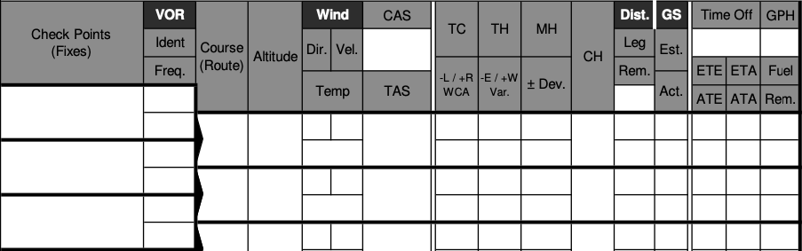
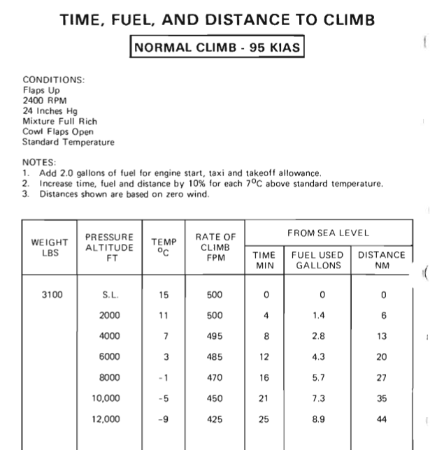
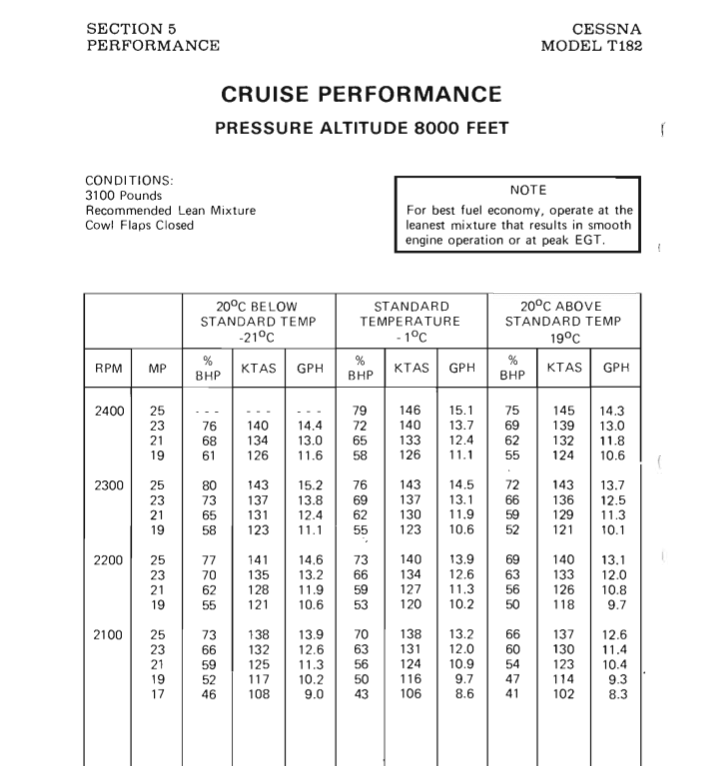
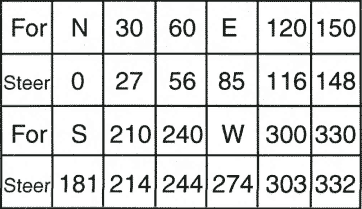
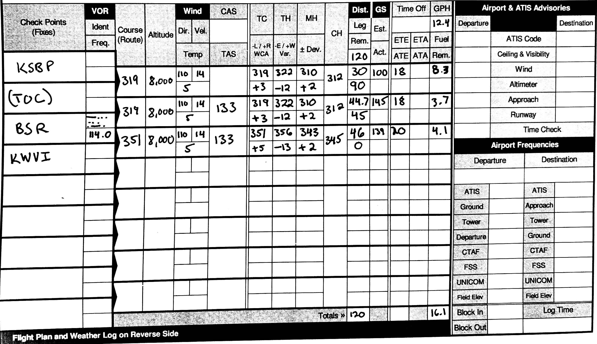

# Sample Problem: Flight Plan KSBP to KMRY

## Winds Aloft

<pre>
DATA BASED ON 151800Z    
VALID 160000Z   FOR USE 2000-0300Z. TEMPS NEG ABV 24000

FT  3000    6000    9000   12000   18000   24000  30000  34000  39000
SBA 9900 1112+11 1414+06 1718-01 1830-18 2042-29 216545 217651 226955
SFO 2112 0411+10 1114+05 1217-03 1217-19 1813-30 172646 162456 192955
</pre>

1. Write down each flight plan waypoint, including a TOC (top of climb) waypoint after the origin, also write our cruising altitude.
   1. Route: `KSBP (TOC) BSR KWVI`
2. Using a plotter or EFB, determine true course (TC) and the distance between each waypoint:
   1. 319&deg;, 319&deg;, 351&deg;
   2. 74.7nm, 45.8nm
3. Using the winds aloft forecast, write down the wind. (We'll use the SFO numbers since its the closest station, and has similar values to 9000.):
   1. 110 &deg;T @ 14 knots
4. Use the Time, Fuel, and Distance chart to determine approximate climb.
   1. We're start approximately at S.L., so use the 8000' line:
   2. 16 minutes, 5.7 gal, 27nm
   3. Temperature is 5&deg;, or 6&deg; above standard, so we'll increase 10%:
   4. **18 minutes, 29.7nm, plus 6.3 gal + 2 gal for taxi = 8.3 gal**
   5. Write down 30nm for the TOC distance, then (74.7nm - 30nm) = 44.7nm for the TOC to BSR leg
5. Determine the TAS of the first leg: Using the 8,000' Cruise Performance Chart
   1. Located the 2200 RPM, 23" of manifold pressure line
   2. Interpolate between the -1&deg;C a30 nd the 19&deg;C temp values.
   3. **12.4 gph** and **133 KTAS**
6. Determine ground speed of first leg.
   1. Using an flight computer, compute the WCA
   2. Wind 110&deg; @ 14 knots, TC 319&deg; T, TAS 133 knots
   3. Result: **145 knots GS, HDG 322&deg; WCA +3&deg;**
7. On the sectional chart, find the closest isogonic line.
   1. Enter and subtract 12&deg; E from the first leg
8. Refer to the compass correction card for your airplane, find the closest entry to the heading to the magnetic heading
   1. For 330 steer 332, so +2
   2. Add +2 to get the MH of **312**
9. Repeat steps 6-8 using the values for the BSR - KWVI leg
10. Subtract the leg distances for each distance remaining
11. Use distance / GS = ETE to compute ETE for each leg
12. Use the (ETE / 60) \* GPH to compute GPH for each line

