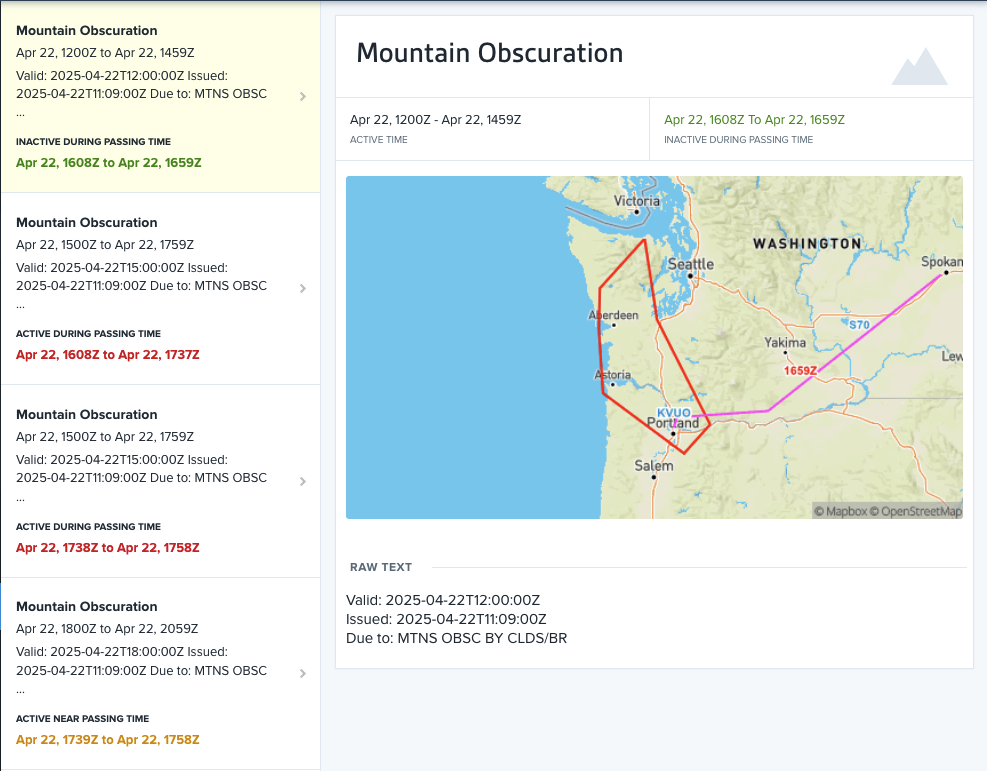
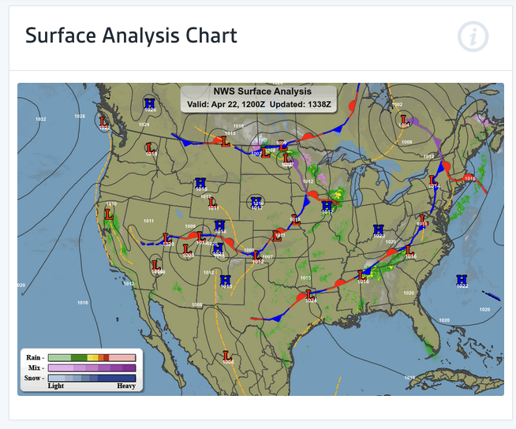
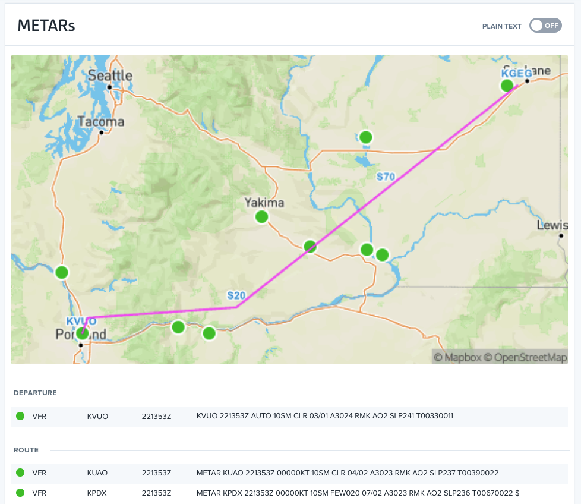
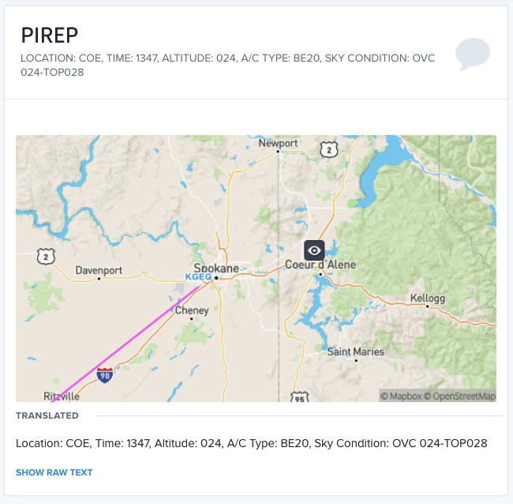
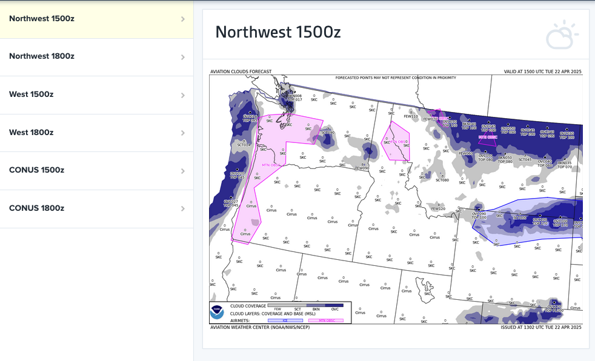
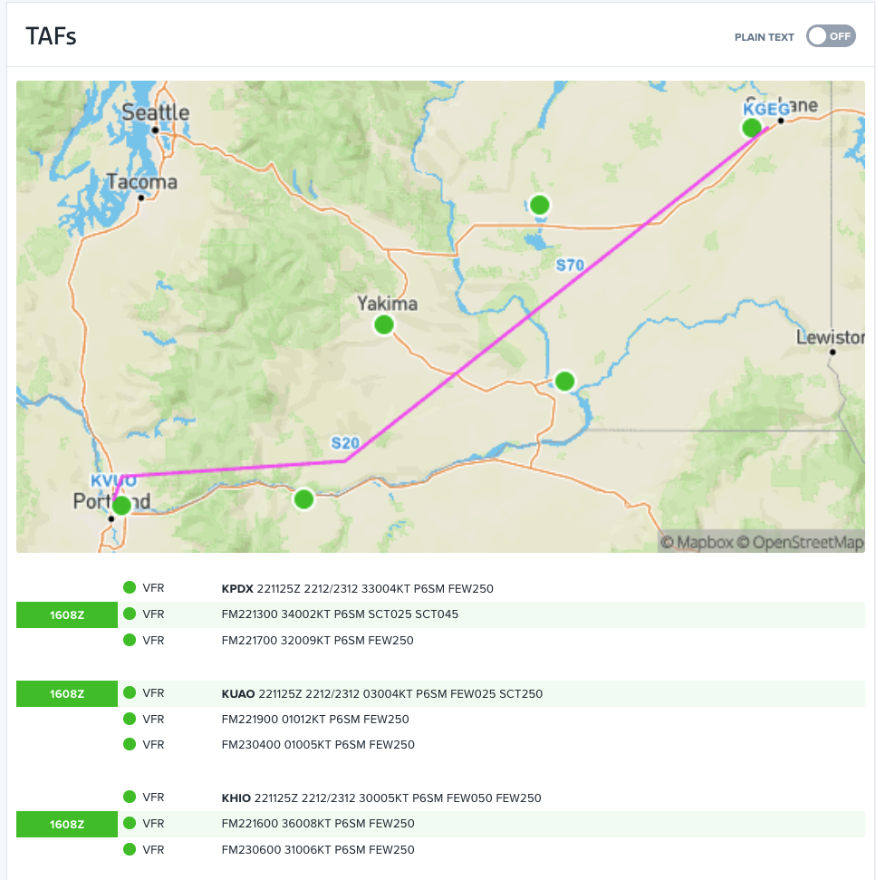
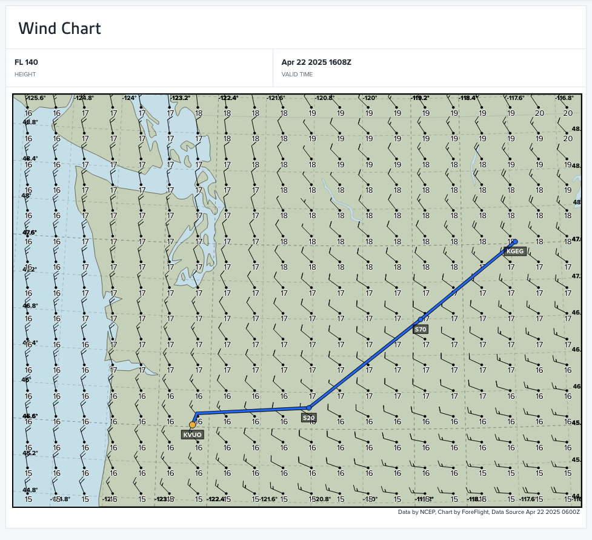
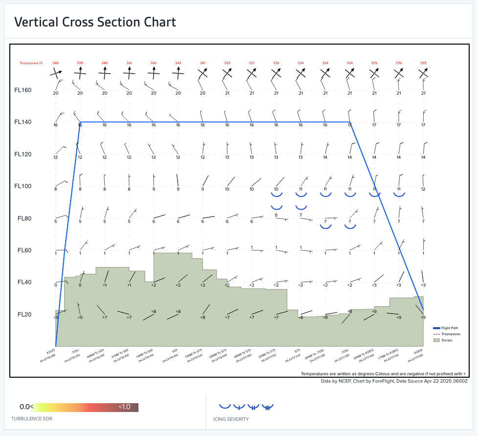
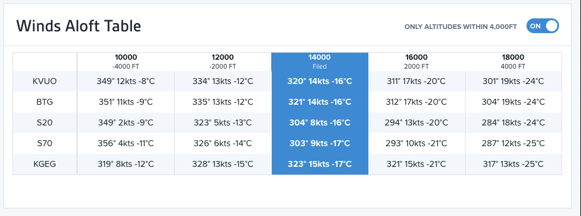
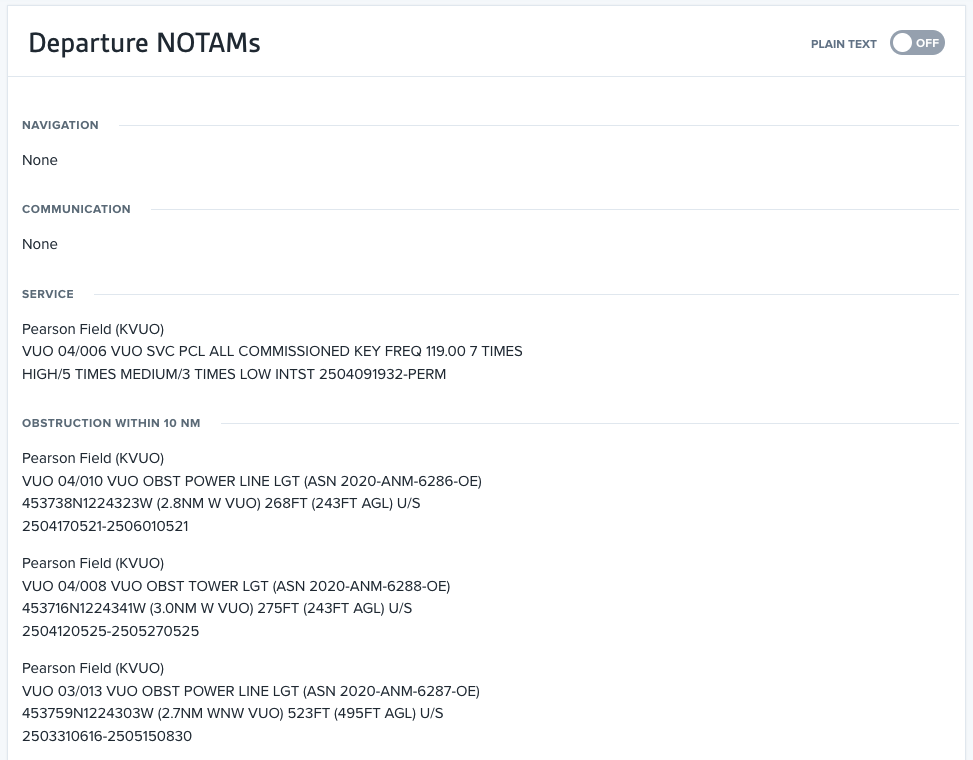

# Sample ForeFlight Weather Planning

- Enter flight plan `KVUO BTG S20 S70 KGEG`
- Send to Flights and create briefing

## Briefing

### AIRMETS

### Surface Analysis Chart

### METARs

### PIREPs

### Forecasts / Cloud Coverage

### Forecasts / TAFs

### Forecasts / Wind Chart

### Forecasts / Vertical Cross-Section

### Forecasts / Winds Aloft Table

### NOTAMs

## Imagery

- Prog Charts: Surface Analysis / Weather Depiction
- Probably of Precipitation Charts
- SIGWX Outlook Chart
- Convective Outlooks
- Convective Forecasts
- GFA Imagery
  - Clouds
  - Surface
- Winds Aloft
- Graphical AIRMETs
- Freezing Level
- Icing: Note charts with SLD
- Turbulence
