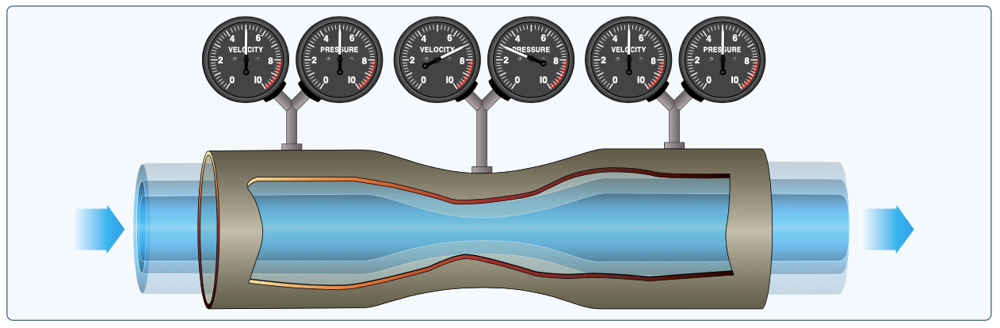
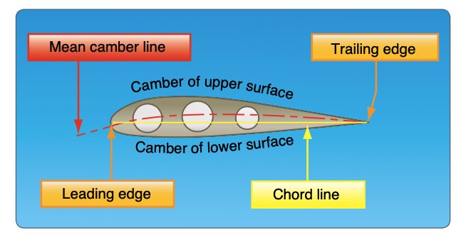

# Airfoils

## Newton's Third Law

- For every action there is an equal and opposite reaction.
- In an airplane, the propeller moves and pushes back the air
- Consequently, the air pushes the propeller and the airplane forward

## Bernoulli's Law

- As the pipe constricts, the pressure and the velocity must increase
- An increase in velocity means a decrease in pressure / a decrease in velocity means a increase in pressure

- The same principle applies to an airfoil
  - Some air is directed above the wing, some is directed below it
  - An increase in velocity decreases the pressure above the wing, which causes a force vertically on the wing

<iframe width="560" height="315" src="https://www.youtube.com/embed/UqBmdZ-BNig?si=7xuS2UL5c50MPghr" title="YouTube video player" frameborder="0" allow="accelerometer; autoplay; clipboard-write; encrypted-media; gyroscope; picture-in-picture; web-share" referrerpolicy="strict-origin-when-cross-origin" allowfullscreen />
