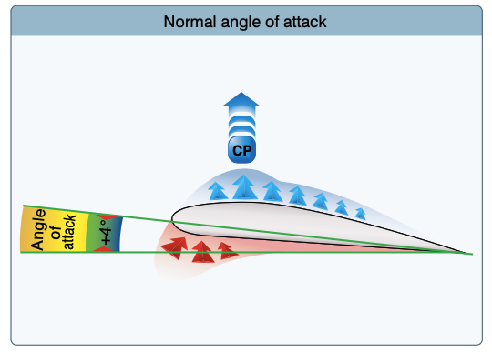

# Angle of Attack

- Angle of attack is parallel and opposite of the flight path
- The steeper the angle of attack the more the air above the wing is deflected, which increases the lifting force
- Increasing the angle of attack too much, the air become turbulent and doesn't stay on the boundary layer on the rear top of the wing
