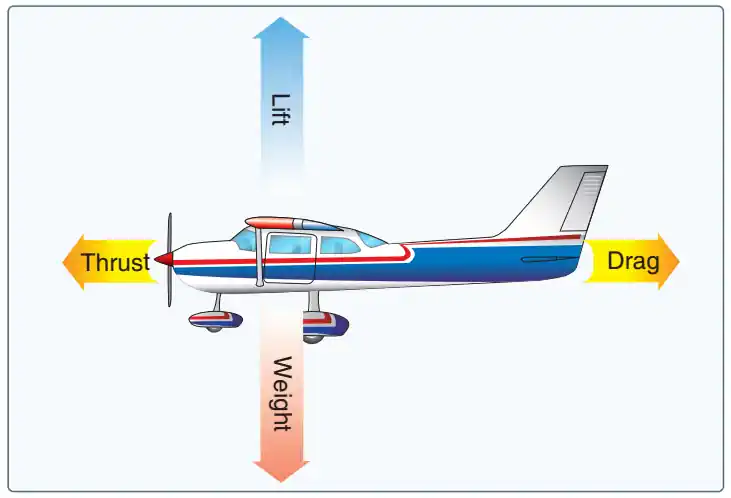
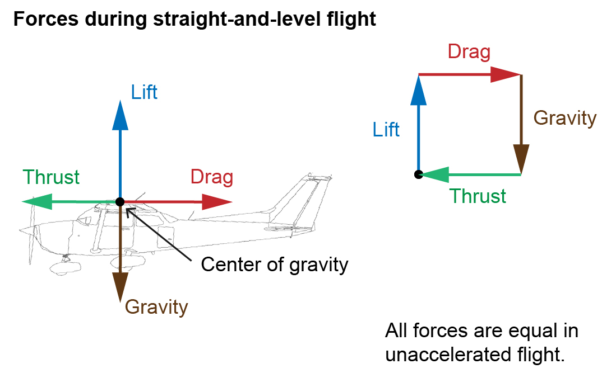
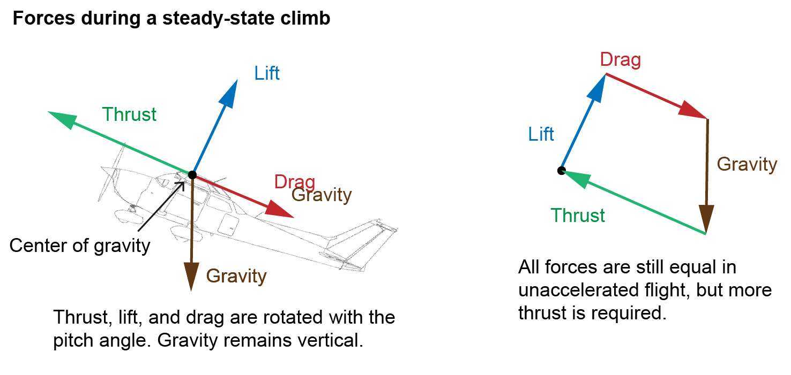
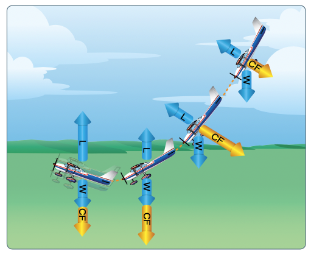
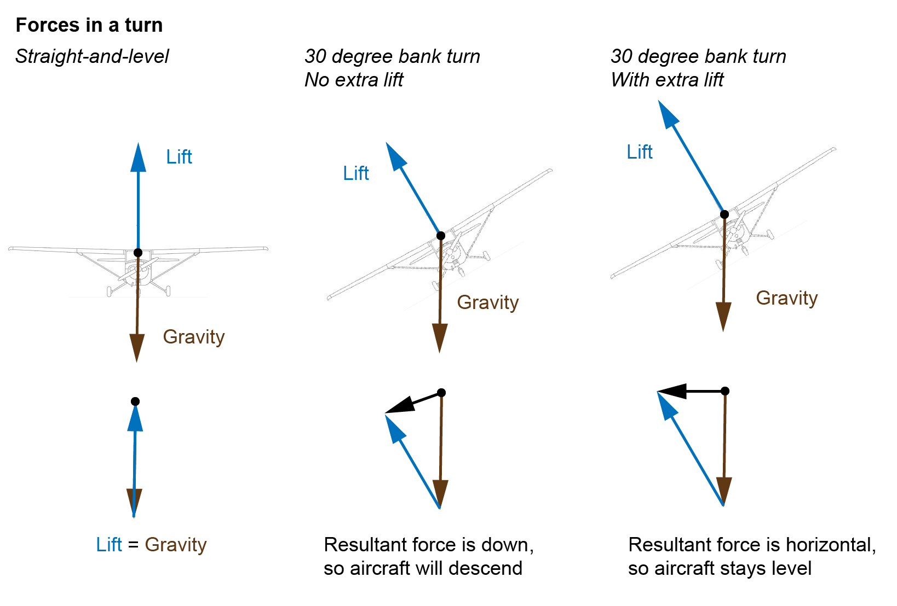
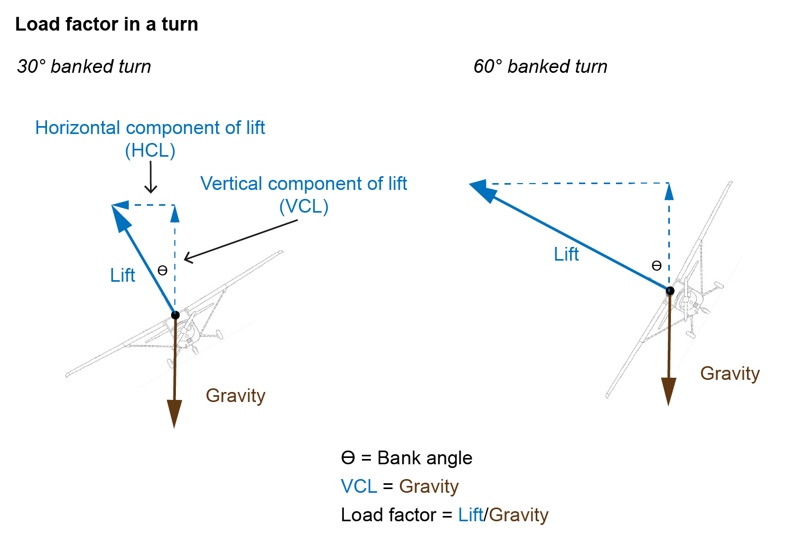
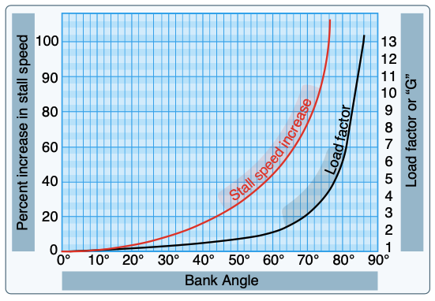

# Forces During Flight

## Forces in Straight-and-Level Flight

- In straight and level, unaccelerated flight all forces are equal

## Forces in a Climb

- The lift vector is a acting rearward and
- Greater thrust is required to balance the forces

## Forces in a Dive

- Consider an aircraft pulling out of a dive:
  - Because a high momentum downward in a dive, rapid changes in pitch will result in a big difference between the aircraft's flight path (downward) and it's pitch angle (less downward), leading to a high angle of attack and a stall
  - Pulling out of a dive slowly allows the flight path to change slowly with the relative wind, keeping the angle of attack small

## Forces in a Turn

- Because a portion of the lift produced by the wing is being used to accelerate the aircraft in the direction of the turn, more lift is required to maintain the same altitude

The load factor of an airplane in a level turn is given by:

$$
\text{load factor} = \frac{1}{\cos{\theta}}, \text{where } \theta = \text{bank angle}
$$

