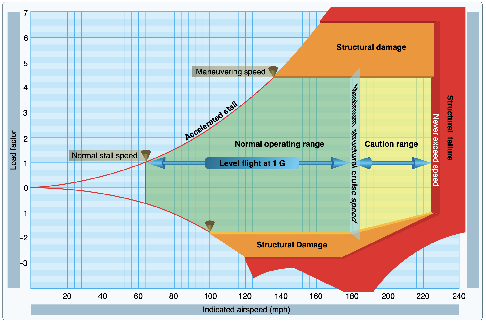

# Load Factor

Load factor is caused by accelerating the airplane in a vertical direction.

### Maneuvering Speed and Vg Diagrams

Maneuvering speed is the speed at which the aircraft will stall before exceeding its load factor limit, if it encounters a sudden increase in angle of attack.

- Consider an airplane flying at a constant airspeed when it encounters a sudden updraft:
  - The relative wind changes the angle of attack, and the wing will instantaneously produce 2x or 3x times the amount of lift
  - This increases lift accelerates the airplane upward, inducing load on the airplane
  - Because this increase in lift is proportional to the square of the airspeed, the faster the airplane goes the more load factor a given gust can induce
  - Maneuvering speed is set at the point at which the wing will stall (exceed the critical angle of attack) before it can impart a load factor greater than the load factor limit (for instance, +3.8g for a the normal category)
- Maneuvering speed allows for full control deflection of a single control surface
- Maneuvering speed increases with weight
  - The heavier the airplane, the more control input will be required to induce a given load factor. So the aircraft will run out of control authority before it can impart too much load factor

### References

- [How is Maneuvering Speed Determined](https://www.youtube.com/watch?v=o_KdHEzIJkk&ab_channel=RodMachado)
- [Stall speed and angle of attack](https://www.youtube.com/watch?v=jLDM8jQFRvs)
