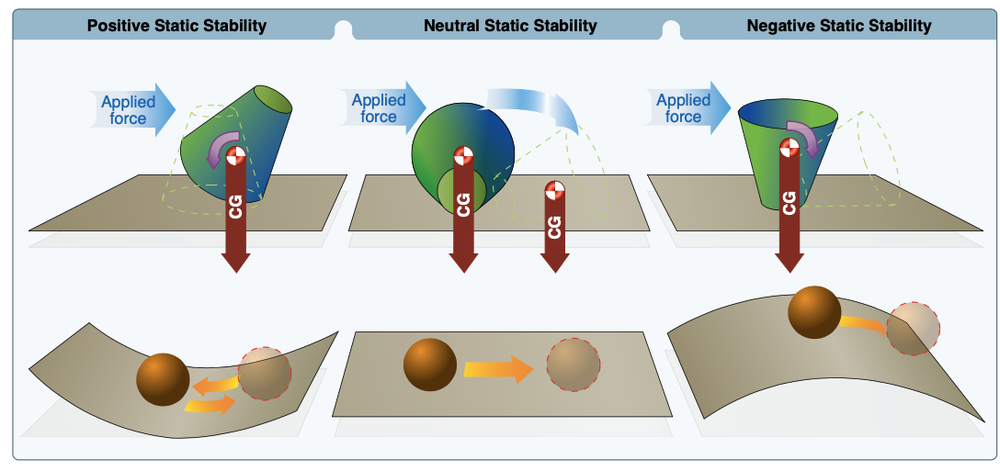
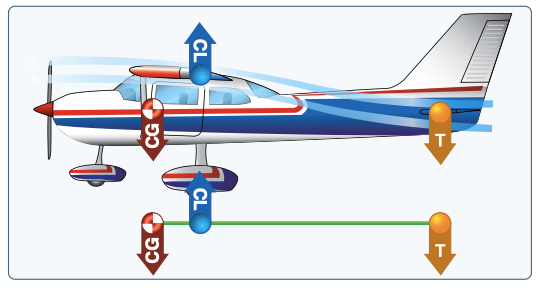
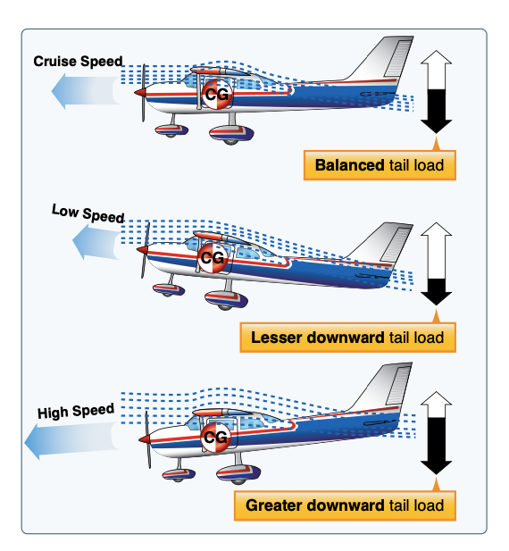
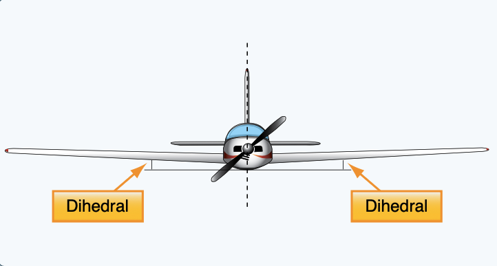
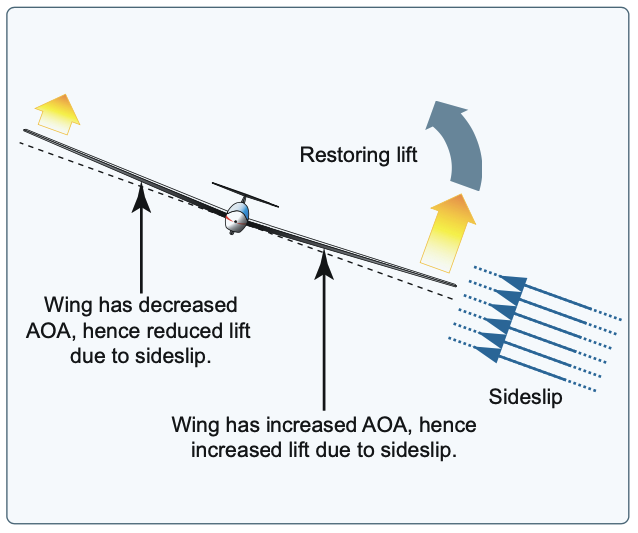

# Stability

- Static stability:
  - Positive stability: Aircraft has a tendency to return to original position after being displaced
  - Neutral stability: Aircraft position will stay in a new position after being displaced
  - Negative stability: Aircraft position has a tendency to move further from the original position after being displayed
- Dynamic stability:
  - Positive dynamic stability: over time, the motion of the displaced object decreases in amplitude and the object displaced returns toward the equilibrium state
  - Neutral dynamic stability: once displaced, the displaced object neither decreases nor increases in amplitude
  - Negative dynamic stability: over time, the motion of the displaced object increases and becomes more divergent

## Center of Gravity and Pressure

- Because Cl and Cg being are distance apart, they create a rotation moment (in the pitch direction)
- This makes the aircraft “nose heavy”
- The horizontal stabilizer provides the necessary downforce to counteract this rotation moment

## Pitch Stability / Longitudinal Stability

1. If the aircraft’s speed decreases, the speed of the airflow over the wing is decreased
2. This in turn causes less downwash over the tail, which causes a lesser downward force on the horizontal stabilizer
3. This will cause the airplane to pitch downward slightly, which increases the aircraft's speed

The feedback loop of the tailplane create pitch stability (longitudinal stability about the lateral axis).

## Yaw Stability / Directional Stability

- Air impacting the side of the tail will yaw the aircraft in opposite direction from which it was disturbed
- This feedback loop provides yaw stability

## Roll Stability / Lateral Stability

### Dihedral

- When an aircraft is momentarily upset in roll, a sideslip will occur
- This causes the lowered wing to develop a higher angle of attack than the raised wing, and the high wing develops a lower angle of attack
- This counteracts the motion of the original upset, and brings the aircraft back into its original position

### Pendulous Effect

Because the fuselage is mounted below the wing, the aircraft will have a natural tendency to right itself with the heavy fuselage on the bottom, like a pendulum.

### Keel Effect

Because the wings are attached in a high position on the fuselage it makes the fuselage behave like a keel exerting a steadying influence.
